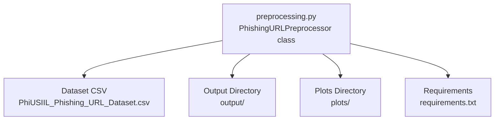
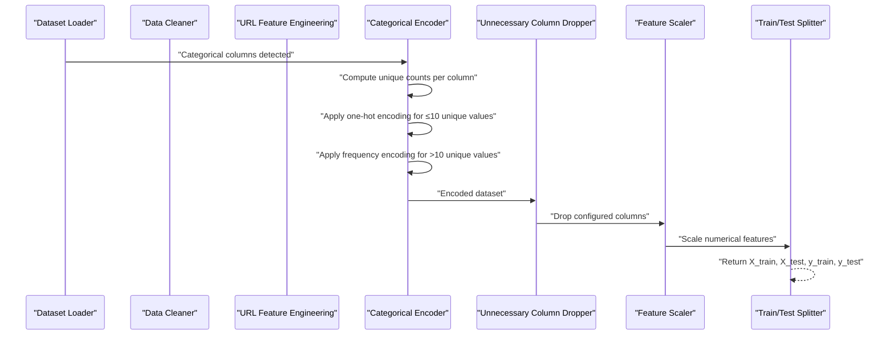
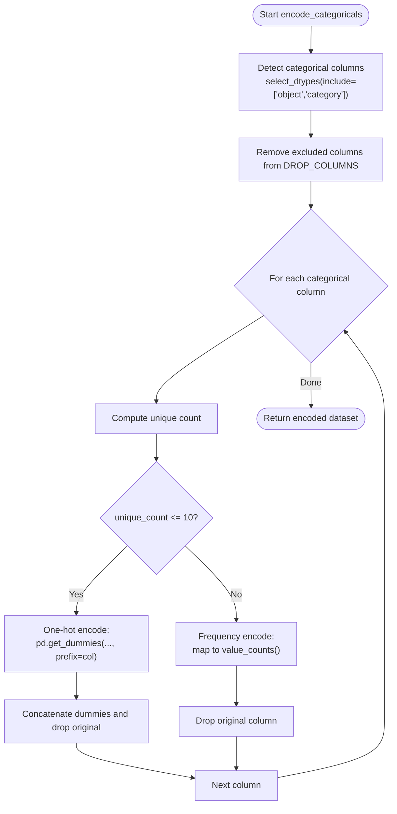
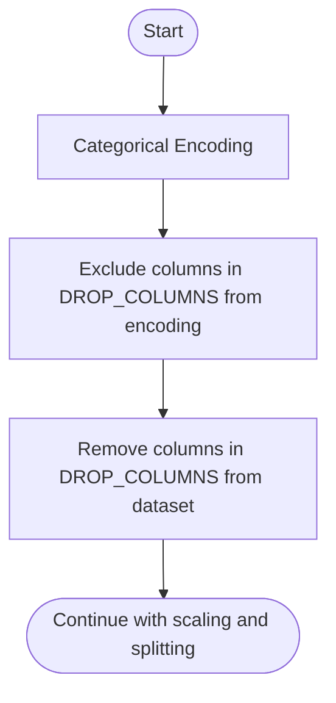
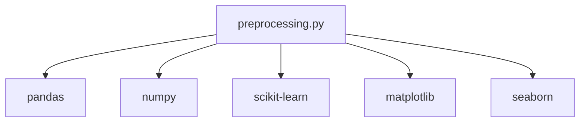

# Categorical Feature Encoding

<cite>
**Referenced Files in This Document**
- [preprocessing.py](file://preprocessing.py)
- [PhiUSIIL_Phishing_URL_Dataset.csv](file://PhiUSIIL_Phishing_URL_Dataset.csv)
- [requirements.txt](file://requirements.txt)
</cite>

## Table of Contents
1. [Introduction](#introduction)
2. [Project Structure](#project-structure)
3. [Core Components](#core-components)
4. [Architecture Overview](#architecture-overview)
5. [Detailed Component Analysis](#detailed-component-analysis)
6. [Dependency Analysis](#dependency-analysis)
7. [Performance Considerations](#performance-considerations)
8. [Troubleshooting Guide](#troubleshooting-guide)
9. [Conclusion](#conclusion)

## Introduction
This document explains the intelligent categorical feature encoding system implemented in the phishing URL detection preprocessing pipeline. It focuses on the encode_categoricals method, which automatically detects categorical columns, applies low-cardinality one-hot encoding, and high-cardinality frequency encoding. It also documents the DROP_COLUMNS exclusion logic and the systematic approach to handling different cardinality scenarios. The goal is to help beginners understand categorical encoding strategies while providing sufficient technical depth for practitioners.

## Project Structure
The preprocessing pipeline is encapsulated in a single module with a dedicated class that orchestrates the entire workflow. The dataset is a CSV file containing URL-related features and categorical attributes.

**Diagram sources**
- [preprocessing.py:112-134](file://preprocessing.py#L112-L134)
- [PhiUSIIL_Phishing_URL_Dataset.csv:1-20](file://PhiUSIIL_Phishing_URL_Dataset.csv#L1-L20)

**Section sources**
- [preprocessing.py:112-134](file://preprocessing.py#L112-L134)
- [PhiUSIIL_Phishing_URL_Dataset.csv:1-20](file://PhiUSIIL_Phishing_URL_Dataset.csv#L1-L20)
- [requirements.txt:1-6](file://requirements.txt#L1-L6)

## Core Components
- PhishingURLPreprocessor: Orchestrates loading, inspection, cleaning, URL feature engineering, categorical encoding, dropping unnecessary columns, scaling, separation of features/target, train/test split, saving outputs, visualization, and summary generation.
- encode_categoricals: Implements intelligent categorical encoding with automatic detection and threshold-based selection between one-hot and frequency encoding.

Key configuration:
- DROP_COLUMNS: Excludes specific columns from downstream modeling (e.g., raw identifiers and text fields unsuitable for ML).
- Cardinality thresholds: ≤10 unique values triggers one-hot encoding; >10 unique values triggers frequency encoding.

**Section sources**
- [preprocessing.py:112-134](file://preprocessing.py#L112-L134)
- [preprocessing.py:40-41](file://preprocessing.py#L40-L41)
- [preprocessing.py:321-350](file://preprocessing.py#L321-L350)

## Architecture Overview
The pipeline stages leading up to categorical encoding are designed to prepare the dataset for machine learning. The encode_categoricals stage sits between URL feature engineering and column removal.

**Diagram sources**
- [preprocessing.py:321-350](file://preprocessing.py#L321-L350)
- [preprocessing.py:355-371](file://preprocessing.py#L355-L371)
- [preprocessing.py:376-401](file://preprocessing.py#L376-L401)
- [preprocessing.py:425-445](file://preprocessing.py#L425-L445)

## Detailed Component Analysis

### Intelligent Categorical Encoding: encode_categoricals
The encode_categoricals method performs:
- Automatic detection of non-numeric categorical columns (object or category dtype).
- Exclusion of columns listed in DROP_COLUMNS from the encoding process.
- Per-column cardinality check:
  - Low-cardinality (≤10): one-hot encoding using dummy variables.
  - High-cardinality (>10): frequency encoding by mapping each category to its observed count in the dataset.
- Logging of actions and unique-value counts for transparency.

**Diagram sources**
- [preprocessing.py:321-350](file://preprocessing.py#L321-L350)

Implementation highlights:
- Categorical detection uses pandas select_dtypes to capture object and category dtypes.
- Exclusion logic removes columns in DROP_COLUMNS from the list of columns to encode.
- One-hot encoding uses pandas get_dummies with a prefix derived from the column name.
- Frequency encoding creates a new column suffixed with _FreqEnc and drops the original.

Decision criteria:
- Threshold of 10 unique values balances model interpretability and dimensionality growth.
- One-hot encoding is preferred for low-cardinality categories because it preserves distinctiveness and is compatible with linear models and tree-based models that do not require ordinal assumptions.
- Frequency encoding is preferred for high-cardinality categories to reduce dimensionality and avoid sparse indicator matrices.

Memory efficiency considerations:
- One-hot encoding increases feature dimensionality by the number of unique categories minus one (drop_first=False in the implementation).
- Frequency encoding keeps dimensionality constant per column and reduces sparsity, often improving memory footprint and training speed.

Model performance impact:
- One-hot encoding can improve performance for linear models and tree-based models when categories are few and informative.
- Frequency encoding can improve performance for high-cardinality categories by capturing category prevalence without exploding dimensionality.

Practical examples of processing:
- Example scenario A: A categorical column with 3 unique categories is one-hot encoded into 3 new binary features.
- Example scenario B: A categorical column with 100 unique categories is frequency encoded into a single new integer feature representing category counts.

**Section sources**
- [preprocessing.py:321-350](file://preprocessing.py#L321-L350)
- [preprocessing.py:40-41](file://preprocessing.py#L40-L41)

### DROP_COLUMNS Exclusion Logic
The DROP_COLUMNS list defines columns that are not suitable for machine learning and are removed during two steps:
- During categorical encoding: These columns are excluded from the encoding process to avoid unnecessary computation.
- During column removal: These columns are dropped from the dataset before scaling and splitting.

Columns commonly excluded:
- FILENAME, URL, Domain, Title — raw identifiers and text fields unsuitable for ML.

**Diagram sources**
- [preprocessing.py:321-350](file://preprocessing.py#L321-L350)
- [preprocessing.py:355-371](file://preprocessing.py#L355-L371)
- [preprocessing.py:40-41](file://preprocessing.py#L40-L41)

**Section sources**
- [preprocessing.py:321-350](file://preprocessing.py#L321-L350)
- [preprocessing.py:355-371](file://preprocessing.py#L355-L371)
- [preprocessing.py:40-41](file://preprocessing.py#L40-L41)

### Systematic Approach to Handling Different Cardinality Scenarios
- Low-cardinality (≤10):
  - Use one-hot encoding to represent categories as binary features.
  - Advantages: Clear separation of categories; compatible with linear models; preserves category identity.
  - Disadvantages: Increases feature count; can cause sparsity.
- High-cardinality (>10):
  - Use frequency encoding to replace categories with their counts.
  - Advantages: Keeps feature count stable; reduces sparsity; captures category popularity.
  - Disadvantages: Loses explicit category identity; requires careful handling of unseen categories at inference time.

**Section sources**
- [preprocessing.py:321-350](file://preprocessing.py#L321-L350)

## Dependency Analysis
The preprocessing pipeline depends on standard scientific Python libraries for data manipulation, machine learning, and visualization.

**Diagram sources**
- [requirements.txt:1-6](file://requirements.txt#L1-L6)
- [preprocessing.py:19-29](file://preprocessing.py#L19-L29)

**Section sources**
- [requirements.txt:1-6](file://requirements.txt#L1-L6)
- [preprocessing.py:19-29](file://preprocessing.py#L19-L29)

## Performance Considerations
- Memory efficiency:
  - One-hot encoding can significantly increase memory usage for high-cardinality categorical features. Consider drop_first=True or target-based encoding to reduce dimensionality.
  - Frequency encoding generally reduces memory overhead compared to one-hot encoding for high-cardinality features.
- Training speed:
  - One-hot encoding increases matrix sparsity and feature count, potentially slowing training for tree-based models.
  - Frequency encoding can accelerate training by reducing dimensionality.
- Model interpretability:
  - One-hot encoding improves interpretability for linear models and tree-based models by explicitly separating categories.
  - Frequency encoding compresses information into a single metric; consider adding target-based encoding for richer semantics.

[No sources needed since this section provides general guidance]

## Troubleshooting Guide
Common issues and resolutions:
- Unexpected missing columns after encoding:
  - Verify that DROP_COLUMNS excludes intended columns and that they are not part of the categorical detection list.
- High memory usage after one-hot encoding:
  - Reduce cardinality by grouping rare categories or switching to frequency encoding for high-cardinality columns.
- Poor model performance with high-cardinality categories:
  - Replace frequency encoding with target-based encoding or embedding techniques if supported by the model.
- Logging messages:
  - The encoder logs the number of unique categories per column and whether one-hot or frequency encoding was applied. Use these logs to diagnose encoding choices.

**Section sources**
- [preprocessing.py:321-350](file://preprocessing.py#L321-L350)
- [preprocessing.py:355-371](file://preprocessing.py#L355-L371)

## Conclusion
The encode_categoricals method provides a robust, threshold-based strategy for transforming categorical features in the phishing URL detection pipeline. By combining one-hot encoding for low-cardinality categories and frequency encoding for high-cardinality categories, it balances model performance, interpretability, and memory efficiency. The DROP_COLUMNS exclusion logic ensures that raw identifiers and text fields are not included in downstream modeling. Together, these mechanisms form a practical foundation for preprocessing categorical data in real-world ML applications.