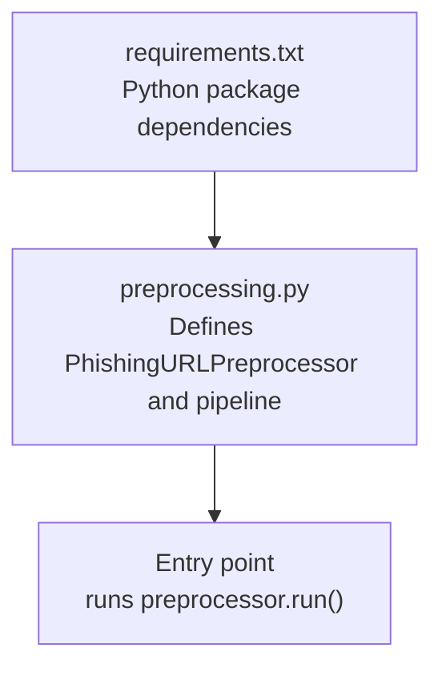
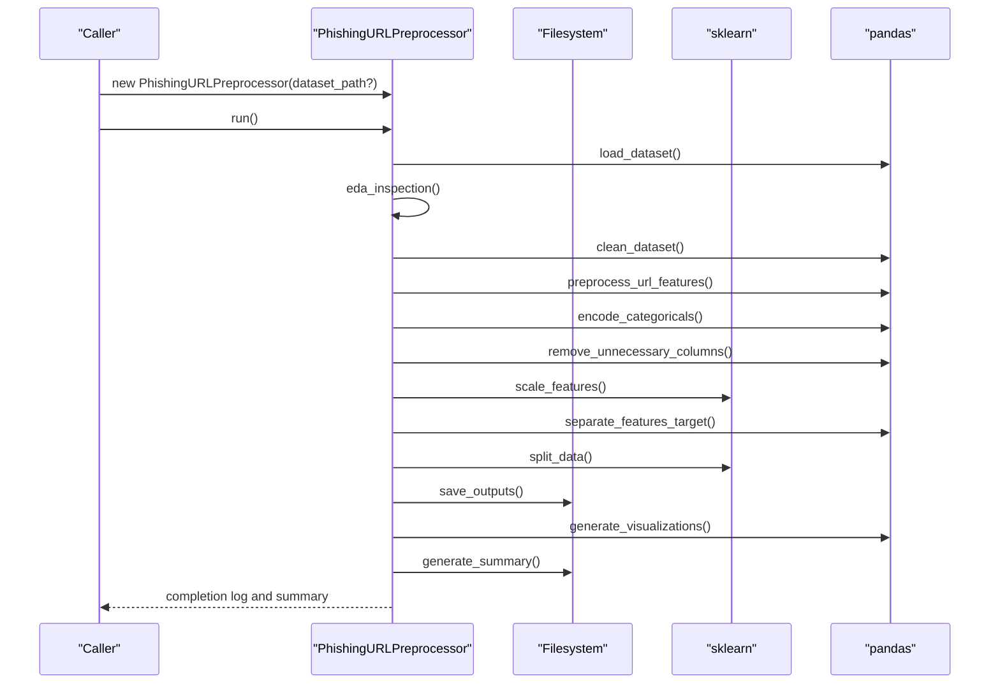
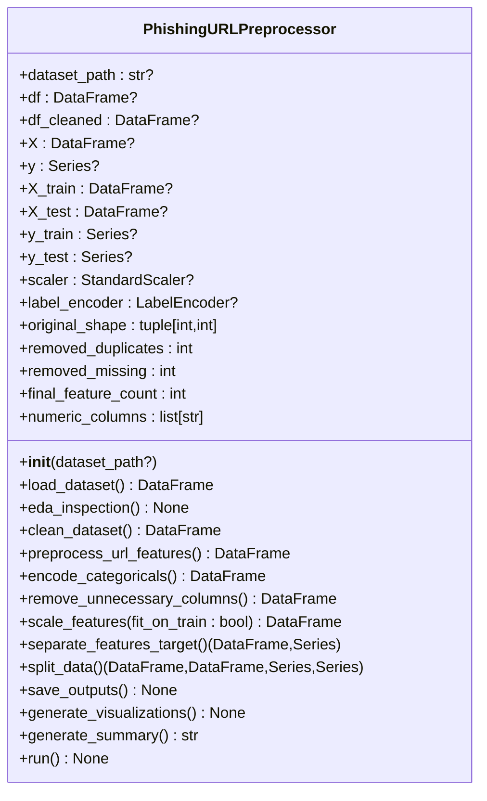
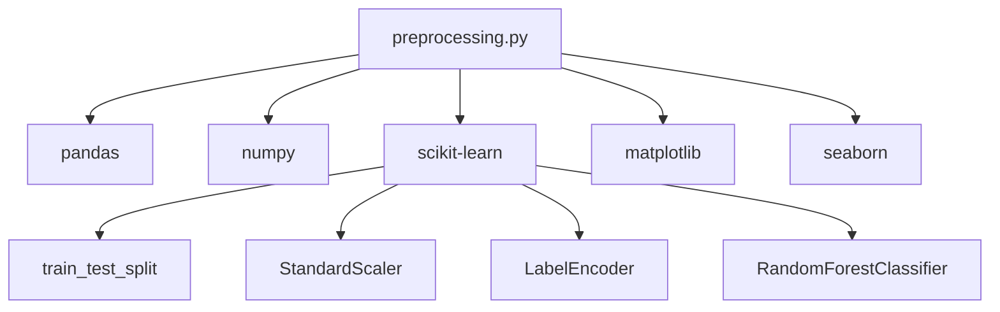

# Core Functionality

<cite>
**Referenced Files in This Document**
- [preprocessing.py](file://preprocessing.py)
- [requirements.txt](file://requirements.txt)
</cite>

## Table of Contents
1. [Introduction](#introduction)
2. [Project Structure](#project-structure)
3. [Core Components](#core-components)
4. [Architecture Overview](#architecture-overview)
5. [Detailed Component Analysis](#detailed-component-analysis)
6. [Dependency Analysis](#dependency-analysis)
7. [Performance Considerations](#performance-considerations)
8. [Troubleshooting Guide](#troubleshooting-guide)
9. [Conclusion](#conclusion)
10. [Appendices](#appendices)

## Introduction
This document explains the core functionality of the PhishingURLPreprocessor class and its end-to-end preprocessing pipeline. It covers each stage from dataset loading and exploratory data analysis to data cleaning, URL feature engineering, categorical encoding, feature scaling, train/test split, saving outputs, and generating visualizations. It also documents configuration options, parameters, return values, and how the pipeline integrates with scikit-learn and pandas utilities. The goal is to make the pipeline understandable for beginners while providing sufficient technical depth for experienced data scientists.

## Project Structure
The project consists of a single preprocessing module that defines the PhishingURLPreprocessor class and a requirements file specifying dependencies.

**Diagram sources**
- [preprocessing.py](file://preprocessing.py)
- [requirements.txt](file://requirements.txt)

**Section sources**
- [preprocessing.py](file://preprocessing.py)
- [requirements.txt](file://requirements.txt)

## Core Components
- PhishingURLPreprocessor: A class encapsulating the entire preprocessing pipeline with methods for each stage and a master run method orchestrating the steps.
- Utility functions: Logging setup, directory creation, CSV auto-detection, and safe DataFrame persistence.
- Configuration constants: Random state, test size, output directories, and columns to drop.

Key responsibilities:
- Load and inspect dataset
- Perform EDA
- Clean data (remove missing/duplicates, validate labels, clip negatives)
- Engineer URL-specific features
- Encode categoricals (one-hot vs frequency)
- Drop unnecessary columns
- Scale numerical features
- Separate features and target
- Stratified train/test split
- Persist outputs and generate plots
- Produce a summary report

**Section sources**
- [preprocessing.py](file://preprocessing.py)

## Architecture Overview
The pipeline is a linear, stepwise process orchestrated by the run method. Each stage updates internal state (dataframes and encoders/scalers) and logs progress. The class maintains attributes for intermediate and final results to support downstream modeling.

**Diagram sources**
- [preprocessing.py](file://preprocessing.py)

## Detailed Component Analysis

### PhishingURLPreprocessor Class
The class encapsulates the preprocessing pipeline with explicit attributes for dataset state and preprocessing artifacts.

**Diagram sources**
- [preprocessing.py](file://preprocessing.py)

**Section sources**
- [preprocessing.py](file://preprocessing.py)

### Stage 1: Load & Inspect
- Purpose: Load CSV dataset and log basic metadata.
- Behavior:
  - Auto-detects CSV if no path provided.
  - Logs shape, columns, dtypes, missing values, duplicates, and class distribution.
  - Normalizes target column name to “label” if common variants are found.
- Parameters:
  - dataset_path: Optional[str]; defaults to auto-detected CSV.
- Returns:
  - pd.DataFrame: Loaded dataset.
- Notes:
  - Raises error if “label” is not found after checking alternatives.

**Section sources**
- [preprocessing.py](file://preprocessing.py)

### Stage 2: Exploratory Data Analysis (EDA)
- Purpose: Log descriptive statistics before cleaning.
- Behavior:
  - Memory usage, missing values summary, duplicate row count, target distribution, numeric columns summary.
- Parameters: None.
- Returns: None.
- Notes:
  - Uses pandas describe and value_counts internally.

**Section sources**
- [preprocessing.py](file://preprocessing.py)

### Stage 3: Data Cleaning
- Purpose: Remove noise and inconsistencies.
- Behavior:
  - Drop rows with any null values.
  - Drop duplicate rows.
  - Filter labels to valid values (assumes binary 0/1).
  - Clip negative counts for columns starting with “NoOf”, “Has”, “Is” to zero.
  - Encode target labels using LabelEncoder.
- Parameters: None.
- Returns:
  - pd.DataFrame: Cleaned dataset.
- Notes:
  - Updates internal counters for removed duplicates and missing rows.

**Section sources**
- [preprocessing.py](file://preprocessing.py)

### Stage 4: URL Feature Preprocessing & Engineering
- Purpose: Extract and engineer URL-specific features from raw URL and Domain columns.
- Behavior:
  - If “URL” exists:
    - Count dots in URL.
    - Count special characters in URL.
    - Presence of “@” and “//”.
    - Presence of “www.”.
    - Presence of suspicious TLDs (when “TLD” exists).
  - If “Domain” exists:
    - Count dots in domain.
    - Presence of hyphen in domain.
- Parameters: None.
- Returns:
  - pd.DataFrame: Dataset with new engineered features.
- Notes:
  - Uses pandas string accessor methods for counting and presence checks.
  - Logs each engineered feature.

**Section sources**
- [preprocessing.py](file://preprocessing.py)

### Stage 5: Encode Categorical Features
- Purpose: Convert non-numeric categorical columns into ML-compatible numeric representations.
- Behavior:
  - Identifies object/category columns.
  - Drops categorical columns that are in DROP_COLUMNS.
  - Low cardinality (<11): one-hot encode (no drop-first).
  - High cardinality: frequency encode (map value counts to new column, drop original).
- Parameters: None.
- Returns:
  - pd.DataFrame: Dataset with encoded categoricals.
- Notes:
  - Logs the encoding strategy per column.

**Section sources**
- [preprocessing.py](file://preprocessing.py)

### Stage 6: Remove Unnecessary Columns
- Purpose: Drop columns unsuitable for ML (e.g., identifiers).
- Behavior:
  - Drops columns listed in DROP_COLUMNS if present.
- Parameters: None.
- Returns:
  - pd.DataFrame: Dataset with unnecessary columns removed.
- Notes:
  - Logs which columns were dropped.

**Section sources**
- [preprocessing.py](file://preprocessing.py)

### Stage 7: Scale Numerical Features
- Purpose: Normalize numerical features.
- Behavior:
  - Detects numeric columns excluding “label”.
  - Applies StandardScaler to all numeric columns.
- Parameters:
  - fit_on_train: bool; placeholder comment indicates fitting on training data is recommended in production.
- Returns:
  - pd.DataFrame: Scaled dataset.
- Notes:
  - Stores numeric column names for reporting.

**Section sources**
- [preprocessing.py](file://preprocessing.py)

### Stage 8: Separate Features & Target
- Purpose: Split cleaned dataset into features (X) and target (y).
- Behavior:
  - Assigns y = “label” and X = cleaned dataset minus “label”.
  - Records final feature count.
- Parameters: None.
- Returns:
  - Tuple[pd.DataFrame, pd.Series]: X and y.
- Notes:
  - Logs shapes and final feature count.

**Section sources**
- [preprocessing.py](file://preprocessing.py)

### Stage 9: Train-Test Split with Stratification
- Purpose: Create balanced train/test splits.
- Behavior:
  - Uses stratify=y to preserve class distribution.
  - Sets shuffle=True and fixed random_state.
- Parameters: None.
- Returns:
  - Tuple[pd.DataFrame, pd.DataFrame, pd.Series, pd.Series]: X_train, X_test, y_train, y_test.
- Notes:
  - Logs class distributions for train and test sets.

**Section sources**
- [preprocessing.py](file://preprocessing.py)

### Stage 10: Save Processed Datasets
- Purpose: Persist outputs to disk.
- Behavior:
  - Ensures output directory exists.
  - Saves cleaned dataset (X and y combined), X_train, X_test, y_train, y_test.
- Parameters: None.
- Returns: None.
- Notes:
  - Uses a safe save function with error handling.

**Section sources**
- [preprocessing.py](file://preprocessing.py)

### Stage 11: EDA Visualizations
- Purpose: Generate diagnostic plots.
- Behavior:
  - Class distribution bar chart.
  - Top-30 feature correlation heatmap (by absolute correlation with label).
  - Top-25 feature importance via Random Forest on numeric features.
  - Histograms for selected URL-related features (if present).
- Parameters: None.
- Returns: None.
- Notes:
  - Uses matplotlib/seaborn; saves to plots directory.

**Section sources**
- [preprocessing.py](file://preprocessing.py)

### Stage 12: Preprocessing Summary Report
- Purpose: Produce a human-readable summary of the preprocessing run.
- Behavior:
  - Aggregates dataset overview, train/test split details, engineered features, scaling info, and output locations.
- Parameters: None.
- Returns:
  - str: Summary text.
- Notes:
  - Writes summary to output directory.

**Section sources**
- [preprocessing.py](file://preprocessing.py)

### Master Run Method
- Purpose: Execute the entire pipeline in order.
- Behavior:
  - Calls each stage in sequence and prints the generated summary.
- Parameters: None.
- Returns: None.
- Notes:
  - Logs timing and completion status.

**Section sources**
- [preprocessing.py](file://preprocessing.py)

## Dependency Analysis
External libraries and their roles:
- pandas: Data loading, transformations, EDA, and saving.
- numpy: Numerical operations and dtypes.
- scikit-learn: train_test_split, StandardScaler, LabelEncoder, RandomForestClassifier (for importance).
- matplotlib/seaborn: Visualization of distributions, correlations, and feature importances.

**Diagram sources**
- [preprocessing.py](file://preprocessing.py)
- [requirements.txt](file://requirements.txt)

**Section sources**
- [preprocessing.py](file://preprocessing.py)
- [requirements.txt](file://requirements.txt)

## Performance Considerations
- String operations on large datasets: URL feature engineering uses pandas string accessor methods; ensure the dataset size is manageable or consider chunking if needed.
- One-hot encoding: For high-cardinality categorical features, frequency encoding is used to reduce dimensionality.
- Scaling: StandardScaler is applied to all numeric features; consider whether to fit only on training data in production.
- Visualization overhead: Generating plots adds I/O and computation time; disable or limit in resource-constrained environments.
- Logging: Excessive logging can slow down processing; adjust log level if needed.

[No sources needed since this section provides general guidance]

## Troubleshooting Guide
Common issues and resolutions:
- No CSV detected:
  - Ensure a CSV file exists in the working directory or pass dataset_path explicitly.
- Target column not found:
  - The loader attempts common variants; rename the target column to “label” if needed.
- Missing “URL” or “Domain”:
  - URL feature engineering will skip if these columns are absent; ensure they exist if you want engineered features.
- No numeric columns for scaling:
  - The scaler will warn and skip scaling; verify that numeric features remain after dropping unnecessary columns.
- Negative counts:
  - The cleaner clips negative counts to zero; confirm that your dataset does not contain invalid negative values.
- Imbalanced classes:
  - Stratified splitting preserves class balance; verify distributions in the summary report.

**Section sources**
- [preprocessing.py](file://preprocessing.py)

## Conclusion
The PhishingURLPreprocessor class provides a robust, modular, and production-ready pipeline for preparing phishing URL datasets. It integrates pandas for data manipulation, scikit-learn for preprocessing and splitting, and matplotlib/seaborn for diagnostics. By following the documented stages, parameters, and return values, users can reproduce the preprocessing workflow and adapt it to their own datasets.

[No sources needed since this section summarizes without analyzing specific files]

## Appendices

### Configuration Options and Parameters
- Constants:
  - RANDOM_STATE: Seed for reproducibility.
  - TEST_SIZE: Proportion of data for testing.
  - OUTPUT_DIR: Directory for saved outputs.
  - PLOTS_DIR: Directory for generated plots.
  - SUMMARY_FILE: Name of the summary report filename.
  - DROP_COLUMNS: Columns to remove during preprocessing.
- Class constructor:
  - dataset_path: Optional[str]; if omitted, the pipeline auto-detects the largest CSV in the directory.

**Section sources**
- [preprocessing.py](file://preprocessing.py)

### Data Flow Between Stages
- Internal state transitions:
  - After load_dataset: self.df holds the raw dataset.
  - After clean_dataset: self.df_cleaned holds cleaned data.
  - After preprocess_url_features: self.df_cleaned augmented with URL-derived features.
  - After encode_categoricals: self.df_cleaned with encoded categoricals.
  - After remove_unnecessary_columns: self.df_cleaned with DROP_COLUMNS removed.
  - After scale_features: self.df_cleaned scaled numerics; scaler stored.
  - After separate_features_target: self.X and self.y prepared.
  - After split_data: self.X_train, self.X_test, self.y_train, self.y_test prepared.
  - After save_outputs: persisted artifacts in output directory.
  - After generate_visualizations: plots saved in plots directory.
  - After generate_summary: summary written to output directory.

**Section sources**
- [preprocessing.py](file://preprocessing.py)