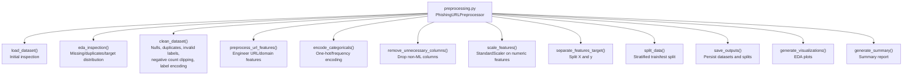
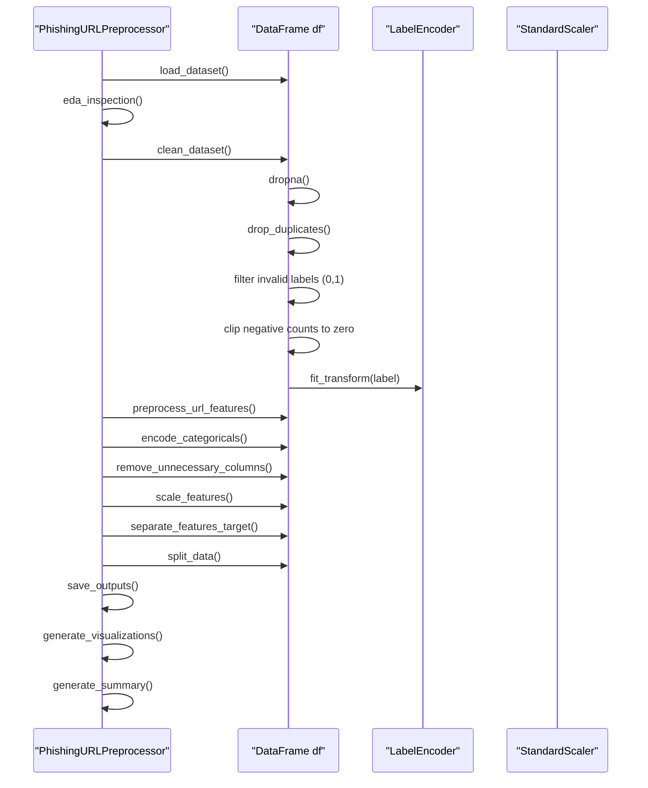
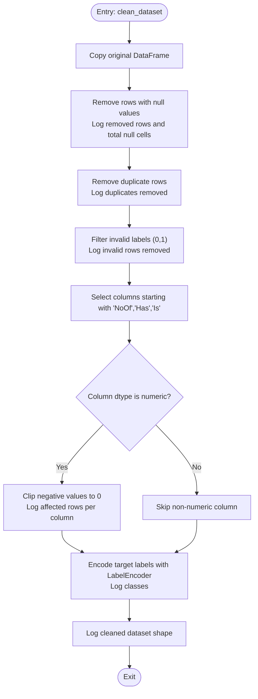
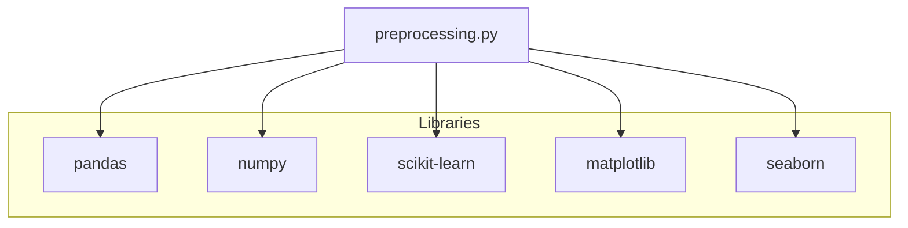

# Data Cleaning and Validation

<cite>
**Referenced Files in This Document**
- [preprocessing.py](file://preprocessing.py)
- [PhiUSIIL_Phishing_URL_Dataset.csv](file://PhiUSIIL_Phishing_URL_Dataset.csv)
- [requirements.txt](file://requirements.txt)
</cite>

## Table of Contents
1. [Introduction](#introduction)
2. [Project Structure](#project-structure)
3. [Core Components](#core-components)
4. [Architecture Overview](#architecture-overview)
5. [Detailed Component Analysis](#detailed-component-analysis)
6. [Dependency Analysis](#dependency-analysis)
7. [Performance Considerations](#performance-considerations)
8. [Troubleshooting Guide](#troubleshooting-guide)
9. [Conclusion](#conclusion)

## Introduction
This document explains the comprehensive data cleaning and validation pipeline implemented for the PhiUSIIL Phishing URL Dataset. It focuses on the clean_dataset method, detailing how null values are removed, duplicate rows are eliminated, invalid labels are filtered, and negative values are clipped for count-like columns. It also documents the LabelEncoder integration for target variable encoding and the systematic approach to data quality validation. Concrete examples from the actual codebase illustrate how the pipeline handles different types of data issues, and the logging messages show the impact on dataset dimensions. Edge cases are addressed with clear rationale for each cleaning decision.

## Project Structure
The preprocessing pipeline is implemented as a single module with a dedicated class orchestrating the entire workflow. The dataset is a CSV file containing URL-related features and a target label indicating legitimate or phishing URLs. The pipeline loads the dataset, inspects it, cleans it, engineers features, encodes categoricals, scales numerical features, separates features and targets, performs a stratified train/test split, saves outputs, generates visualizations, and produces a summary report.

**Diagram sources**
- [preprocessing.py:112-688](file://preprocessing.py#L112-L688)

**Section sources**
- [preprocessing.py:112-688](file://preprocessing.py#L112-L688)
- [PhiUSIIL_Phishing_URL_Dataset.csv:1-200](file://PhiUSIIL_Phishing_URL_Dataset.csv#L1-L200)

## Core Components
- PhishingURLPreprocessor: Central orchestrator class managing the end-to-end pipeline.
- clean_dataset: Core method performing data quality checks and transformations.
- LabelEncoder integration: Encodes target labels for downstream modeling.
- Logging: Comprehensive logging for each step, including counts of removed rows and shape changes.
- Data quality validation: Missing values, duplicates, invalid labels, and negative counts are systematically handled.

Key responsibilities:
- Load and inspect dataset.
- Validate and clean data.
- Engineer and encode features.
- Scale numerical features.
- Split data and persist outputs.
- Generate visualizations and summary reports.

**Section sources**
- [preprocessing.py:112-688](file://preprocessing.py#L112-L688)

## Architecture Overview
The pipeline follows a modular, stepwise approach. Each stage logs progress and impacts on dataset dimensions. The clean_dataset method is the cornerstone of data quality validation, ensuring the dataset is ready for machine learning.

**Diagram sources**
- [preprocessing.py:138-688](file://preprocessing.py#L138-L688)

## Detailed Component Analysis

### clean_dataset Method Implementation
The clean_dataset method performs four primary operations to ensure data quality and ML readiness:

1) Null value removal
- Drops rows with any missing values.
- Logs total removed rows and total null cells before and after.

2) Duplicate row elimination
- Removes exact duplicate rows.
- Logs the number of duplicates removed.

3) Invalid label filtering
- Ensures the target column contains only valid class labels (assumed to be 0 and 1 for binary classification).
- Removes rows with invalid labels and logs the count removed.

4) Negative value clipping for count columns
- Identifies columns whose names start with prefixes commonly used for counts (e.g., “NoOf”, “Has”, “Is”).
- For numeric columns among these, clips negative values to zero and logs how many were corrected.

5) Target label encoding
- Uses LabelEncoder to transform the target labels into integers.
- Logs the resulting class labels.

6) Final dataset shape logging
- Logs the shape of the cleaned dataset.

**Diagram sources**
- [preprocessing.py:206-257](file://preprocessing.py#L206-L257)

**Section sources**
- [preprocessing.py:206-257](file://preprocessing.py#L206-L257)

### LabelEncoder Integration for Target Variable Encoding
- A new LabelEncoder instance is created and fitted on the target column (converted to string to ensure compatibility).
- The transformed integer-encoded labels replace the original target column.
- The encoder’s classes are logged for verification.

Rationale:
- Many ML libraries expect integer-encoded targets for classification tasks.
- Using LabelEncoder ensures consistent encoding across runs and preserves class identity.

Impact:
- The target column becomes integer-valued (0 and 1 for binary classification).
- Subsequent steps (scaling, splitting, modeling) operate on numeric targets.

**Section sources**
- [preprocessing.py:250-253](file://preprocessing.py#L250-L253)

### Systematic Approach to Data Quality Validation
The pipeline validates data quality through:
- Initial inspection: shape, dtypes, missing values, duplicates, and target distribution.
- EDA summary: missing counts, duplicates, target proportions, and numeric summaries.
- Cleaning phase: explicit removal/clipping and logging of changes.
- Post-cleaning inspection: final dataset shape and feature counts.

Logging messages capture:
- Original and cleaned shapes.
- Number of rows removed due to nulls and duplicates.
- Number of invalid labels removed.
- Number of negative values clipped per count column.
- Encoded target classes.
- Numeric features scaled.

These logs enable auditable tracking of data transformations and their impact on dataset dimensions.

**Section sources**
- [preprocessing.py:138-202](file://preprocessing.py#L138-L202)
- [preprocessing.py:214-257](file://preprocessing.py#L214-L257)

### Concrete Examples from the Codebase
- Null value removal: The method drops rows with any missing values and logs the total number of removed rows and total null cells.
- Duplicate row elimination: Exact duplicates are removed and the count is logged.
- Invalid label filtering: Rows with labels outside {0, 1} are removed and logged.
- Negative value clipping: For columns starting with “NoOf”, “Has”, or “Is” and having numeric dtype, negative values are clipped to zero and the count of clipped values is logged.
- Target label encoding: The target column is encoded using LabelEncoder and the resulting classes are logged.

These behaviors are implemented in the clean_dataset method and validated by the logging statements.

**Section sources**
- [preprocessing.py:221-248](file://preprocessing.py#L221-L248)
- [preprocessing.py:250-253](file://preprocessing.py#L250-L253)

### Edge Cases and Rationale
- Missing target column: The loader attempts to rename common alternative names to “label”; if none are found, it raises an error. This prevents silent failures during downstream steps.
- Mixed-type count columns: Only numeric columns matching the “NoOf*/Has*/Is*” naming convention are processed for negative clipping. Non-numeric columns are skipped.
- Non-binary labels: Only labels 0 and 1 are retained; others are removed. This ensures strict binary classification for downstream modeling.
- Negative counts: Clipping to zero is conservative and safe for count-like features; it avoids introducing noise from extreme negatives.
- Empty dataset after cleaning: While not explicitly handled, the logging will reflect zero rows, and subsequent steps will fail gracefully with informative errors.

Rationale:
- Consistency and safety: The pipeline prioritizes predictable, reproducible transformations.
- Transparency: Every change is logged for traceability.
- Robustness: Common pitfalls (mixed labels, negative counts) are proactively addressed.

**Section sources**
- [preprocessing.py:155-163](file://preprocessing.py#L155-L163)
- [preprocessing.py:241-248](file://preprocessing.py#L241-L248)

## Dependency Analysis
The pipeline relies on external libraries for data manipulation, preprocessing, and visualization. The requirements file specifies the minimum versions for pandas, numpy, scikit-learn, matplotlib, and seaborn.

**Diagram sources**
- [requirements.txt:1-6](file://requirements.txt#L1-L6)
- [preprocessing.py:19-29](file://preprocessing.py#L19-L29)

**Section sources**
- [requirements.txt:1-6](file://requirements.txt#L1-L6)
- [preprocessing.py:19-29](file://preprocessing.py#L19-L29)

## Performance Considerations
- Memory usage: The EDA inspection logs memory usage to help assess feasibility for large datasets.
- Numerical scaling: StandardScaler is applied only to numeric columns, excluding the target, to avoid data leakage.
- One-hot vs frequency encoding: Low-cardinality categoricals are one-hot encoded; high-cardinality ones are frequency encoded to reduce dimensionality.
- Headless plotting: Matplotlib is configured to use a non-interactive backend for headless environments.

Practical tips:
- For very large datasets, consider chunked processing or sampling during development.
- Ensure sufficient disk space for saving outputs and plots.
- Monitor memory usage during scaling and visualization generation.

**Section sources**
- [preprocessing.py:178-181](file://preprocessing.py#L178-L181)
- [preprocessing.py:386-398](file://preprocessing.py#L386-L398)
- [preprocessing.py:335-347](file://preprocessing.py#L335-L347)
- [preprocessing.py:22-24](file://preprocessing.py#L22-L24)

## Troubleshooting Guide
Common issues and resolutions:
- No CSV detected: The auto-detection raises a FileNotFoundError if no CSV is found. Place the dataset in the working directory or specify the path explicitly.
- Target column not found: The loader tries common alternative names; if none match, it raises an error. Ensure the dataset contains a valid target column.
- Empty dataset after cleaning: If all rows are removed due to invalid labels or missing values, the pipeline will log zero rows. Review logs and adjust filters.
- Missing outputs: Ensure the output directory exists and permissions are sufficient; the pipeline creates directories automatically but still requires write access.
- Plot generation failures: Confirm matplotlib backend compatibility and available disk space for saving plots.

Where to look:
- Auto-detection and error messages for dataset loading.
- Logging statements for each cleaning step.
- Summary report for final dataset dimensions and feature counts.

**Section sources**
- [preprocessing.py:82-96](file://preprocessing.py#L82-L96)
- [preprocessing.py:155-163](file://preprocessing.py#L155-L163)
- [preprocessing.py:214-257](file://preprocessing.py#L214-L257)
- [preprocessing.py:590-656](file://preprocessing.py#L590-L656)

## Conclusion
The data cleaning and validation pipeline provides a robust, transparent, and auditable approach to preparing the PhiUSIIL Phishing URL Dataset for machine learning. The clean_dataset method systematically removes nulls and duplicates, filters invalid labels, clips negative counts for count-like features, and encodes targets using LabelEncoder. Comprehensive logging tracks the impact on dataset dimensions and data quality. The pipeline’s modular design, clear separation of concerns, and detailed reporting make it accessible to beginners while offering sufficient technical depth for data quality assessment and troubleshooting.