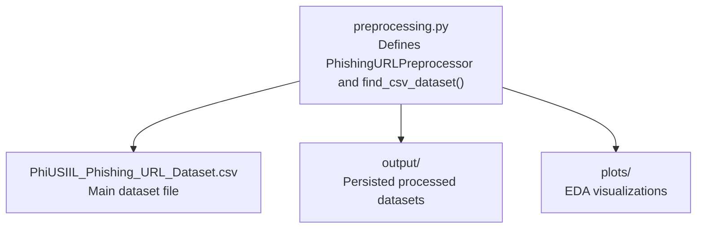
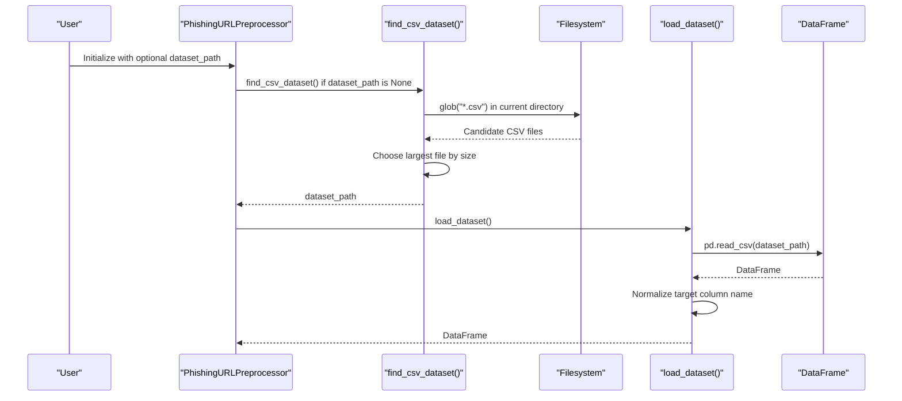
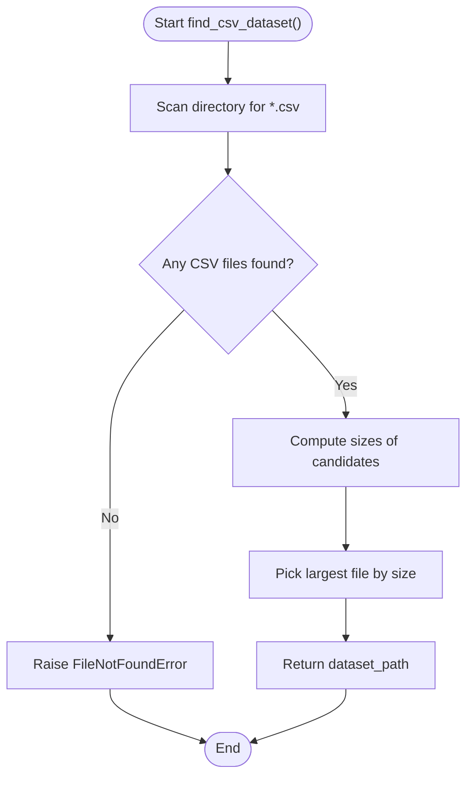
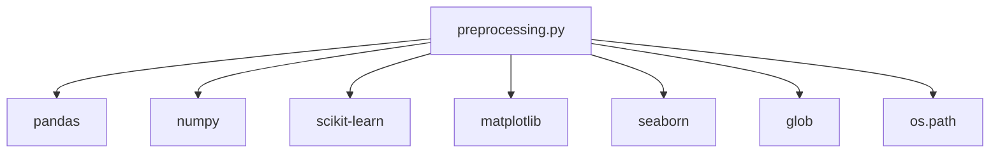

# Dataset Loading and Detection

<cite>
**Referenced Files in This Document**
- [preprocessing.py](file://preprocessing.py)
- [PhiUSIIL_Phishing_URL_Dataset.csv](file://PhiUSIIL_Phishing_URL_Dataset.csv)
- [requirements.txt](file://requirements.txt)
</cite>

## Table of Contents
1. [Introduction](#introduction)
2. [Project Structure](#project-structure)
3. [Core Components](#core-components)
4. [Architecture Overview](#architecture-overview)
5. [Detailed Component Analysis](#detailed-component-analysis)
6. [Dependency Analysis](#dependency-analysis)
7. [Performance Considerations](#performance-considerations)
8. [Troubleshooting Guide](#troubleshooting-guide)
9. [Conclusion](#conclusion)

## Introduction
This document explains the dataset loading and automatic detection functionality used by the phishing URL preprocessing pipeline. It focuses on how the system automatically discovers CSV datasets, selects the main dataset among multiple candidates, and handles various naming conventions for the target column. The goal is to make the implementation approachable for beginners while providing precise technical details about the file discovery mechanism.

## Project Structure
The project consists of a preprocessing pipeline script and a dataset file. The preprocessing module defines the dataset auto-detection logic and integrates with the rest of the pipeline.

**Diagram sources**
- [preprocessing.py](file://preprocessing.py)
- [PhiUSIIL_Phishing_URL_Dataset.csv](file://PhiUSIIL_Phishing_URL_Dataset.csv)

**Section sources**
- [preprocessing.py](file://preprocessing.py)
- [PhiUSIIL_Phishing_URL_Dataset.csv](file://PhiUSIIL_Phishing_URL_Dataset.csv)

## Core Components
- PhishingURLPreprocessor: Orchestrates the end-to-end preprocessing pipeline, including dataset loading, inspection, cleaning, feature engineering, encoding, scaling, splitting, saving outputs, and generating reports.
- find_csv_dataset(): Scans a directory for CSV files and selects the largest one as the main dataset candidate.
- Automatic target column normalization: Detects common variations of the target column name and renames them to a canonical form.

Key behaviors:
- Automatic CSV detection using glob patterns.
- Preference for the largest CSV file as the main dataset.
- Robust error handling when no CSV files are found.
- Flexible target column naming conventions.

**Section sources**
- [preprocessing.py](file://preprocessing.py)

## Architecture Overview
The dataset loading and detection workflow is integrated into the PhishingURLPreprocessor initialization and the dataset loading step.

**Diagram sources**
- [preprocessing.py](file://preprocessing.py)

## Detailed Component Analysis

### PhishingURLPreprocessor Initialization
- Constructor behavior:
  - Accepts an optional dataset_path argument.
  - If dataset_path is None, invokes find_csv_dataset() to auto-detect the dataset.
  - Stores the resolved dataset_path and initializes internal state for the pipeline.

- Why this matters:
  - Enables flexible usage: either pass a known path or rely on auto-detection.
  - Keeps the rest of the pipeline agnostic of the dataset source.

**Section sources**
- [preprocessing.py](file://preprocessing.py)

### Automatic CSV File Detection with find_csv_dataset()
- Directory scanning:
  - Uses glob to match all files ending with .csv in the specified directory.
  - Raises a clear error if no CSV files are found.

- Selection strategy:
  - Chooses the largest CSV file by size.
  - Assumes the largest file is the main dataset, which is practical for typical datasets where a single large file contains the primary data.

- Fallback behavior:
  - If multiple CSV files exist, the largest is preferred.
  - If no CSV files are present, a FileNotFoundError is raised.

- Practical implications:
  - Place the main dataset in the working directory so it is detected automatically.
  - If multiple datasets exist, ensure the main dataset is the largest to avoid mis-selection.

**Diagram sources**
- [preprocessing.py](file://preprocessing.py)

**Section sources**
- [preprocessing.py](file://preprocessing.py)

### Handling Multiple CSV Files in the Root Directory
- Scenario:
  - Multiple CSV files exist in the root directory.
- Behavior:
  - The auto-detection scans all CSV files and selects the largest one.
- Example:
  - If a small metadata CSV and the main dataset CSV coexist, the main dataset is chosen because it is larger.
- Best practice:
  - Keep only one large dataset CSV in the root directory to avoid ambiguity.

**Section sources**
- [preprocessing.py](file://preprocessing.py)

### Automatic Detection Workflow
- Step-by-step:
  - Initialize PhishingURLPreprocessor without specifying dataset_path.
  - The constructor calls find_csv_dataset() to locate the dataset.
  - The loader reads the CSV and performs initial inspection.
  - The loader normalizes the target column name to a canonical form.

- Why this works:
  - The pipeline is designed to be hands-free for common setups.
  - The selection logic favors the most likely main dataset.

**Section sources**
- [preprocessing.py](file://preprocessing.py)

### Target Column Normalization
- Purpose:
  - Ensure the target column is consistently named for downstream processing.
- Mechanism:
  - If the canonical "label" column is missing, the loader checks for common variants (e.g., "Label", "LABEL", "class", "Class", "CLASS", "target", "Target").
  - Renames the first matching variant to "label".
  - Raises an error if none of the expected names are found.

- Benefits:
  - Supports datasets with varying column naming conventions.
  - Reduces manual preprocessing steps.

**Section sources**
- [preprocessing.py](file://preprocessing.py)

### Error Handling for Missing Datasets
- Symptom:
  - FileNotFoundError indicating no CSV files were found in the directory.
- Resolution:
  - Place a CSV dataset in the working directory.
  - Ensure the dataset is the largest file if multiple CSVs exist.
  - Verify the dataset contains the expected target column or rename it accordingly.

**Section sources**
- [preprocessing.py](file://preprocessing.py)

## Dependency Analysis
- External libraries:
  - pandas for CSV loading and data manipulation.
  - numpy for numerical operations.
  - scikit-learn for preprocessing and modeling utilities.
  - matplotlib and seaborn for visualization.
- Internal dependencies:
  - find_csv_dataset() depends on glob and os.path for filesystem operations.
  - PhishingURLPreprocessor depends on pandas for DataFrame operations and scikit-learn for scaling and encoding.

**Diagram sources**
- [preprocessing.py](file://preprocessing.py)
- [requirements.txt](file://requirements.txt)

**Section sources**
- [preprocessing.py](file://preprocessing.py)
- [requirements.txt](file://requirements.txt)

## Performance Considerations
- Filesystem scanning:
  - glob is efficient for small to moderate numbers of files.
  - For very large directories, consider limiting the search scope or providing dataset_path explicitly.
- Memory usage:
  - Large CSV files can consume significant memory when loaded into a DataFrame.
  - Consider chunking or optimizing data types if memory becomes a constraint.
- Selection cost:
  - Computing file sizes is O(n) with respect to the number of CSV candidates.
  - This is negligible compared to CSV loading and preprocessing.

## Troubleshooting Guide
Common issues and resolutions:
- No CSV files found:
  - Ensure a CSV dataset exists in the working directory.
  - Confirm the filename ends with .csv.
- Wrong dataset selected:
  - If multiple CSVs exist, ensure the main dataset is the largest.
  - Alternatively, pass dataset_path explicitly to the constructor.
- Target column not recognized:
  - Rename the target column to "label" or ensure it matches one of the supported variants.
- Unexpected errors during loading:
  - Verify the CSV is well-formed and contains the expected columns.
  - Check for encoding issues or malformed rows.

**Section sources**
- [preprocessing.py](file://preprocessing.py)

## Conclusion
The dataset loading and automatic detection mechanism provides a robust, beginner-friendly way to load and normalize phishing URL datasets. By leveraging glob-based scanning and preferring the largest CSV file, the system reliably identifies the main dataset. The target column normalization ensures consistent handling across datasets with varying naming conventions. For best results, keep a single large dataset CSV in the working directory and ensure the target column follows the expected naming scheme.