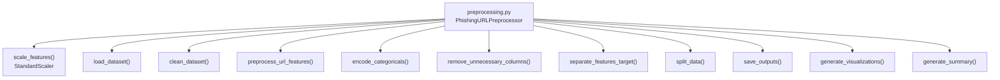
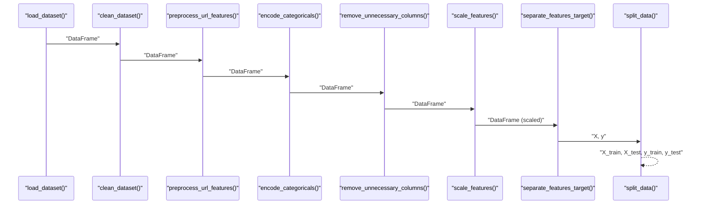
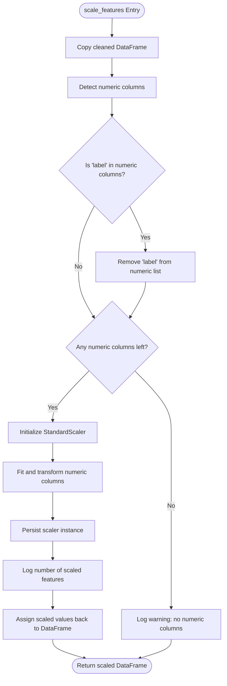
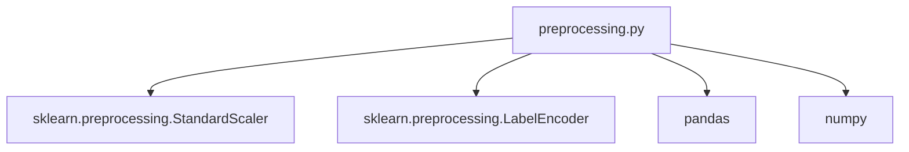

# Feature Scaling and Normalization

<cite>
**Referenced Files in This Document**
- [preprocessing.py](file://preprocessing.py)
- [requirements.txt](file://requirements.txt)
</cite>

## Table of Contents
1. [Introduction](#introduction)
2. [Project Structure](#project-structure)
3. [Core Components](#core-components)
4. [Architecture Overview](#architecture-overview)
5. [Detailed Component Analysis](#detailed-component-analysis)
6. [Dependency Analysis](#dependency-analysis)
7. [Performance Considerations](#performance-considerations)
8. [Troubleshooting Guide](#troubleshooting-guide)
9. [Conclusion](#conclusion)
10. [Appendices](#appendices)

## Introduction
This document explains the numerical feature scaling and normalization process implemented in the phishing URL detection preprocessing pipeline. It focuses on the scale_features method that applies StandardScaler for z-score normalization, the automatic detection of numerical columns while excluding the target variable, and the handling of datasets with no numeric features. It also covers the persistence of the scaler object for future use and the logging of scaling operations. Practical examples illustrate how the pipeline transforms numerical features, and the mathematical basis for standardization is explained. Finally, it addresses implications for machine learning algorithms, the importance of consistent scaling across train/test sets, edge cases such as constant features and mixed data types, and best practices for robust preprocessing.

## Project Structure
The preprocessing pipeline is implemented as a single module with a cohesive class-based design. The feature scaling logic resides in the PhishingURLPreprocessor class, specifically in the scale_features method. Supporting components include logging configuration, dataset loading, cleaning, feature engineering, categorical encoding, column removal, train/test splitting, saving outputs, and visualization/reporting.

**Diagram sources**
- [preprocessing.py](file://preprocessing.py)

**Section sources**
- [preprocessing.py](file://preprocessing.py)

## Core Components
- PhishingURLPreprocessor: Orchestrates the end-to-end preprocessing pipeline, including loading, cleaning, feature engineering, encoding, scaling, splitting, saving, and reporting.
- scale_features: Applies StandardScaler to numerical features, automatically detects numeric columns excluding the target, logs operations, and persists the scaler for reuse.
- Logging: Centralized logging setup and step-wise logging for transparency and reproducibility.
- Scaler persistence: The scaler instance is stored in the class to enable consistent transformations in future runs.

Key implementation references:
- Scaler initialization and fit/transform: [scale_features:376-401](file://preprocessing.py#L376-L401)
- Automatic numeric column detection and exclusion of target: [scale_features:387-391](file://preprocessing.py#L387-L391)
- Logging of scaling operations: [scale_features](file://preprocessing.py#L398)
- Scaler persistence field: [PhishingURLPreprocessor.__init__:117-134](file://preprocessing.py#L117-L134)

**Section sources**
- [preprocessing.py:117-134](file://preprocessing.py#L117-L134)
- [preprocessing.py:376-401](file://preprocessing.py#L376-L401)

## Architecture Overview
The scaling stage sits between feature engineering and train/test split. It operates on the cleaned dataset to normalize numeric features, then separates features and target, and finally splits into train and test sets.

**Diagram sources**
- [preprocessing.py](file://preprocessing.py)
- [preprocessing.py](file://preprocessing.py)
- [preprocessing.py](file://preprocessing.py)
- [preprocessing.py](file://preprocessing.py)
- [preprocessing.py](file://preprocessing.py)
- [preprocessing.py](file://preprocessing.py)
- [preprocessing.py](file://preprocessing.py)

## Detailed Component Analysis

### StandardScaler-based Z-Score Normalization
The scale_features method applies StandardScaler to numeric features. It:
- Detects numeric columns using dtype selection.
- Excludes the target variable from scaling.
- Creates a new StandardScaler instance and fits/transforms the selected columns.
- Logs the number of scaled features.
- Persists the scaler instance for potential future use.

**Diagram sources**
- [preprocessing.py:376-401](file://preprocessing.py#L376-L401)

**Section sources**
- [preprocessing.py:376-401](file://preprocessing.py#L376-L401)

### Automatic Detection of Numerical Columns Excluding the Target
- Numeric detection: Uses dtype-based selection to identify numeric columns.
- Target exclusion: Explicitly removes the target variable from the list of columns to be scaled.
- Edge case handling: If no numeric columns remain after exclusion, the method logs a warning and returns the DataFrame unchanged.

References:
- Numeric detection and target exclusion: [scale_features:387-391](file://preprocessing.py#L387-L391)
- No numeric columns branch: [scale_features:392-394](file://preprocessing.py#L392-L394)

**Section sources**
- [preprocessing.py:387-394](file://preprocessing.py#L387-L394)

### Scaler Persistence and Future Use
- The scaler instance is stored in the class attribute for potential reuse in downstream tasks (e.g., transforming new data consistently).
- The summary report documents the scaler used and the number of numerical columns scaled.

References:
- Scaler persistence field: [PhishingURLPreprocessor.__init__](file://preprocessing.py#L127)
- Scaler assignment: [scale_features](file://preprocessing.py#L396)
- Summary report inclusion: [generate_summary:628-631](file://preprocessing.py#L628-L631)

**Section sources**
- [preprocessing.py](file://preprocessing.py#L127)
- [preprocessing.py](file://preprocessing.py#L396)
- [preprocessing.py:628-631](file://preprocessing.py#L628-L631)

### Logging of Scaling Operations
- Step-level logging announces the scaling stage.
- After scaling, the method logs the number of numerical features transformed.
- A warning is logged when no numeric columns are found.

References:
- Stage logging: [scale_features:382-384](file://preprocessing.py#L382-L384)
- Scaled features count: [scale_features](file://preprocessing.py#L398)
- Warning for no numeric columns: [scale_features](file://preprocessing.py#L393)

**Section sources**
- [preprocessing.py:382-398](file://preprocessing.py#L382-L398)

### Mathematical Basis for Standardization (Z-Score)
Standardization transforms each numeric feature to have zero mean and unit variance:
- Mean centering: subtract the feature’s mean.
- Unit variance scaling: divide by the feature’s standard deviation.

This ensures that features contribute equally to distance-based algorithms and gradient-based optimization, improving convergence and stability.

[No sources needed since this section explains general mathematical concepts]

### Implications for Machine Learning Algorithms
- Distance-based algorithms (e.g., k-NN, SVM) benefit from standardized features because they rely on distances that become dominated by features with larger scales otherwise.
- Gradient-based optimizers (e.g., neural networks, logistic regression) converge faster and more reliably with standardized inputs.
- Tree-based models are less sensitive to scaling, but standardization can still improve numerical stability and consistency across pipelines.

[No sources needed since this section provides general guidance]

### Consistent Scaling Across Train/Test Sets
- Best practice: fit the scaler only on training data and apply the same scaler to test data to avoid data leakage.
- Current implementation scales the entire cleaned dataset before splitting, which simplifies the pipeline but may introduce leakage. The method’s docstring acknowledges this and suggests fitting only on training data for production.

Reference:
- Docstring note on fitting on training data: [scale_features:379-381](file://preprocessing.py#L379-L381)

**Section sources**
- [preprocessing.py:379-381](file://preprocessing.py#L379-L381)

### Edge Cases and Robustness
- Constant features: StandardScaler divides by the standard deviation; constant features would yield division by zero. In scikit-learn, StandardScaler handles constant features by setting their standardized values to zeros and issuing a warning. The pipeline should log and monitor such cases during scaling.
- Mixed data types: The numeric detection filters out non-numeric columns, preventing errors during scaling.
- No numeric features: The method logs a warning and returns the DataFrame unchanged.

References:
- Numeric detection and exclusion: [scale_features:387-391](file://preprocessing.py#L387-L391)
- No numeric columns handling: [scale_features:392-394](file://preprocessing.py#L392-L394)

**Section sources**
- [preprocessing.py:387-394](file://preprocessing.py#L387-L394)

### Concrete Examples of Pipeline Transformations
- Example 1: A dataset with numeric features URLLength, NoOfDotsInURL, and label is scaled. The scaler centers and scales URLLength and NoOfDotsInURL while leaving label unchanged.
- Example 2: A dataset with only categorical features yields no scaling; the method logs a warning and returns the DataFrame unchanged.
- Example 3: A dataset with mixed types (numeric and object) scales only the numeric columns, excluding the target.

References:
- Numeric detection and scaling: [scale_features:387-398](file://preprocessing.py#L387-L398)

**Section sources**
- [preprocessing.py:387-398](file://preprocessing.py#L387-L398)

## Dependency Analysis
The preprocessing module depends on scikit-learn’s StandardScaler for scaling and LabelEncoder for target encoding. The pipeline uses pandas and numpy for data manipulation and NumPy’s numeric dtype detection for identifying numeric columns.

**Diagram sources**
- [preprocessing.py](file://preprocessing.py)
- [requirements.txt](file://requirements.txt)

**Section sources**
- [preprocessing.py](file://preprocessing.py)
- [requirements.txt](file://requirements.txt)

## Performance Considerations
- StandardScaler is efficient for typical tabular datasets and works well with sparse matrices when configured accordingly.
- For very large datasets, consider memory usage during fit/transform and ensure that only necessary numeric columns are processed.
- Persisting the scaler avoids recomputation and enables consistent transformations across datasets.

[No sources needed since this section provides general guidance]

## Troubleshooting Guide
Common issues and resolutions:
- No numeric columns found: Verify that the dataset contains numeric features and that the target variable is excluded. The method logs a warning and returns the DataFrame unchanged.
- Constant features causing instability: Monitor for warnings from StandardScaler and consider removing or transforming constant features before scaling.
- Data leakage risk: Fit the scaler only on training data and apply the same scaler to test data to avoid information leakage.

References:
- Warning for no numeric columns: [scale_features](file://preprocessing.py#L393)
- Scaler persistence and reuse: [PhishingURLPreprocessor.__init__](file://preprocessing.py#L127)
- Docstring note on training-only fitting: [scale_features:379-381](file://preprocessing.py#L379-L381)

**Section sources**
- [preprocessing.py](file://preprocessing.py#L393)
- [preprocessing.py](file://preprocessing.py#L127)
- [preprocessing.py:379-381](file://preprocessing.py#L379-L381)

## Conclusion
The preprocessing pipeline’s scale_features method provides a robust, transparent, and reusable approach to numerical feature scaling using StandardScaler. It automatically identifies numeric columns, excludes the target variable, logs operations, and persists the scaler for future use. While the current implementation scales the entire dataset before splitting, best practice recommends fitting the scaler only on training data to prevent leakage. Understanding the mathematical basis of standardization and addressing edge cases such as constant features and mixed data types ensures reliable preprocessing for machine learning workflows.

[No sources needed since this section summarizes without analyzing specific files]

## Appendices

### Appendix A: How to Extend the Pipeline for Production
- Fit-only-on-training scaling: Modify the pipeline to compute numeric columns post-split and fit the scaler on X_train only, then transform X_test with the persisted scaler.
- Persist the scaler: Serialize the fitted scaler (e.g., using joblib or pickle) alongside the model to ensure consistent transformations in production.
- Validation: Add checks to ensure the scaler is compatible with new data (same feature names and shapes).

[No sources needed since this section provides general guidance]