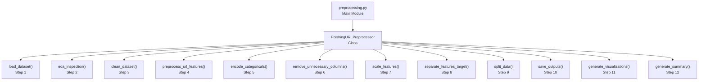
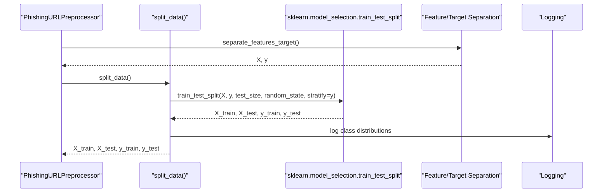
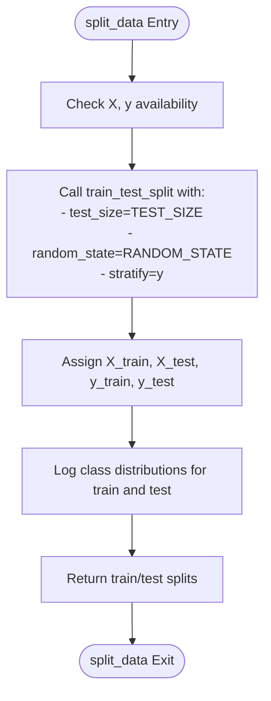
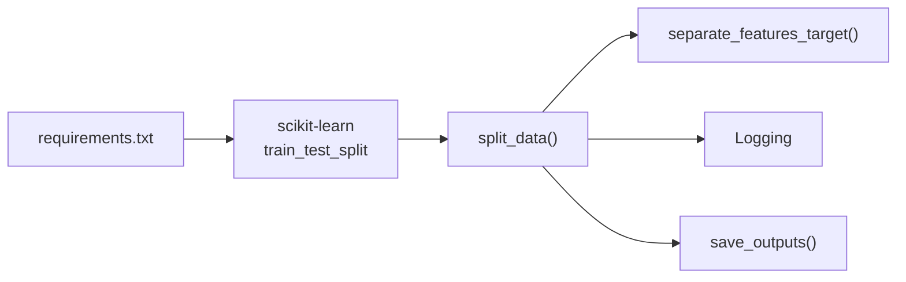

# Train-Test Split Strategy

<cite>
**Referenced Files in This Document**
- [preprocessing.py](file://preprocessing.py)
- [requirements.txt](file://requirements.txt)
- [X_test.csv](file://output/X_test.csv)
- [y_test.csv](file://output/y_test.csv)
</cite>

## Table of Contents
1. [Introduction](#introduction)
2. [Project Structure](#project-structure)
3. [Core Components](#core-components)
4. [Architecture Overview](#architecture-overview)
5. [Detailed Component Analysis](#detailed-component-analysis)
6. [Dependency Analysis](#dependency-analysis)
7. [Performance Considerations](#performance-considerations)
8. [Troubleshooting Guide](#troubleshooting-guide)
9. [Conclusion](#conclusion)

## Introduction
This document explains the stratified train-test split implementation used in the phishing URL detection pipeline. It focuses on how the `split_data` method preserves class balance using scikit-learn's `train_test_split` with stratification, how the configurable test size ratio is applied, and how a fixed random state ensures reproducibility. It also covers the systematic approach to maintaining data integrity during splitting, the logging of class distribution comparisons between train and test sets, and practical examples of handling imbalanced datasets. Finally, it addresses production considerations around fitting scalers only on training data versus the current simplified approach.

## Project Structure
The preprocessing pipeline is implemented as a single module with a comprehensive class-based architecture. The train-test split occurs as part of the end-to-end pipeline, immediately after separating features and targets.

**Diagram sources**
- [preprocessing.py:112-688](file://preprocessing.py#L112-L688)

**Section sources**
- [preprocessing.py:112-688](file://preprocessing.py#L112-L688)

## Core Components
The train-test split is encapsulated in the `split_data` method of the `PhishingURLPreprocessor` class. This method performs a stratified split to preserve the proportion of each class in both training and testing sets, uses a configurable test size ratio, and applies a fixed random state for reproducibility.

Key characteristics:
- Uses scikit-learn's `train_test_split` with `stratify=y`
- Configurable test size via a module-level constant
- Fixed random state for reproducible splits
- Logs class distributions for both training and testing sets
- Returns standardized train/test splits for downstream modeling

**Section sources**
- [preprocessing.py:425-445](file://preprocessing.py#L425-L445)
- [preprocessing.py:34-35](file://preprocessing.py#L34-L35)
- [preprocessing.py:34-35](file://preprocessing.py#L34-L35)

## Architecture Overview
The train-test split fits into the broader preprocessing pipeline as follows:

**Diagram sources**
- [preprocessing.py:406-445](file://preprocessing.py#L406-L445)
- [preprocessing.py:26-26](file://preprocessing.py#L26)

## Detailed Component Analysis

### Stratified Train-Test Split Implementation
The `split_data` method orchestrates the stratified split:

- **Stratification**: Ensures that the proportion of each class in the training set mirrors that in the test set, preventing class imbalance artifacts in either subset.
- **Configurable test size**: Controlled by a module-level constant, allowing easy adjustment of the proportion allocated to testing.
- **Fixed random state**: Guarantees identical splits across runs, essential for reproducible experiments and fair comparisons.
- **Data integrity**: The method separates features and targets before splitting, preserving the relationship between samples and labels.
- **Logging**: Prints shapes and class distributions for both training and testing sets, enabling quick verification of balance.

**Diagram sources**
- [preprocessing.py:425-445](file://preprocessing.py#L425-L445)
- [preprocessing.py:34-35](file://preprocessing.py#L34-L35)

**Section sources**
- [preprocessing.py:425-445](file://preprocessing.py#L425-L445)
- [preprocessing.py:34-35](file://preprocessing.py#L34-L35)

### Practical Example: Imbalanced Dataset Handling
The pipeline demonstrates robust handling of imbalanced datasets through stratification:

- **Preservation of class balance**: Even when the original dataset has unequal class frequencies, stratification ensures both training and testing sets reflect the same proportions.
- **Verification via logging**: The method logs class distributions for both sets, making it straightforward to confirm that stratification worked as intended.
- **Production implications**: In real-world scenarios, stratification prevents models from being biased toward majority classes during evaluation.

Concrete evidence from saved outputs:
- The test set CSV contains labeled samples, confirming that stratification preserved class labels across splits.
- The saved outputs include both feature matrices and target vectors for both training and testing sets.

**Section sources**
- [preprocessing.py:440-443](file://preprocessing.py#L440-L443)
- [preprocessing.py:464-467](file://preprocessing.py#L464-L467)
- [X_test.csv:1-20](file://output/X_test.csv#L1-L20)
- [y_test.csv:1-50](file://output/y_test.csv#L1-L50)

### Stratification Importance for Classification Tasks
Stratification is crucial for classification tasks because:
- **Accurate evaluation**: Without stratification, a small or absent minority class in the test set can lead to misleading performance metrics.
- **Representative sampling**: Ensures that both training and testing sets are representative of the population, improving generalization assessment.
- **Fair comparison**: Enables fair comparison of models across different datasets or experiments when class distributions vary.

### Production Considerations: Scaler Fitting Strategy
Current approach:
- The pipeline scales the entire cleaned dataset before splitting. While convenient, this can leak information from the test set into the scaler parameters, potentially inflating performance estimates.

Recommended production approach:
- Fit the scaler only on the training set, then transform both training and testing sets using the fitted scaler. This prevents data leakage and yields a more realistic evaluation of model performance.

Impact on reproducibility:
- The current fixed random state ensures reproducible splits, but the scaler fitting strategy should be adjusted to avoid contamination of the test set.

**Section sources**
- [preprocessing.py:376-401](file://preprocessing.py#L376-L401)
- [preprocessing.py:425-445](file://preprocessing.py#L425-L445)

## Dependency Analysis
The train-test split depends on external libraries and internal pipeline stages:

**Diagram sources**
- [preprocessing.py:26-26](file://preprocessing.py#L26)
- [preprocessing.py:406-445](file://preprocessing.py#L406-L445)
- [requirements.txt:1-6](file://requirements.txt#L1-L6)

**Section sources**
- [preprocessing.py:26-26](file://preprocessing.py#L26)
- [requirements.txt:1-6](file://requirements.txt#L1-L6)

## Performance Considerations
- Stratification overhead: The stratified split adds minimal computational cost compared to the overall pipeline.
- Memory footprint: Keeping the entire dataset in memory before splitting simplifies code but increases memory usage. For very large datasets, consider streaming or chunked approaches.
- Reproducibility benefits: Fixed random state ensures consistent results across runs, aiding debugging and experimentation.

## Troubleshooting Guide
Common issues and resolutions:
- **Unequal class distributions in test set**: Verify that stratification is enabled and that the target variable contains the expected classes.
- **Unexpected shapes**: Confirm that features and targets were separated correctly before splitting.
- **Reproducibility concerns**: Ensure the fixed random state remains unchanged and that no preprocessing steps inadvertently alter the order of samples.

Validation steps:
- Review logged class distributions for both training and testing sets.
- Compare saved outputs to confirm that both feature matrices and target vectors are present.

**Section sources**
- [preprocessing.py:440-443](file://preprocessing.py#L440-L443)
- [preprocessing.py:464-467](file://preprocessing.py#L464-L467)

## Conclusion
The stratified train-test split in this pipeline ensures balanced representation of classes in both training and testing sets, using a configurable test size ratio and a fixed random state for reproducibility. The implementation is straightforward and well-integrated into the preprocessing workflow, with clear logging to verify class distributions. For production-grade systems, consider adjusting the scaler fitting strategy to avoid data leakage and adopting more scalable approaches for very large datasets.