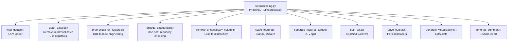
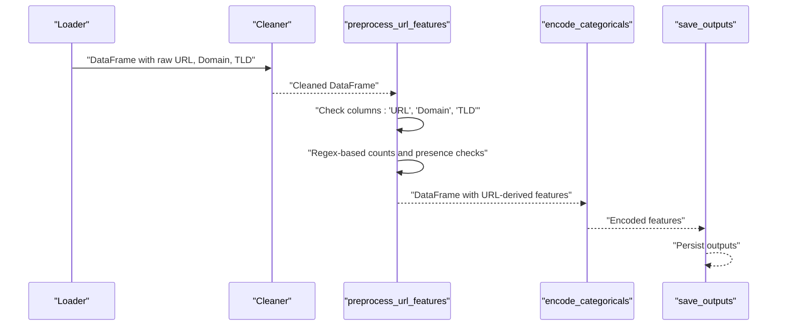
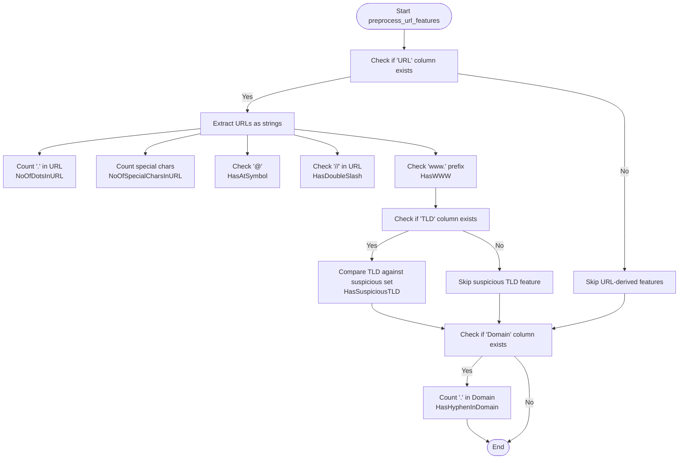
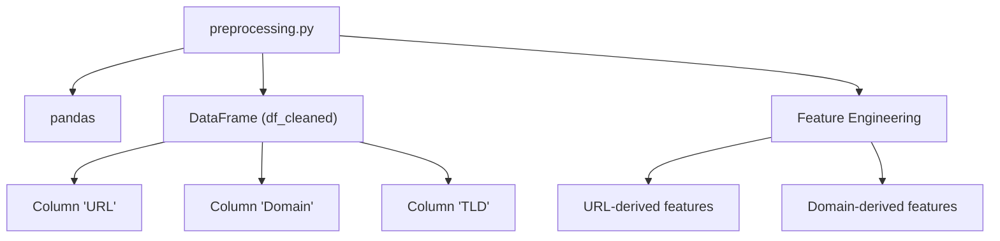

# URL Feature Engineering

<cite>
**Referenced Files in This Document**
- [preprocessing.py](file://preprocessing.py)
- [PhiUSIIL_Phishing_URL_Dataset.csv](file://PhiUSIIL_Phishing_URL_Dataset.csv)
- [requirements.txt](file://requirements.txt)
</cite>

## Table of Contents
1. [Introduction](#introduction)
2. [Project Structure](#project-structure)
3. [Core Components](#core-components)
4. [Architecture Overview](#architecture-overview)
5. [Detailed Component Analysis](#detailed-component-analysis)
6. [Dependency Analysis](#dependency-analysis)
7. [Performance Considerations](#performance-considerations)
8. [Troubleshooting Guide](#troubleshooting-guide)
9. [Conclusion](#conclusion)

## Introduction
This document explains the URL-specific feature engineering and preprocessing pipeline implemented in the phishing URL detection system. It focuses on the preprocess_url_features method, detailing how raw URL strings are transformed into robust numerical features. The guide covers:
- URL length analysis
- Dot counting
- Special character detection
- Suspicious symbol identification (@, //)
- WWW prefix detection
- Suspicious TLD identification
- Conditional feature engineering based on available columns (URL, Domain, TLD)
- Regex-based string analysis techniques
- Feature naming conventions and rationale
- Handling of missing URL data and fallback behavior

The goal is to make URL analysis techniques accessible to beginners while providing sufficient technical depth for practitioners.

## Project Structure
The preprocessing pipeline is encapsulated in a single module that orchestrates loading, cleaning, feature engineering, encoding, scaling, splitting, saving, and reporting. The dataset is a CSV with rich URL-related attributes, including URL, Domain, TLD, and derived metrics.

**Diagram sources**
- [preprocessing.py:112-688](file://preprocessing.py#L112-L688)

**Section sources**
- [preprocessing.py:112-688](file://preprocessing.py#L112-L688)
- [PhiUSIIL_Phishing_URL_Dataset.csv:1-200](file://PhiUSIIL_Phishing_URL_Dataset.csv#L1-L200)

## Core Components
This section highlights the URL feature engineering component and its surrounding pipeline stages.

- PhishingURLPreprocessor: Orchestrates the entire pipeline from loading to reporting.
- preprocess_url_features: The core method that extracts and engineers URL-related features conditionally based on available columns.
- Data cleaning and validation: Ensures data quality prior to feature engineering.
- Encoding and scaling: Prepares categorical and numerical features for modeling.

Key responsibilities:
- Detect presence of raw URL, Domain, and TLD columns and engineer features accordingly.
- Apply regex-based string analysis for counts and presence checks.
- Log feature engineering steps and handle missing data gracefully.

**Section sources**
- [preprocessing.py:112-688](file://preprocessing.py#L112-L688)
- [preprocessing.py:262-316](file://preprocessing.py#L262-L316)

## Architecture Overview
The URL feature engineering stage sits between data cleaning and categorical encoding. It conditionally enriches the dataset with new features derived from URL and Domain strings.

**Diagram sources**
- [preprocessing.py:262-316](file://preprocessing.py#L262-L316)
- [preprocessing.py:321-350](file://preprocessing.py#L321-L350)
- [preprocessing.py:450-470](file://preprocessing.py#L450-L470)

## Detailed Component Analysis

### preprocess_url_features: URL Feature Engineering
The method performs conditional feature engineering based on available columns. It transforms raw URL strings into numerical features using pandas vectorized string operations and regex patterns.

- Input assumptions:
  - df_cleaned: A cleaned DataFrame that may contain columns "URL", "Domain", and/or "TLD".
- Behavior:
  - If "URL" exists:
    - Count dots in the full URL.
    - Count special characters in the URL (non-alphanumeric except ".", "/", ":").
    - Presence checks for "@" and "//" symbols.
    - Presence check for "www." prefix.
    - If "TLD" exists, flag suspicious TLDs (e.g., tk, ml, ga, cf, top, xyz, bid, work, date, party, link, download).
  - If "Domain" exists:
    - Count dots in the domain.
    - Presence check for "-" in the domain.
- Output:
  - Returns the updated DataFrame with newly engineered features appended.

Feature naming conventions and rationale:
- NoOfDotsInURL: Counts "." occurrences; higher dot counts often indicate obfuscation or subdomain proliferation.
- NoOfSpecialCharsInURL: Counts non-alphanumeric characters except ".", "/", ":"; unusual special characters can signal malicious intent.
- HasAtSymbol: Binary indicator for "@" in URL; commonly abused in phishing.
- HasDoubleSlash: Binary indicator for "//"; suspicious double slash can imply protocol-relative or malformed URLs.
- HasWWW: Binary indicator for "www." prefix; benign but sometimes used in deceptive branding.
- HasSuspiciousTLD: Binary indicator for known abusive TLDs; helps identify high-risk domains.
- NoOfDotsInDomain: Counts "." in the domain part; multiple dots can imply subdomain abuse.
- HasHyphenInDomain: Binary indicator for "-" in domain; hyphens are common in deceptive domains.

Fallback behavior:
- If "URL" is missing, the method logs a warning and skips URL-derived features.
- If "Domain" or "TLD" are missing, those specific features are not generated.

Example transformations (conceptual):
- URL "https://www.example.com/path?param=value&other=123":
  - NoOfDotsInURL: counts "." in the entire URL string.
  - NoOfSpecialCharsInURL: counts "&", "=", "?" and others.
  - HasAtSymbol: 0 (no "@").
  - HasDoubleSlash: 1 (presence of "//").
  - HasWWW: 1 (prefix "www.").
  - HasSuspiciousTLD: depends on TLD value (e.g., com is not suspicious).
- Domain "subdomain.example.com":
  - NoOfDotsInDomain: counts "." in the domain.
  - HasHyphenInDomain: 0 (no "-").

**Diagram sources**
- [preprocessing.py:262-316](file://preprocessing.py#L262-L316)

**Section sources**
- [preprocessing.py:262-316](file://preprocessing.py#L262-L316)

### Conditional Feature Engineering Based on Available Columns
The method applies feature engineering selectively:
- URL-dependent features are created only when "URL" is present.
- Domain-dependent features are created only when "Domain" is present.
- TLD-dependent features are created only when "TLD" is present.

This ensures robustness when datasets vary in column availability.

**Section sources**
- [preprocessing.py:279-316](file://preprocessing.py#L279-L316)

### Regex-Based String Analysis Techniques
The implementation uses pandas string accessor methods with regex patterns:
- str.count(regex): Efficiently counts matches for patterns like "." and "[^a-zA-Z0-9\.\/:]".
- str.contains(regex, na=False): Detects presence of symbols with safe NA handling.
- Case normalization: TLD comparison uses lowercased values to reduce false negatives.

These techniques enable fast, vectorized transformations across large datasets.

**Section sources**
- [preprocessing.py:283-304](file://preprocessing.py#L283-L304)

### Suspicious TLD Identification
Known abusive TLDs are maintained in a set and compared against the TLD column. The comparison is case-insensitive to maximize coverage.

Common suspicious TLDs include: tk, ml, ga, cf, top, xyz, bid, work, date, party, link, download.

**Section sources**
- [preprocessing.py:300-304](file://preprocessing.py#L300-L304)

### Handling Missing URL Data and Fallback Behavior
- If "URL" is absent, the method logs a warning and skips URL-derived features.
- If "Domain" or "TLD" are absent, those features are not generated.
- The method preserves the original DataFrame shape and column set for downstream steps.

This design prevents runtime errors and allows the pipeline to adapt to varying dataset schemas.

**Section sources**
- [preprocessing.py:305-316](file://preprocessing.py#L305-L316)

### Feature Naming Conventions and Rationale
Naming convention:
- Prefixes:
  - NoOf: Count-based features (e.g., NoOfDotsInURL).
  - Has: Binary presence features (e.g., HasAtSymbol).
- Suffixes:
  - InURL/InDomain/TLD: Specify the source of the feature.
- Descriptive semantics:
  - Features reflect URL structure, protocol anomalies, and domain characteristics linked to phishing risk.

Rationale:
- NoOfDotsInURL: Subdomain proliferation is a common phishing tactic.
- NoOfSpecialCharsInURL: Excessive special characters can indicate obfuscation.
- HasAtSymbol/HasDoubleSlash: Indicators of suspicious URL constructs.
- HasWWW: Benign but can be used to mimic trusted brands.
- HasSuspiciousTLD: Known risky TLDs correlate with malicious activity.
- NoOfDotsInDomain/HasHyphenInDomain: Heuristic signals for deceptive domains.

**Section sources**
- [preprocessing.py:262-316](file://preprocessing.py#L262-L316)

## Dependency Analysis
The URL feature engineering stage depends on:
- pandas for vectorized string operations and regex-based analysis.
- The cleaned DataFrame produced by earlier pipeline stages.
- Optional columns: "URL", "Domain", "TLD".

**Diagram sources**
- [preprocessing.py:262-316](file://preprocessing.py#L262-L316)
- [requirements.txt:1-6](file://requirements.txt#L1-L6)

**Section sources**
- [preprocessing.py:262-316](file://preprocessing.py#L262-L316)
- [requirements.txt:1-6](file://requirements.txt#L1-L6)

## Performance Considerations
- Vectorization: Using pandas str methods with regex avoids Python loops, enabling efficient processing of large datasets.
- Memory efficiency: Features are computed in-place and appended to the DataFrame without intermediate copies.
- Early exits: Skipping feature engineering when columns are missing reduces unnecessary computation.
- Logging: Verbose logging helps track performance and correctness during development and deployment.

[No sources needed since this section provides general guidance]

## Troubleshooting Guide
Common issues and resolutions:
- Missing "URL" column:
  - Symptom: Warning logged and URL-derived features skipped.
  - Resolution: Ensure the dataset includes a "URL" column or adjust expectations.
- Missing "Domain" or "TLD" columns:
  - Symptom: Domain-derived features not generated.
  - Resolution: Verify dataset schema or add domain extraction logic upstream.
- Unexpected NaNs:
  - Symptom: Some features show unexpected nulls.
  - Resolution: Confirm data cleaning steps and ensure no nulls remain before feature engineering.
- Case sensitivity in TLD:
  - Symptom: Suspicious TLD not flagged.
  - Resolution: The implementation lowercases TLDs; ensure TLD values are normalized consistently.

**Section sources**
- [preprocessing.py:305-316](file://preprocessing.py#L305-L316)

## Conclusion
The preprocess_url_features method provides a robust, conditional, and scalable approach to extracting URL-related features from phishing datasets. By leveraging pandas vectorized string operations and regex-based analysis, it efficiently transforms raw URLs into interpretable numerical features. The method’s conditional logic ensures resilience across varying dataset schemas, while explicit naming conventions and documented rationale aid both understanding and maintenance. Together with the broader preprocessing pipeline, it forms a solid foundation for building reliable phishing URL detection models.