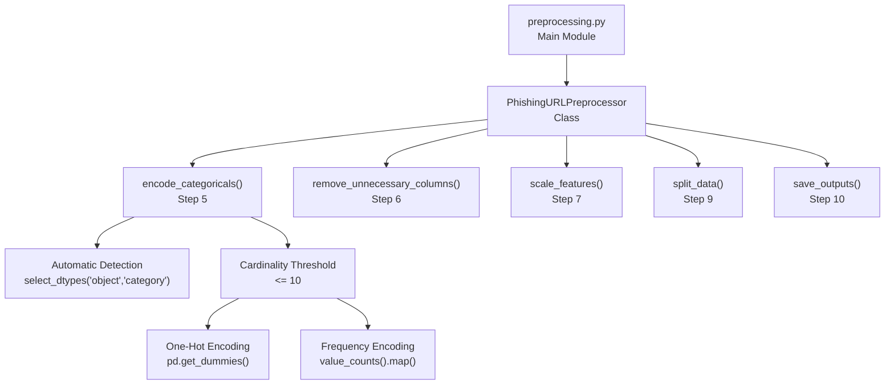
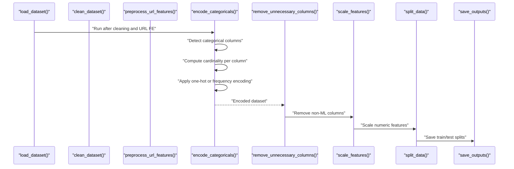
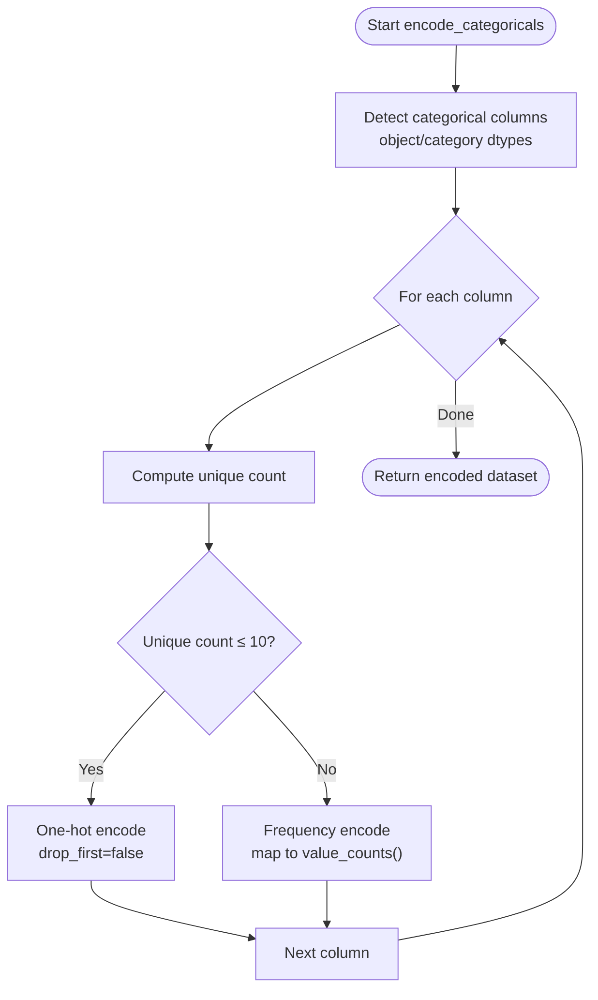
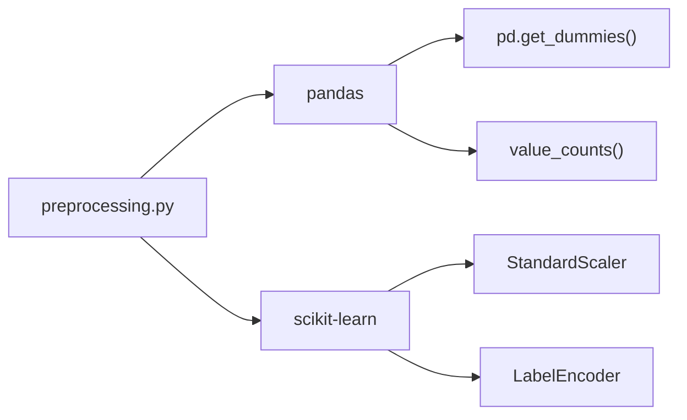

# Categorical Variable Encoding

<cite>
**Referenced Files in This Document**
- [preprocessing.py](file://preprocessing.py)
- [requirements.txt](file://requirements.txt)
</cite>

## Table of Contents
1. [Introduction](#introduction)
2. [Project Structure](#project-structure)
3. [Core Components](#core-components)
4. [Architecture Overview](#architecture-overview)
5. [Detailed Component Analysis](#detailed-component-analysis)
6. [Dependency Analysis](#dependency-analysis)
7. [Performance Considerations](#performance-considerations)
8. [Troubleshooting Guide](#troubleshooting-guide)
9. [Conclusion](#conclusion)

## Introduction
This document explains the categorical feature encoding strategy implemented in the phishing URL detection preprocessing pipeline. It focuses on a dual approach to handling categorical variables:
- One-hot encoding for low-cardinality features (≤10 unique values)
- Frequency encoding for high-cardinality features (>10 unique values)

It documents automatic detection of categorical columns, the threshold-based encoding strategy, the impact on feature space dimensions, and how the process is applied consistently to both training and test datasets while preserving encoding mappings.

## Project Structure
The preprocessing pipeline is implemented as a single module with a cohesive class-based workflow. The categorical encoding logic resides in a dedicated step within the pipeline.

**Diagram sources**
- [preprocessing.py:318-351](file://preprocessing.py#L318-L351)

**Section sources**
- [preprocessing.py:112-134](file://preprocessing.py#L112-L134)
- [preprocessing.py:318-351](file://preprocessing.py#L318-L351)

## Core Components
- Automatic categorical detection: The pipeline identifies categorical columns using pandas’ dtype selection for object and category types.
- Threshold-based strategy: A fixed cardinality threshold of 10 determines whether to one-hot encode or frequency encode.
- Consistent encoding across splits: The encoding is applied to the full cleaned dataset before splitting, ensuring identical feature spaces for training and testing.

Key implementation references:
- Categorical detection and encoding loop: [preprocessing.py:327-350](file://preprocessing.py#L327-L350)
- One-hot encoding path: [preprocessing.py:338-341](file://preprocessing.py#L338-L341)
- Frequency encoding path: [preprocessing.py:343-347](file://preprocessing.py#L343-L347)

**Section sources**
- [preprocessing.py:327-350](file://preprocessing.py#L327-L350)

## Architecture Overview
The categorical encoding step integrates into the broader preprocessing pipeline. It runs after URL feature engineering and before column removal, scaling, and train/test split.

**Diagram sources**
- [preprocessing.py:669-678](file://preprocessing.py#L669-L678)
- [preprocessing.py:318-351](file://preprocessing.py#L318-L351)
- [preprocessing.py:354-371](file://preprocessing.py#L354-L371)
- [preprocessing.py:376-401](file://preprocessing.py#L376-L401)
- [preprocessing.py:425-445](file://preprocessing.py#L425-L445)
- [preprocessing.py:450-469](file://preprocessing.py#L450-L469)

## Detailed Component Analysis

### Categorical Encoding Strategy
The pipeline applies a dual encoding strategy based on cardinality:
- Low-cardinality (<10 unique values): One-hot encoding using pandas dummy variables.
- High-cardinality (≥10 unique values): Frequency encoding by mapping each category to its training-time occurrence count.

**Diagram sources**
- [preprocessing.py:327-350](file://preprocessing.py#L327-L350)

**Section sources**
- [preprocessing.py:327-350](file://preprocessing.py#L327-L350)

### Automatic Categorical Detection
- The pipeline selects columns with object or category dtypes to identify potential categorical variables.
- Identifier and text columns listed for later removal are excluded from the categorical set prior to encoding.

Implementation references:
- Categorical selection: [preprocessing.py:328](file://preprocessing.py#L328)
- Exclusion of DROP_COLUMNS from categorical set: [preprocessing.py:330-333](file://preprocessing.py#L330-L333)

**Section sources**
- [preprocessing.py:328](file://preprocessing.py#L328)
- [preprocessing.py:330-333](file://preprocessing.py#L330-L333)

### Threshold-Based Encoding Strategy
- Cardinality threshold: 10 unique values.
- Low-cardinality columns are one-hot encoded, expanding feature space by the number of categories minus one (no drop-first).
- High-cardinality columns are frequency encoded, preserving dimensionality while capturing category prevalence.

Implementation references:
- Threshold and branching: [preprocessing.py:336-347](file://preprocessing.py#L336-L347)
- One-hot encoding call: [preprocessing.py:339](file://preprocessing.py#L339)
- Frequency encoding mapping: [preprocessing.py:344-345](file://preprocessing.py#L344-L345)

**Section sources**
- [preprocessing.py:336-347](file://preprocessing.py#L336-L347)
- [preprocessing.py:339](file://preprocessing.py#L339)
- [preprocessing.py:344-345](file://preprocessing.py#L344-L345)

### Impact on Feature Space Dimensions
- One-hot encoding increases dimensionality by the number of categories minus one per column.
- Frequency encoding preserves the original number of rows while replacing categories with counts, keeping feature dimensions unchanged.
- The pipeline logs the final feature count after separation of features and target.

Implementation references:
- Final feature count reporting: [preprocessing.py:415](file://preprocessing.py#L415)
- Feature separation: [preprocessing.py:406-420](file://preprocessing.py#L406-L420)

**Section sources**
- [preprocessing.py:415](file://preprocessing.py#L415)
- [preprocessing.py:406-420](file://preprocessing.py#L406-L420)

### Encoding Process for Training and Test Datasets
- The pipeline encodes the full cleaned dataset before splitting, ensuring identical feature spaces for training and testing.
- Frequency encoding uses training-time value counts to map categories in both sets.
- After encoding, the dataset is split into train and test sets with stratification to preserve class balance.

Implementation references:
- Encoding before split: [preprocessing.py:673](file://preprocessing.py#L673)
- Train/test split with stratification: [preprocessing.py:425-445](file://preprocessing.py#L425-L445)
- Saving outputs: [preprocessing.py:450-469](file://preprocessing.py#L450-L469)

**Section sources**
- [preprocessing.py:673](file://preprocessing.py#L673)
- [preprocessing.py:425-445](file://preprocessing.py#L425-L445)
- [preprocessing.py:450-469](file://preprocessing.py#L450-L469)

### Example Encoded Feature Names and Cardinality Thresholds
- One-hot encoded columns: The pipeline prefixes the original column name and creates dummy variables for each category. Example: a column named Category becomes Category_A, Category_B, Category_C, etc.
- Frequency encoded columns: The pipeline appends a suffix indicating frequency encoding and drops the original column. Example: a column named Category becomes Category_FreqEnc.
- Cardinality threshold: 10 unique values separates one-hot vs frequency encoding.

Implementation references:
- One-hot prefix and dummy creation: [preprocessing.py:339](file://preprocessing.py#L339)
- Frequency suffix and mapping: [preprocessing.py:345](file://preprocessing.py#L345)
- Threshold definition: [preprocessing.py:337](file://preprocessing.py#L337)

**Section sources**
- [preprocessing.py:339](file://preprocessing.py#L339)
- [preprocessing.py:345](file://preprocessing.py#L345)
- [preprocessing.py:337](file://preprocessing.py#L337)

### Benefits of Each Encoding Approach
- One-hot encoding:
  - Suitable for low-cardinality categorical features.
  - Preserves discriminative power for small number of categories.
  - Increases feature space; consider memory and computational cost.
- Frequency encoding:
  - Suitable for high-cardinality categorical features.
  - Reduces dimensionality compared to one-hot encoding.
  - Captures category prevalence; may introduce leakage if not applied consistently across splits.

Implementation references:
- One-hot encoding path: [preprocessing.py:338-341](file://preprocessing.py#L338-L341)
- Frequency encoding path: [preprocessing.py:343-347](file://preprocessing.py#L343-L347)

**Section sources**
- [preprocessing.py:338-341](file://preprocessing.py#L338-L341)
- [preprocessing.py:343-347](file://preprocessing.py#L343-L347)

## Dependency Analysis
The categorical encoding step depends on pandas for dtype detection and one-hot/frequency transformations, and on scikit-learn’s preprocessing utilities for scaling and label encoding.

**Diagram sources**
- [preprocessing.py:26-29](file://preprocessing.py#L26-L29)
- [preprocessing.py:328](file://preprocessing.py#L328)
- [preprocessing.py:339](file://preprocessing.py#L339)
- [preprocessing.py:344](file://preprocessing.py#L344)

**Section sources**
- [preprocessing.py:26-29](file://preprocessing.py#L26-L29)
- [preprocessing.py:328](file://preprocessing.py#L328)
- [preprocessing.py:339](file://preprocessing.py#L339)
- [preprocessing.py:344](file://preprocessing.py#L344)

## Performance Considerations
- One-hot encoding can significantly increase feature dimensionality for columns with many categories, potentially affecting model training time and memory usage.
- Frequency encoding maintains constant feature dimensions and can improve scalability for high-cardinality features.
- The pipeline computes cardinalities per column and applies the appropriate strategy, minimizing overhead.

[No sources needed since this section provides general guidance]

## Troubleshooting Guide
- Unexpected high-dimensional features:
  - Verify the cardinality threshold and confirm columns were one-hot encoded.
  - Review the logging output for per-column encoding decisions.
- Missing encoded columns in test set:
  - Confirm that encoding was applied to the full dataset before splitting.
  - Ensure that categorical columns are present in both training and test sets.
- Dimension mismatch errors:
  - Check that frequency encoding uses training-time value counts and that the same mapping is applied during inference.

**Section sources**
- [preprocessing.py:336-347](file://preprocessing.py#L336-L347)
- [preprocessing.py:673](file://preprocessing.py#L673)
- [preprocessing.py:425-445](file://preprocessing.py#L425-L445)

## Conclusion
The preprocessing pipeline implements a practical, threshold-based categorical encoding strategy tailored for phishing URL detection. By automatically detecting categorical columns and applying one-hot encoding for low-cardinality features and frequency encoding for high-cardinality features, it balances model interpretability and scalability. The approach ensures consistent feature spaces across training and test sets, facilitating reliable model evaluation and deployment.