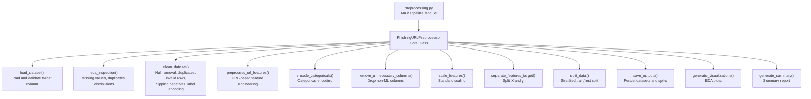
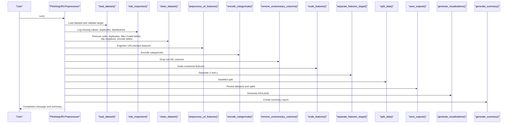
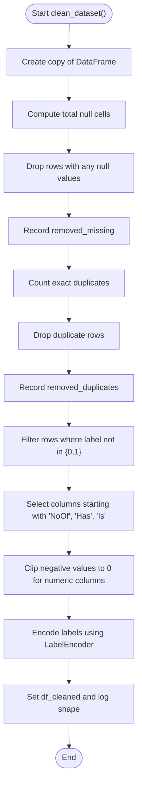
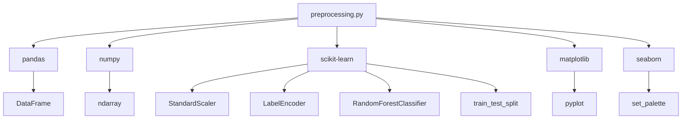

# Data Cleaning and Validation

<cite>
**Referenced Files in This Document**
- [preprocessing.py](file://preprocessing.py)
- [PhiUSIIL_Phishing_URL_Dataset.csv](file://PhiUSIIL_Phishing_URL_Dataset.csv)
- [requirements.txt](file://requirements.txt)
- [cleaned_dataset.csv](file://output/cleaned_dataset.csv)
</cite>

## Table of Contents
1. [Introduction](#introduction)
2. [Project Structure](#project-structure)
3. [Core Components](#core-components)
4. [Architecture Overview](#architecture-overview)
5. [Detailed Component Analysis](#detailed-component-analysis)
6. [Dependency Analysis](#dependency-analysis)
7. [Performance Considerations](#performance-considerations)
8. [Troubleshooting Guide](#troubleshooting-guide)
9. [Conclusion](#conclusion)

## Introduction
This document provides comprehensive documentation for the data cleaning pipeline designed for the PhiUSIIL Phishing URL Dataset. The pipeline systematically handles duplicate removal, missing value management, invalid row filtering, and validation of binary classification targets. It also implements a clipping mechanism for negative numerical values in count-based columns and performs target label encoding using LabelEncoder for machine learning compatibility. The documentation includes validation metrics, removal statistics, and quality assurance measures throughout the cleaning process.

## Project Structure
The project follows a modular structure centered around a preprocessing pipeline that orchestrates data loading, inspection, cleaning, feature engineering, encoding, scaling, splitting, saving, visualization, and reporting.

**Diagram sources**
- [preprocessing.py:112-688](file://preprocessing.py#L112-L688)

**Section sources**
- [preprocessing.py:112-688](file://preprocessing.py#L112-L688)

## Core Components
This section details the primary components of the preprocessing pipeline and their roles in ensuring data quality and ML readiness.

- **PhishingURLPreprocessor**: Orchestrates the entire pipeline, maintaining state for shapes, removed counts, feature counts, and scalers/encoders.
- **Data Loading and Inspection**: Loads the dataset, validates the presence of the target column (with fallbacks), logs basic statistics, missing values, duplicates, and class distribution.
- **Cleaning Phase**: Removes rows with null values, drops exact duplicates, filters invalid labels (ensures binary classification), clips negative counts to zero, and encodes labels using LabelEncoder.
- **Feature Engineering**: Adds URL-derived features (e.g., dot counts, special character counts, suspicious symbol presence, domain-related features) when raw URL or domain columns are present.
- **Categorical Encoding**: Applies one-hot encoding for low-cardinality categoricals and frequency encoding for high-cardinality ones, excluding predefined non-ML columns.
- **Column Dropping**: Removes predefined non-ML columns (e.g., FILENAME, URL, Domain, Title) to avoid leakage and reduce dimensionality.
- **Scaling**: Standardizes numerical features while excluding the target variable.
- **Train/Test Split**: Performs stratified splitting to maintain class balance across sets.
- **Output Persistence**: Saves cleaned datasets, train/test splits, and generates summary reports and visualizations.

**Section sources**
- [preprocessing.py:112-688](file://preprocessing.py#L112-L688)

## Architecture Overview
The pipeline is structured as a stateful class with a master run method that sequentially executes steps. It leverages scikit-learn for scaling and splitting, pandas/numpy for data manipulation, and matplotlib/seaborn for visualization.

**Diagram sources**
- [preprocessing.py:138-688](file://preprocessing.py#L138-L688)

## Detailed Component Analysis

### Data Loading and Target Validation
- Automatically detects the CSV dataset in the working directory and selects the largest file as the main dataset.
- Validates the presence of the target column, attempting common variations (e.g., Label, LABEL, class, CLASS, target, Target) and renaming to "label" if found.
- Logs shape, data types, missing values, duplicates, and class distribution for initial inspection.

**Section sources**
- [preprocessing.py:82-166](file://preprocessing.py#L82-L166)

### Exploratory Data Analysis (EDA)
- Computes and logs memory usage, missing value counts and percentages, duplicate counts, target distribution, and numeric column summaries.
- Provides insights into data characteristics prior to cleaning.

**Section sources**
- [preprocessing.py:171-202](file://preprocessing.py#L171-L202)

### Data Cleaning Pipeline
- **Null Removal**: Drops rows with any null values and records the number of removed rows based on total null cells.
- **Duplicate Removal**: Identifies and removes exact duplicate rows, recording the count of removed duplicates.
- **Invalid Row Filtering**: Filters out rows where the label is not 0 or 1, ensuring a binary classification target.
- **Clipping Mechanism**: Iterates through columns whose names start with "NoOf", "Has", or "Is" and clips negative values to zero for integer/float columns.
- **Label Encoding**: Uses LabelEncoder to transform labels into integers, enabling downstream ML algorithms to consume numeric targets.

**Diagram sources**
- [preprocessing.py:206-257](file://preprocessing.py#L206-L257)

**Section sources**
- [preprocessing.py:206-257](file://preprocessing.py#L206-L257)

### URL Feature Preprocessing and Engineering
- Generates new features from the raw URL and domain when available:
  - Number of dots in URL
  - Number of special characters in URL
  - Presence of suspicious symbols (e.g., @, //)
  - Presence of "www" prefix
  - Presence of suspicious TLDs
  - Number of dots and hyphen presence in domain
- Logs the creation of each engineered feature.

**Section sources**
- [preprocessing.py:262-316](file://preprocessing.py#L262-L316)

### Categorical Encoding Strategy
- Identifies categorical columns and excludes predefined non-ML columns from encoding.
- Applies one-hot encoding for low-cardinality categoricals (≤10 unique values).
- Applies frequency encoding for high-cardinality categoricals and drops the original column after encoding.

**Section sources**
- [preprocessing.py:321-350](file://preprocessing.py#L321-L350)

### Column Dropping for ML Readiness
- Drops predefined non-ML columns (FILENAME, URL, Domain, Title) to prevent leakage and reduce dimensionality.

**Section sources**
- [preprocessing.py:355-371](file://preprocessing.py#L355-L371)

### Feature Scaling
- Scales numerical features using StandardScaler, excluding the target variable.
- Logs the number of numerical features scaled and warns if none are found.

**Section sources**
- [preprocessing.py:376-401](file://preprocessing.py#L376-L401)

### Target Variable Separation and Train/Test Split
- Separates features (X) and target (y) and records the final feature count.
- Performs stratified train/test split to preserve class balance.

**Section sources**
- [preprocessing.py:406-445](file://preprocessing.py#L406-L445)

### Output Persistence and Reporting
- Saves the cleaned dataset and train/test splits to the output directory.
- Generates EDA visualizations (class distribution, correlation heatmap, feature importance, histograms).
- Creates a comprehensive preprocessing summary report with dataset overview, removal statistics, train/test split details, feature engineering notes, scaling information, and output file locations.

**Section sources**
- [preprocessing.py:450-656](file://preprocessing.py#L450-L656)

## Dependency Analysis
The preprocessing pipeline relies on several external libraries and maintains internal dependencies among its components.

**Diagram sources**
- [requirements.txt:1-6](file://requirements.txt#L1-L6)
- [preprocessing.py:19-29](file://preprocessing.py#L19-L29)

**Section sources**
- [requirements.txt:1-6](file://requirements.txt#L1-L6)
- [preprocessing.py:19-29](file://preprocessing.py#L19-L29)

## Performance Considerations
- **Memory Efficiency**: The pipeline logs memory usage during EDA to help assess dataset size impact.
- **Scalability**: StandardScaler is applied to the entire cleaned dataset before splitting; in production, fit only on training data to avoid leakage.
- **Feature Engineering Cost**: URL and domain feature engineering adds computational overhead; consider vectorized operations and optional execution based on column availability.
- **Logging Overhead**: Extensive logging aids debugging but may slow execution in resource-constrained environments.

[No sources needed since this section provides general guidance]

## Troubleshooting Guide
Common issues and resolutions during the preprocessing pipeline:

- **Target Column Not Found**: The loader attempts multiple common variants and raises an error if none match. Ensure the dataset contains a suitable target column or rename it appropriately.
- **Missing CSV Detection**: If no CSV is found, the auto-detection raises an error. Verify the working directory contains a CSV file.
- **No Numerical Features for Scaling**: If no numeric columns remain after dropping non-ML columns, scaling logs a warning. Add numeric features or adjust column exclusions.
- **Large Memory Usage**: Monitor memory usage during EDA and consider sampling or chunking for very large datasets.
- **Encoding Errors**: Ensure categorical columns are properly typed as object/category before encoding. Low-cardinality columns are one-hot encoded; high-cardinality columns are frequency-encoded.

**Section sources**
- [preprocessing.py:82-166](file://preprocessing.py#L82-L166)
- [preprocessing.py:376-401](file://preprocessing.py#L376-L401)

## Conclusion
The PhiUSIIL Phishing URL Dataset preprocessing pipeline provides a robust, modular framework for cleaning, validating, and preparing data for machine learning. It systematically removes null-containing rows, eliminates duplicates, validates and transforms labels, clips negative counts, and prepares features for modeling. The pipeline includes comprehensive logging, validation metrics, and quality assurance measures, ensuring reproducibility and transparency. The generated outputs and visualizations support further analysis and model development.