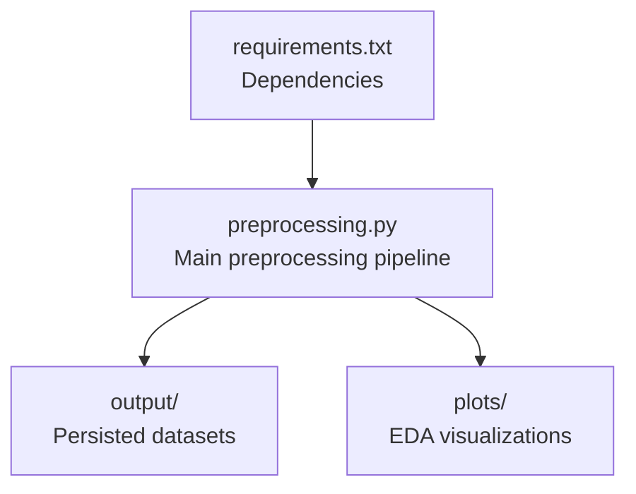
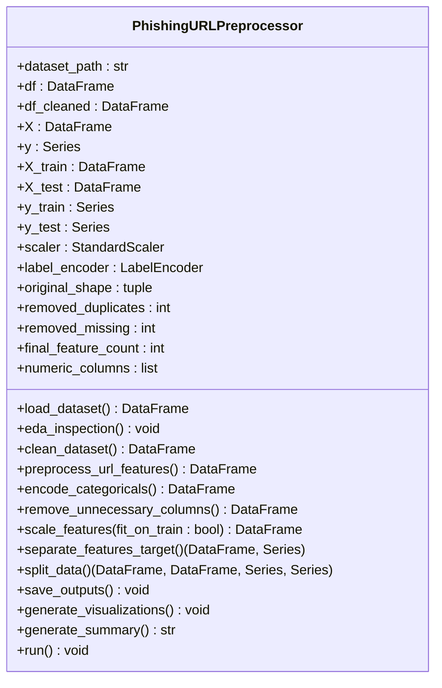
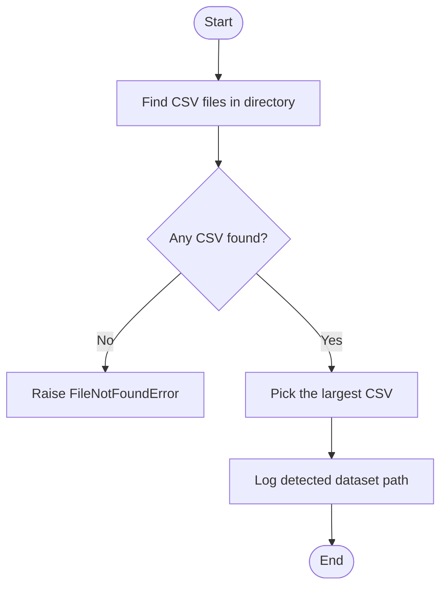
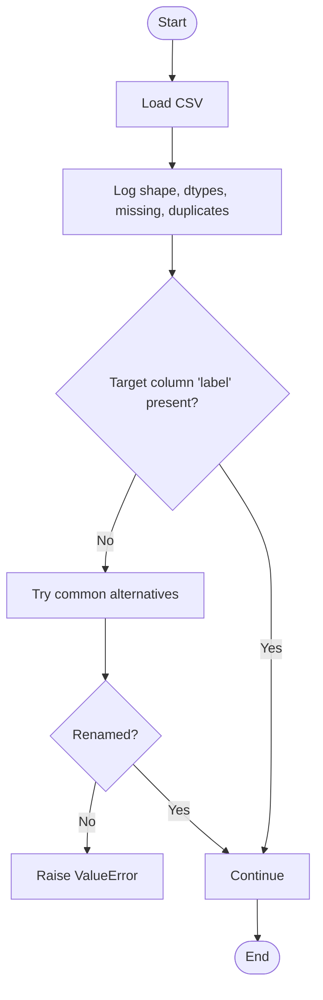
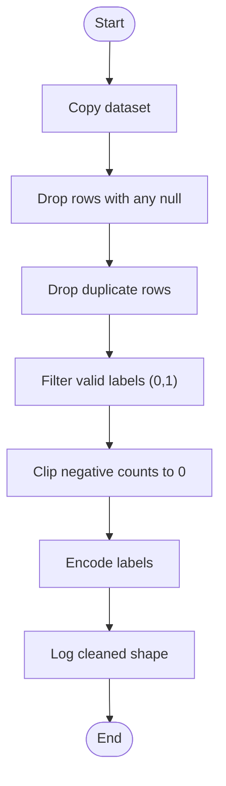
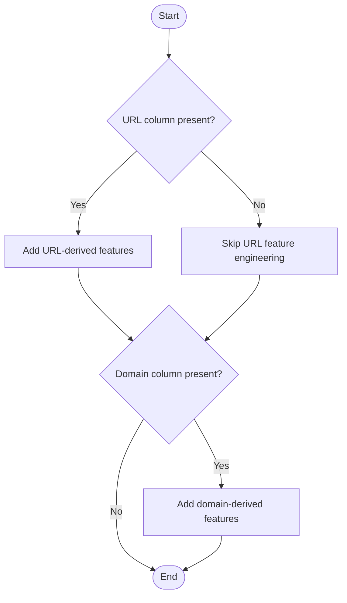
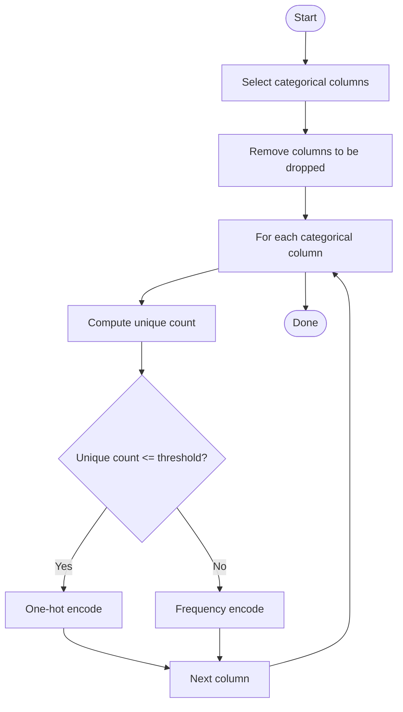
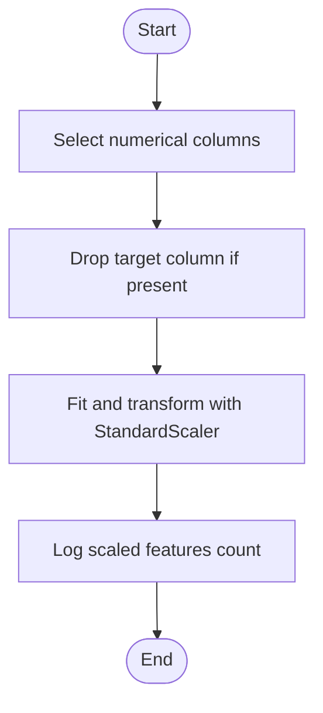
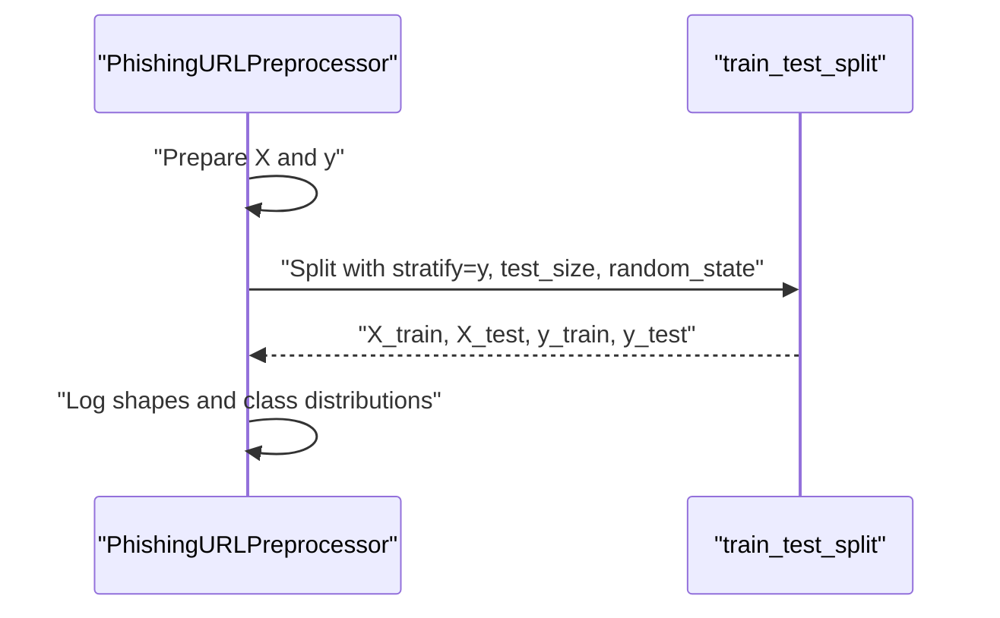
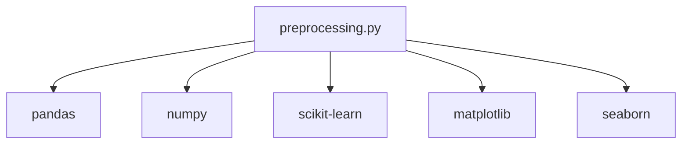

# Data Processing

<cite>
**Referenced Files in This Document**
- [preprocessing.py](file://preprocessing.py)
- [requirements.txt](file://requirements.txt)
</cite>

## Table of Contents
1. [Introduction](#introduction)
2. [Project Structure](#project-structure)
3. [Core Components](#core-components)
4. [Architecture Overview](#architecture-overview)
5. [Detailed Component Analysis](#detailed-component-analysis)
6. [Dependency Analysis](#dependency-analysis)
7. [Performance Considerations](#performance-considerations)
8. [Troubleshooting Guide](#troubleshooting-guide)
9. [Conclusion](#conclusion)
10. [Appendices](#appendices)

## Introduction
This document describes the end-to-end data processing pipeline that transforms raw phishing URL datasets into machine learning-ready datasets. It covers dataset discovery, loading, exploratory data analysis, cleaning, feature engineering, encoding, scaling, splitting, saving outputs, and generating visualizations. The pipeline is designed to be robust, reproducible, and production-ready, with logging, error handling, and quality assurance built-in.

## Project Structure
The repository contains a single preprocessing script and a requirements file. The preprocessing script orchestrates the entire pipeline and writes outputs to dedicated directories.

**Diagram sources**
- [preprocessing.py:693-700](file://preprocessing.py#L693-L700)
- [requirements.txt:1-6](file://requirements.txt#L1-L6)

**Section sources**
- [preprocessing.py:693-700](file://preprocessing.py#L693-L700)
- [requirements.txt:1-6](file://requirements.txt#L1-L6)

## Core Components
- Automatic CSV detection: Locates the largest CSV file in the working directory when a dataset path is not provided.
- Dataset loader and inspection: Loads CSV, logs shape, dtypes, missing values, duplicates, and target distribution; normalizes target column names.
- Exploratory Data Analysis (EDA): Summarizes missing values, duplicates, target distribution, and numeric columns.
- Data cleaning: Drops nulls, duplicates, filters invalid labels, clips negative counts, and encodes labels.
- URL feature engineering: Extracts dot counts, special character counts, suspicious symbol presence, WWW prefix, suspicious TLDs, and domain-based features.
- Categorical encoding: Applies one-hot encoding for low-cardinality features and frequency encoding for high-cardinality features.
- Column removal: Drops predefined non-ML columns.
- Feature scaling: Normalizes numerical features using StandardScaler.
- Train/test split: Performs stratified split to preserve class balance.
- Outputs: Saves cleaned dataset and train/test splits; generates EDA visualizations; produces a summary report.

**Section sources**
- [preprocessing.py:82-96](file://preprocessing.py#L82-L96)
- [preprocessing.py:138-166](file://preprocessing.py#L138-L166)
- [preprocessing.py:171-201](file://preprocessing.py#L171-L201)
- [preprocessing.py:206-257](file://preprocessing.py#L206-L257)
- [preprocessing.py:262-316](file://preprocessing.py#L262-L316)
- [preprocessing.py:321-350](file://preprocessing.py#L321-L350)
- [preprocessing.py:355-371](file://preprocessing.py#L355-L371)
- [preprocessing.py:376-401](file://preprocessing.py#L376-L401)
- [preprocessing.py:425-445](file://preprocessing.py#L425-L445)
- [preprocessing.py:450-469](file://preprocessing.py#L450-L469)
- [preprocessing.py:474-586](file://preprocessing.py#L474-L586)
- [preprocessing.py:590-656](file://preprocessing.py#L590-L656)

## Architecture Overview
The pipeline is implemented as a single class that encapsulates all steps. It uses a stepwise execution order, logging, and consistent error handling.

**Diagram sources**
- [preprocessing.py:112-688](file://preprocessing.py#L112-L688)

## Detailed Component Analysis

### Dataset Loading and Automatic CSV Detection
- Automatic detection locates all CSV files in the working directory and selects the largest one as the primary dataset.
- If no CSV is found, raises a file-not-found error.
- Logs the detected dataset path for traceability.

**Diagram sources**
- [preprocessing.py:82-96](file://preprocessing.py#L82-L96)

**Section sources**
- [preprocessing.py:82-96](file://preprocessing.py#L82-L96)

### Initial Data Exploration and Validation
- Loads the dataset and logs shape, column names, dtypes, missing values, duplicates, and target distribution.
- Normalizes target column names by renaming common variants to a canonical label column.
- Raises an error if the target column is not found after normalization attempts.

**Diagram sources**
- [preprocessing.py:138-166](file://preprocessing.py#L138-L166)

**Section sources**
- [preprocessing.py:138-166](file://preprocessing.py#L138-L166)

### Data Cleaning Procedures
- Removes rows with any null values and records the total number of removed rows and null cells.
- Removes duplicate rows and records the number of removed duplicates.
- Filters rows with invalid labels (assumes binary classification with values 0 and 1).
- Clips negative values in count-like columns (starting with specific prefixes) to zero.
- Encodes target labels using a label encoder and logs the resulting classes.

**Diagram sources**
- [preprocessing.py:206-257](file://preprocessing.py#L206-L257)

**Section sources**
- [preprocessing.py:206-257](file://preprocessing.py#L206-L257)

### URL-Specific Feature Engineering
- If a raw URL column exists:
  - Counts dots in the full URL.
  - Counts special characters in the URL.
  - Detects suspicious symbols (e.g., @, //).
  - Detects www prefix.
  - Detects suspicious TLDs (commonly abused domains).
- If a domain column exists:
  - Counts dots in the domain.
  - Detects hyphens in the domain.

**Diagram sources**
- [preprocessing.py:262-316](file://preprocessing.py#L262-L316)

**Section sources**
- [preprocessing.py:262-316](file://preprocessing.py#L262-L316)

### Categorical Variable Encoding Strategies
- Identifies object/category columns excluding those marked for removal.
- Applies one-hot encoding for low-cardinality features (≤ threshold).
- Applies frequency encoding for high-cardinality features (> threshold).
- Logs the number of categories/values encoded for each column.

**Diagram sources**
- [preprocessing.py:321-350](file://preprocessing.py#L321-L350)

**Section sources**
- [preprocessing.py:321-350](file://preprocessing.py#L321-L350)

### Feature Scaling with StandardScaler
- Identifies numerical columns excluding the target.
- Fits and transforms numerical features using StandardScaler.
- Logs the number of numerical features scaled.

**Diagram sources**
- [preprocessing.py:376-401](file://preprocessing.py#L376-L401)

**Section sources**
- [preprocessing.py:376-401](file://preprocessing.py#L376-L401)

### Stratified Train/Test Split
- Splits the dataset into training and testing sets while preserving class balance.
- Uses a fixed random state for reproducibility.
- Logs shapes and class distributions for both sets.

**Diagram sources**
- [preprocessing.py:425-445](file://preprocessing.py#L425-L445)

**Section sources**
- [preprocessing.py:425-445](file://preprocessing.py#L425-L445)

### Data Validation Checks, Error Handling, and Quality Assurance
- Logging: Comprehensive logging with timestamps and levels for each step.
- Error handling: Explicit try/except around the main entry point; individual steps log failures and continue where possible.
- Quality assurance:
  - Verifies presence of target column and normalizes names.
  - Validates labels and removes invalid rows.
  - Ensures directories exist before writing outputs.
  - Generates summary report with dataset overview, split details, feature engineering notes, scaling info, and output locations.

**Section sources**
- [preprocessing.py:53-67](file://preprocessing.py#L53-L67)
- [preprocessing.py:694-699](file://preprocessing.py#L694-L699)
- [preprocessing.py:590-656](file://preprocessing.py#L590-L656)

## Dependency Analysis
The preprocessing module depends on several libraries for data manipulation, modeling, and visualization.

**Diagram sources**
- [requirements.txt:1-6](file://requirements.txt#L1-L6)
- [preprocessing.py:19-29](file://preprocessing.py#L19-L29)

**Section sources**
- [requirements.txt:1-6](file://requirements.txt#L1-L6)
- [preprocessing.py:19-29](file://preprocessing.py#L19-L29)

## Performance Considerations
- Memory usage: The loader logs memory usage to help assess dataset size impact.
- Vectorized operations: String operations and boolean indexing are used extensively for efficiency.
- One-hot vs frequency encoding: Balances dimensionality growth (one-hot) versus information retention (frequency encoding) for categorical features.
- Headless plotting: Matplotlib is configured to use a non-interactive backend for headless environments.
- Parallelism: Random forest feature importance computation uses multiple jobs for speed.

[No sources needed since this section provides general guidance]

## Troubleshooting Guide
- CSV detection fails: Ensure a single CSV file exists or pass an explicit dataset path. The detector prefers the largest CSV.
- Target column missing: The loader attempts common variants; if none match, rename the target column to the expected canonical name or adjust the loader logic.
- Missing values: The cleaner drops rows with any null values; inspect the EDA summary to understand the impact.
- Negative counts: The cleaner clips negative values in count-like columns to zero; verify the intended behavior.
- No numeric columns for scaling: The scaler logs a warning when no numeric columns are present; confirm feature engineering and column removal steps.
- Plotting issues: Ensure the plots directory exists; the generator creates it automatically.

**Section sources**
- [preprocessing.py:82-96](file://preprocessing.py#L82-L96)
- [preprocessing.py:138-166](file://preprocessing.py#L138-L166)
- [preprocessing.py:206-257](file://preprocessing.py#L206-L257)
- [preprocessing.py:376-401](file://preprocessing.py#L376-L401)
- [preprocessing.py:474-586](file://preprocessing.py#L474-L586)

## Conclusion
This preprocessing pipeline provides a robust, automated, and auditable pathway from raw phishing URL data to machine learning-ready datasets. It emphasizes correctness (validation and encoding), transparency (logging and summaries), and reproducibility (fixed random state and deterministic steps). The modular design allows easy extension and maintenance.

## Appendices
- Output artifacts:
  - Cleaned dataset CSV.
  - Training and test feature and target CSVs.
  - EDA visualizations (class distribution, correlation heatmap, feature importance, histograms).
  - Preprocessing summary report.

**Section sources**
- [preprocessing.py:450-469](file://preprocessing.py#L450-L469)
- [preprocessing.py:474-586](file://preprocessing.py#L474-L586)
- [preprocessing.py:590-656](file://preprocessing.py#L590-L656)