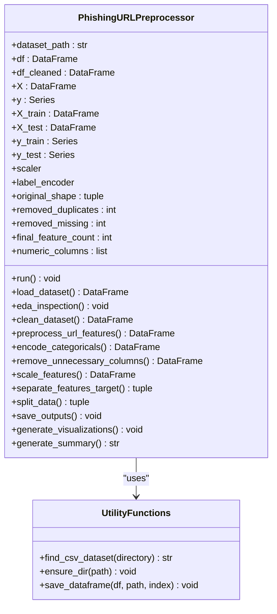
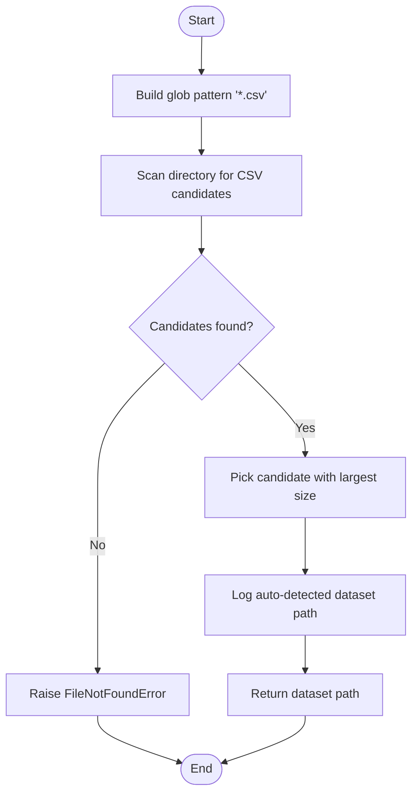
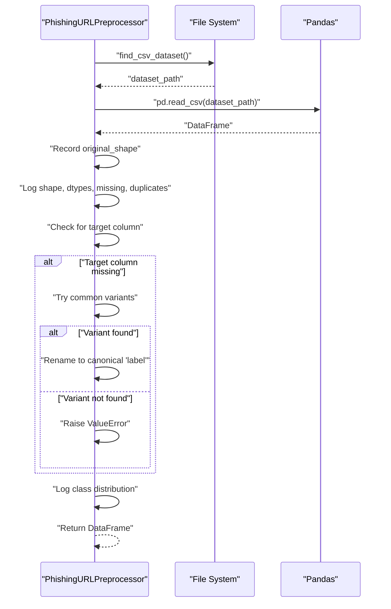
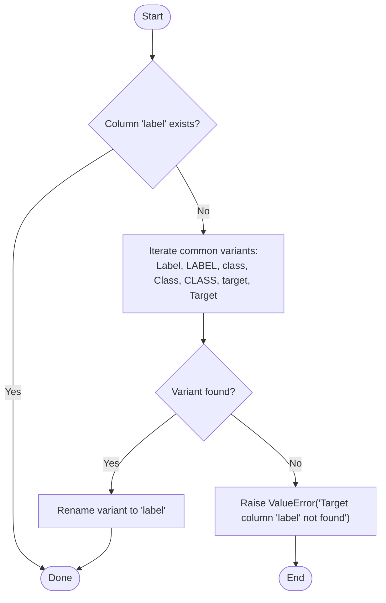
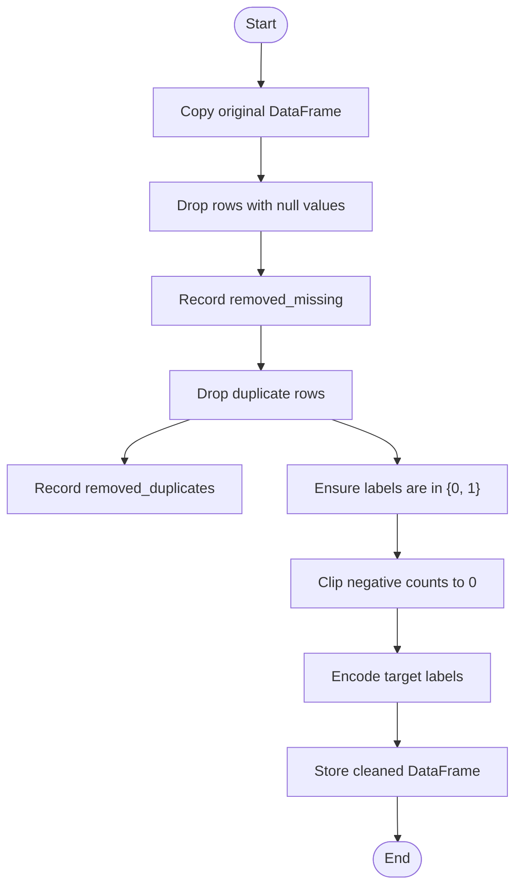
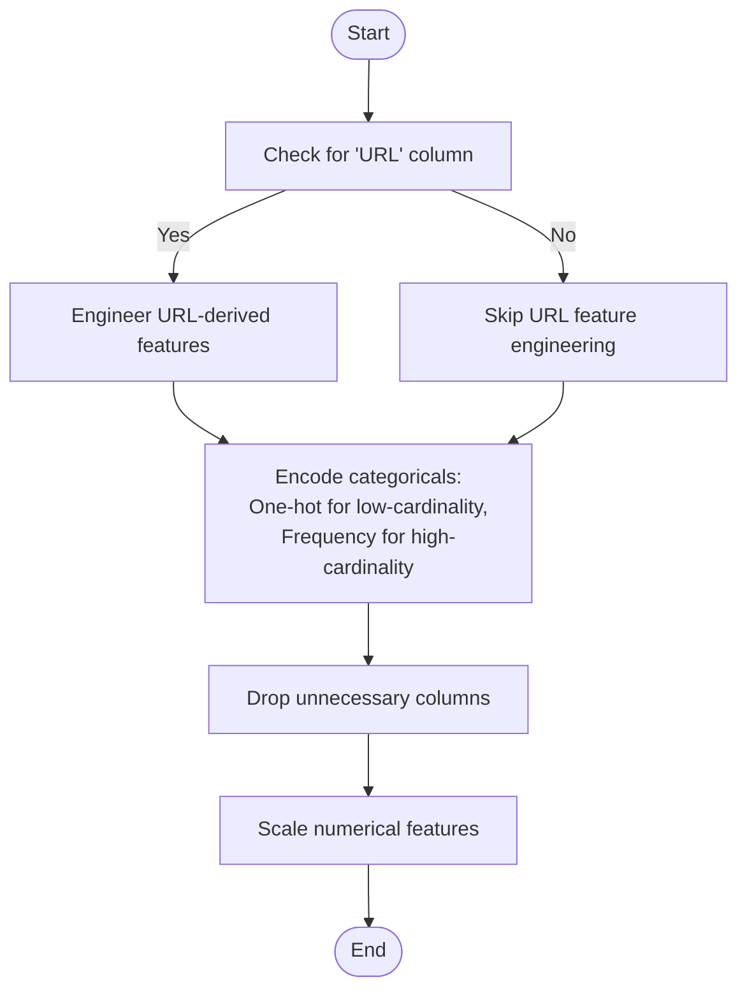
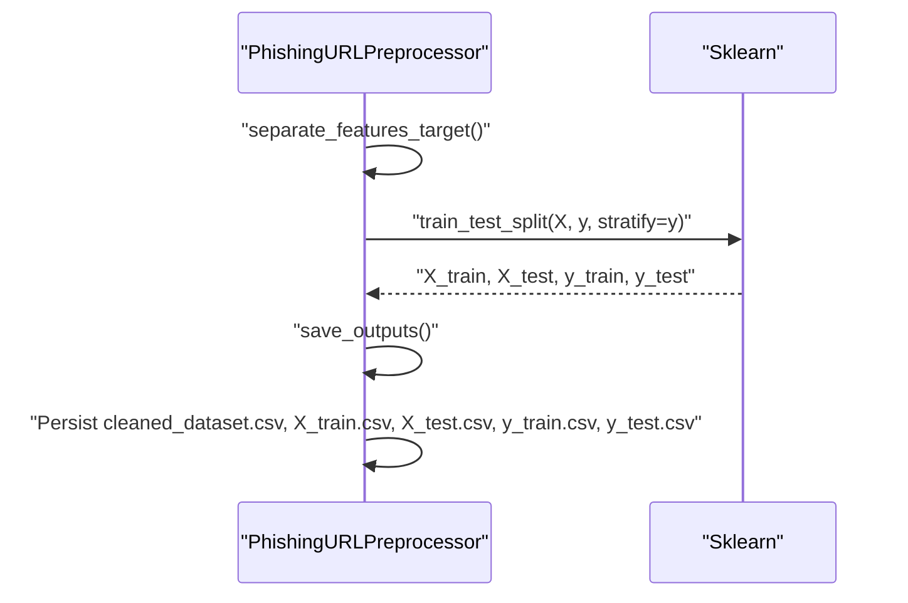
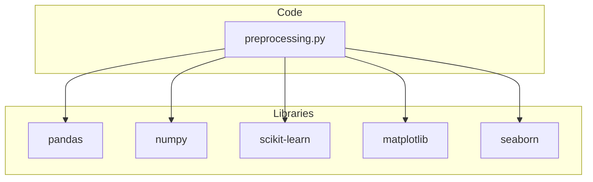

# Dataset Loading and Detection

<cite>
**Referenced Files in This Document**
- [preprocessing.py](file://preprocessing.py)
- [PhiUSIIL_Phishing_URL_Dataset.csv](file://PhiUSIIL_Phishing_URL_Dataset.csv)
- [requirements.txt](file://requirements.txt)
</cite>

## Table of Contents
1. [Introduction](#introduction)
2. [Project Structure](#project-structure)
3. [Core Components](#core-components)
4. [Architecture Overview](#architecture-overview)
5. [Detailed Component Analysis](#detailed-component-analysis)
6. [Dependency Analysis](#dependency-analysis)
7. [Performance Considerations](#performance-considerations)
8. [Troubleshooting Guide](#troubleshooting-guide)
9. [Conclusion](#conclusion)

## Introduction
This document explains the dataset loading and automatic detection mechanism used by the phishing URL dataset preprocessing pipeline. It covers how the system automatically detects CSV datasets, performs initial shape inspection, validates and normalizes the target column, and handles flexible naming conventions. It also documents error handling for missing datasets and essential dataset properties, along with examples of supported dataset formats and common issues encountered during loading.

## Project Structure
The project consists of a single preprocessing script that orchestrates the entire pipeline, plus a dataset file and an output directory for persisted artifacts. The preprocessing module encapsulates dataset detection, loading, inspection, cleaning, feature engineering, encoding, scaling, splitting, saving, and reporting.

```mermaid
graph TB
A["preprocessing.py<br/>Main preprocessing pipeline"] --> B["find_csv_dataset()<br/>Automatic CSV detection"]
A --> C["load_dataset()<br/>Initial inspection and target normalization"]
A --> D["clean_dataset()<br/>Missing values, duplicates, label validation"]
A --> E["preprocess_url_features()<br/>URL feature engineering"]
A --> F["encode_categoricals()<br/>Categorical encoding"]
A --> G["remove_unnecessary_columns()<br/>Drop non-ML columns"]
A --> H["scale_features()<br/>Numerical scaling"]
A --> I["separate_features_target()<br/>Split X and y"]
A --> J["split_data()<br/>Stratified train/test split"]
A --> K["save_outputs()<br/>Persist processed datasets"]
A --> L["generate_visualizations()<br/>EDA plots"]
A --> M["generate_summary()<br/>Summary report"]
N["PhiUSIIL_Phishing_URL_Dataset.csv<br/>Example dataset"] -.-> C
O["output/<br/>Persisted artifacts"] -.-> K
```

**Diagram sources**
- [preprocessing.py:82-96](file://preprocessing.py#L82-L96)
- [preprocessing.py:138-166](file://preprocessing.py#L138-L166)
- [preprocessing.py:206-257](file://preprocessing.py#L206-L257)
- [preprocessing.py:262-316](file://preprocessing.py#L262-L316)
- [preprocessing.py:321-350](file://preprocessing.py#L321-L350)
- [preprocessing.py:355-371](file://preprocessing.py#L355-L371)
- [preprocessing.py:376-401](file://preprocessing.py#L376-L401)
- [preprocessing.py:406-420](file://preprocessing.py#L406-L420)
- [preprocessing.py:425-445](file://preprocessing.py#L425-L445)
- [preprocessing.py:450-469](file://preprocessing.py#L450-L469)
- [preprocessing.py:474-586](file://preprocessing.py#L474-L586)
- [preprocessing.py:590-656](file://preprocessing.py#L590-L656)

**Section sources**
- [preprocessing.py:82-96](file://preprocessing.py#L82-L96)
- [preprocessing.py:138-166](file://preprocessing.py#L138-L166)
- [preprocessing.py:450-469](file://preprocessing.py#L450-L469)

## Core Components
- Automatic CSV detection: Scans a directory for CSV files and selects the largest file as the primary dataset.
- Dataset loading and inspection: Loads the CSV, logs shape, columns, data types, missing values, duplicates, and target distribution.
- Flexible target column handling: Normalizes target columns to a canonical name regardless of case or common variants.
- Validation and error handling: Raises explicit errors when no CSV is found or when the target column is missing.
- Output persistence: Saves cleaned datasets and train/test splits to the output directory.

**Section sources**
- [preprocessing.py:82-96](file://preprocessing.py#L82-L96)
- [preprocessing.py:138-166](file://preprocessing.py#L138-L166)
- [preprocessing.py:450-469](file://preprocessing.py#L450-L469)

## Architecture Overview
The preprocessing pipeline is a class-based workflow that loads a dataset, inspects it, cleans and transforms it, and produces train/test splits and visualizations. The dataset detection is centralized and invoked during initialization.

**Diagram sources**
- [preprocessing.py:112-134](file://preprocessing.py#L112-L134)
- [preprocessing.py:82-107](file://preprocessing.py#L82-L107)

## Detailed Component Analysis

### Automatic CSV Detection
The automatic detection scans the specified directory for CSV files using a glob pattern and selects the largest file as the primary dataset. This approach assumes the largest CSV is the main dataset among multiple candidates.

**Diagram sources**
- [preprocessing.py:82-96](file://preprocessing.py#L82-L96)

**Section sources**
- [preprocessing.py:82-96](file://preprocessing.py#L82-L96)

### Dataset Loading Workflow
The loading workflow performs initial inspection and target normalization:
- Loads the CSV into a DataFrame.
- Records the original shape.
- Logs shape, columns, data types, missing values, and duplicate rows.
- Validates presence of the target column and normalizes it to a canonical name.

**Diagram sources**
- [preprocessing.py:138-166](file://preprocessing.py#L138-L166)
- [preprocessing.py:82-96](file://preprocessing.py#L82-L96)

**Section sources**
- [preprocessing.py:138-166](file://preprocessing.py#L138-L166)

### Target Column Normalization
The system supports flexible naming conventions for the target column and normalizes them to a canonical name. It attempts common variants and renames them accordingly.

**Diagram sources**
- [preprocessing.py:155-163](file://preprocessing.py#L155-L163)

**Section sources**
- [preprocessing.py:155-163](file://preprocessing.py#L155-L163)

### Data Cleaning and Validation
After loading, the pipeline validates and cleans the dataset:
- Removes rows with null values and records how many were removed.
- Removes duplicate rows.
- Validates target labels to ensure they are valid for binary classification.
- Clips negative counts to zero for count-like features.
- Encodes target labels using a label encoder.

**Diagram sources**
- [preprocessing.py:206-257](file://preprocessing.py#L206-L257)

**Section sources**
- [preprocessing.py:206-257](file://preprocessing.py#L206-L257)

### Feature Engineering and Encoding
The pipeline engineers URL-related features if the raw URL column is present and encodes categorical features appropriately.

**Diagram sources**
- [preprocessing.py:262-316](file://preprocessing.py#L262-L316)
- [preprocessing.py:321-350](file://preprocessing.py#L321-L350)
- [preprocessing.py:355-371](file://preprocessing.py#L355-L371)
- [preprocessing.py:376-401](file://preprocessing.py#L376-L401)

**Section sources**
- [preprocessing.py:262-316](file://preprocessing.py#L262-L316)
- [preprocessing.py:321-350](file://preprocessing.py#L321-L350)
- [preprocessing.py:355-371](file://preprocessing.py#L355-L371)
- [preprocessing.py:376-401](file://preprocessing.py#L376-L401)

### Train/Test Split and Persistence
The pipeline performs a stratified split to preserve class balance and persists outputs to CSV files.

**Diagram sources**
- [preprocessing.py:406-420](file://preprocessing.py#L406-L420)
- [preprocessing.py:425-445](file://preprocessing.py#L425-L445)
- [preprocessing.py:450-469](file://preprocessing.py#L450-L469)

**Section sources**
- [preprocessing.py:406-420](file://preprocessing.py#L406-L420)
- [preprocessing.py:425-445](file://preprocessing.py#L425-L445)
- [preprocessing.py:450-469](file://preprocessing.py#L450-L469)

## Dependency Analysis
The preprocessing pipeline depends on external libraries for data manipulation, machine learning, and visualization. The dataset itself is a CSV file with a fixed schema.

**Diagram sources**
- [requirements.txt:1-6](file://requirements.txt#L1-L6)
- [preprocessing.py:19-28](file://preprocessing.py#L19-L28)

**Section sources**
- [requirements.txt:1-6](file://requirements.txt#L1-L6)
- [preprocessing.py:19-28](file://preprocessing.py#L19-L28)

## Performance Considerations
- CSV scanning uses a glob pattern and picks the largest file, which is efficient but assumes the largest file is the intended dataset.
- Data loading and transformations are performed in-memory; large datasets may require sufficient memory resources.
- Scaling and encoding steps operate only on numerical and categorical features respectively, minimizing overhead.
- Stratified splitting ensures balanced class representation in train and test sets.

[No sources needed since this section provides general guidance]

## Troubleshooting Guide
Common issues and resolutions:
- No CSV files found: The automatic detection raises a file-not-found error when no CSV files are present in the directory. Place the dataset CSV in the working directory or pass an explicit path.
- Missing target column: If the target column is not named the canonical form or any supported variant, the pipeline raises a value error. Ensure the dataset includes a target column with one of the supported names.
- Invalid labels: Rows with target labels outside the expected set are removed. Verify that labels represent valid classes for binary classification.
- Negative counts: Count-like features with negative values are clipped to zero. Review feature engineering logic if unexpected negatives persist.
- Memory usage: Large datasets may exceed available memory during loading or transformations. Consider chunking or optimizing data types.

**Section sources**
- [preprocessing.py:82-96](file://preprocessing.py#L82-L96)
- [preprocessing.py:155-163](file://preprocessing.py#L155-L163)
- [preprocessing.py:206-257](file://preprocessing.py#L206-L257)

## Conclusion
The dataset loading and automatic detection mechanism provides a robust, configurable foundation for preprocessing phishing URL datasets. It automates CSV discovery, enforces target normalization, validates essential properties, and integrates seamlessly with downstream preprocessing steps. By adhering to the supported naming conventions and dataset format, users can reliably leverage the pipeline for training and evaluation.