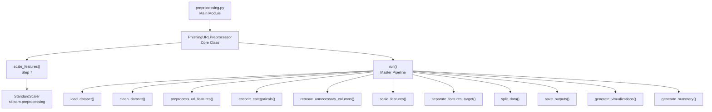
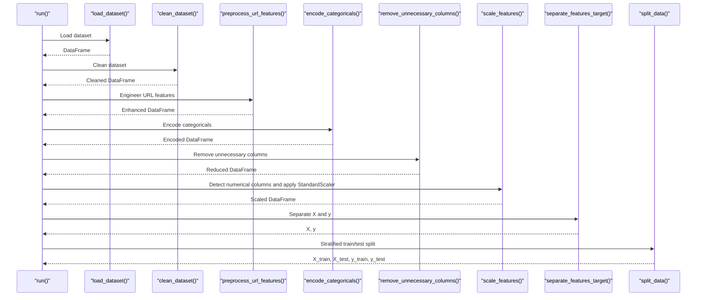
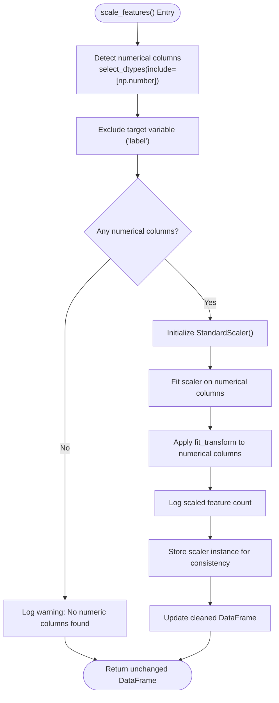
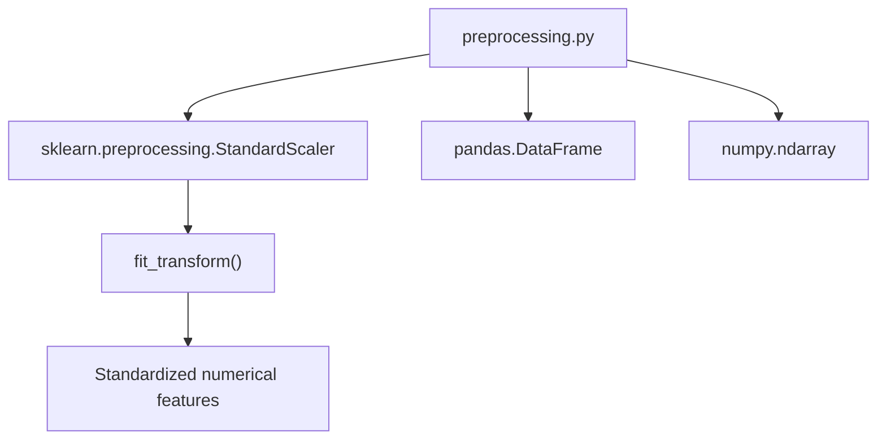

# Numerical Feature Scaling

<cite>
**Referenced Files in This Document**
- [preprocessing.py](file://preprocessing.py)
- [requirements.txt](file://requirements.txt)
</cite>

## Table of Contents
1. [Introduction](#introduction)
2. [Project Structure](#project-structure)
3. [Core Components](#core-components)
4. [Architecture Overview](#architecture-overview)
5. [Detailed Component Analysis](#detailed-component-analysis)
6. [Dependency Analysis](#dependency-analysis)
7. [Performance Considerations](#performance-considerations)
8. [Troubleshooting Guide](#troubleshooting-guide)
9. [Conclusion](#conclusion)
10. [Appendices](#appendices)

## Introduction
This document explains numerical feature scaling using StandardScaler within the phishing URL detection preprocessing pipeline. It covers the standardization process that transforms features to zero mean and unit variance, the importance of numerical feature normalization for machine learning algorithms, and the exclusion of the target variable from scaling. It documents the automatic detection of numerical columns, the scaling application process, and the preservation of scaling objects for consistency. It also provides rationale for scaling, potential impacts on model performance, and best practices for feature normalization in phishing URL detection contexts.

## Project Structure
The preprocessing pipeline is implemented as a single module with a cohesive class-based architecture. The scaling logic resides within the PhishingURLPreprocessor class and integrates seamlessly with the broader preprocessing workflow.

**Diagram sources**
- [preprocessing.py:112-688](file://preprocessing.py#L112-L688)

**Section sources**
- [preprocessing.py:112-688](file://preprocessing.py#L112-L688)

## Core Components
This section focuses on the scaling component and its role in the preprocessing pipeline.

- StandardScaler usage: The pipeline applies StandardScaler to numerical features automatically detected from the cleaned dataset.
- Automatic numerical column detection: Numerical columns are identified using dtype selection, and the target variable is excluded from scaling.
- Scaling application: The scaler is fitted on the selected numerical columns and applied to transform them.
- Preservation of scaler object: The fitted StandardScaler instance is stored in the preprocessor for consistency and future reuse.

Key implementation references:
- Scaler import and initialization: [preprocessing.py:26](file://preprocessing.py#L26), [preprocessing.py:126](file://preprocessing.py#L126)
- Scaling step definition: [preprocessing.py:376-401](file://preprocessing.py#L376-L401)
- Numerical column detection and exclusion: [preprocessing.py:386-391](file://preprocessing.py#L386-L391)
- Scaling application: [preprocessing.py:396-397](file://preprocessing.py#L396-L397)
- Summary reporting: [preprocessing.py:628-629](file://preprocessing.py#L628-L629)

**Section sources**
- [preprocessing.py:26](file://preprocessing.py#L26)
- [preprocessing.py:126](file://preprocessing.py#L126)
- [preprocessing.py:376-401](file://preprocessing.py#L376-L401)
- [preprocessing.py:386-391](file://preprocessing.py#L386-L391)
- [preprocessing.py:396-397](file://preprocessing.py#L396-L397)
- [preprocessing.py:628-629](file://preprocessing.py#L628-L629)

## Architecture Overview
The scaling step is integrated into the master pipeline and operates on the cleaned dataset prior to train/test split. It ensures that numerical features are standardized while preserving the target variable and categorical encodings.

**Diagram sources**
- [preprocessing.py:661-688](file://preprocessing.py#L661-L688)
- [preprocessing.py:376-401](file://preprocessing.py#L376-L401)

## Detailed Component Analysis

### StandardScaler Implementation
The scaling step encapsulates the standardization process and integrates with the broader preprocessing workflow.

**Diagram sources**
- [preprocessing.py:376-401](file://preprocessing.py#L376-L401)

Key implementation references:
- Numerical column detection: [preprocessing.py:386-387](file://preprocessing.py#L386-L387)
- Target exclusion: [preprocessing.py:389-390](file://preprocessing.py#L389-L390)
- Scaler initialization and fitting: [preprocessing.py:396-397](file://preprocessing.py#L396-L397)
- Logging and storage: [preprocessing.py:397-398](file://preprocessing.py#L397-L398), [preprocessing.py:126](file://preprocessing.py#L126)

**Section sources**
- [preprocessing.py:376-401](file://preprocessing.py#L376-L401)
- [preprocessing.py:386-390](file://preprocessing.py#L386-L390)
- [preprocessing.py:396-398](file://preprocessing.py#L396-L398)
- [preprocessing.py:126](file://preprocessing.py#L126)

### Scaling Application Process
The scaling process follows a deterministic sequence: detect numerical features, exclude the target, initialize the scaler, fit and transform, and persist the scaler for consistency.

- Automatic detection: Numerical columns are inferred using dtype selection.
- Target exclusion: The target variable is removed from the scaling operation to prevent leakage.
- Transformation: StandardScaler computes mean and standard deviation and transforms features accordingly.
- Consistency: The fitted scaler is retained for reproducibility and future transformations.

Implementation references:
- Detection and exclusion: [preprocessing.py:386-391](file://preprocessing.py#L386-L391)
- Fitting and transforming: [preprocessing.py:396-397](file://preprocessing.py#L396-L397)
- Summary reporting: [preprocessing.py:628-629](file://preprocessing.py#L628-L629)

**Section sources**
- [preprocessing.py:386-391](file://preprocessing.py#L386-L391)
- [preprocessing.py:396-397](file://preprocessing.py#L396-L397)
- [preprocessing.py:628-629](file://preprocessing.py#L628-L629)

### Best Practices for Feature Normalization in Phishing URL Detection
- Exclude the target variable: The target variable must be excluded from scaling to avoid data leakage.
- Fit on training data in production: While the current implementation fits on the entire cleaned dataset for simplicity, production systems should fit the scaler only on training data and apply it to test data.
- Preserve scaler instances: Store the fitted scaler to ensure consistent transformations across datasets and deployments.
- Monitor feature distributions: After scaling, verify that numerical features exhibit approximately zero mean and unit variance.

References:
- Target exclusion during scaling: [preprocessing.py:389-390](file://preprocessing.py#L389-L390)
- Production note in scaling step: [preprocessing.py:378-381](file://preprocessing.py#L378-L381)

**Section sources**
- [preprocessing.py:389-390](file://preprocessing.py#L389-L390)
- [preprocessing.py:378-381](file://preprocessing.py#L378-L381)

## Dependency Analysis
The scaling step depends on scikit-learn’s StandardScaler and integrates with the broader preprocessing pipeline.

**Diagram sources**
- [preprocessing.py:26](file://preprocessing.py#L26)
- [preprocessing.py:396-397](file://preprocessing.py#L396-L397)

External dependencies:
- scikit-learn: StandardScaler is imported and used for scaling.
- pandas/numpy: Used for DataFrame operations and numerical computations.

**Section sources**
- [preprocessing.py:26](file://preprocessing.py#L26)
- [requirements.txt:3](file://requirements.txt#L3)

## Performance Considerations
- Computational cost: StandardScaler performs per-feature mean and standard deviation calculations and applies linear transformations. For large datasets, this is efficient and scales linearly with the number of samples and features.
- Memory usage: The scaling operation modifies the DataFrame in place for the selected columns, minimizing memory overhead.
- Numerical stability: StandardScaler handles near-zero variance features by raising warnings; consider feature selection or regularization if encountering constant features.

[No sources needed since this section provides general guidance]

## Troubleshooting Guide
Common issues and resolutions during scaling:

- No numerical columns detected:
  - Cause: All remaining columns are non-numeric after cleaning and feature engineering.
  - Resolution: Verify that numerical features were preserved or engineered before scaling.
  - Reference: [preprocessing.py:392-394](file://preprocessing.py#L392-L394)

- Target leakage risk:
  - Cause: Including the target variable in scaling.
  - Resolution: Ensure the target variable is excluded from scaling.
  - Reference: [preprocessing.py:389-390](file://preprocessing.py#L389-L390)

- Inconsistent scaling across datasets:
  - Cause: Fitting on the entire dataset instead of training data.
  - Resolution: Fit the scaler only on training data and apply it to test data.
  - Reference: [preprocessing.py:378-381](file://preprocessing.py#L378-L381)

- Preserving scaler for deployment:
  - Action: Store the fitted scaler instance for reuse.
  - Reference: [preprocessing.py:126](file://preprocessing.py#L126), [preprocessing.py:396-397](file://preprocessing.py#L396-L397)

**Section sources**
- [preprocessing.py:392-394](file://preprocessing.py#L392-L394)
- [preprocessing.py:389-390](file://preprocessing.py#L389-L390)
- [preprocessing.py:378-381](file://preprocessing.py#L378-L381)
- [preprocessing.py:126](file://preprocessing.py#L126)
- [preprocessing.py:396-397](file://preprocessing.py#L396-L397)

## Conclusion
The preprocessing pipeline implements robust numerical feature scaling using StandardScaler. It automatically detects numerical columns, excludes the target variable, and applies standardization to improve model convergence and performance. The fitted scaler is preserved for consistency, enabling reproducible transformations across datasets. For production deployments, fit the scaler only on training data and apply it to test data to avoid leakage and ensure reliable generalization.

[No sources needed since this section summarizes without analyzing specific files]

## Appendices

### Scaling Step in the Master Pipeline
The scaling step is invoked as part of the master pipeline and precedes feature separation and train/test split.

- Pipeline invocation: [preprocessing.py:675](file://preprocessing.py#L675)
- Step order: [preprocessing.py:661-688](file://preprocessing.py#L661-L688)

**Section sources**
- [preprocessing.py:675](file://preprocessing.py#L675)
- [preprocessing.py:661-688](file://preprocessing.py#L661-L688)