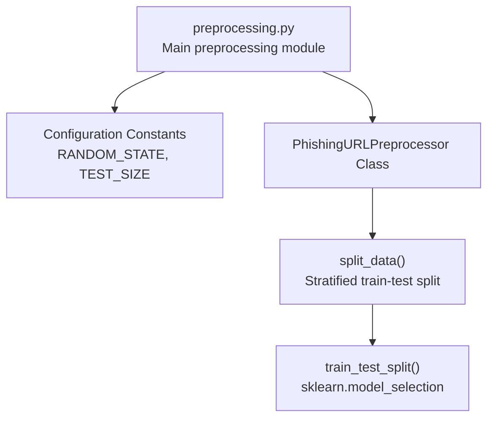
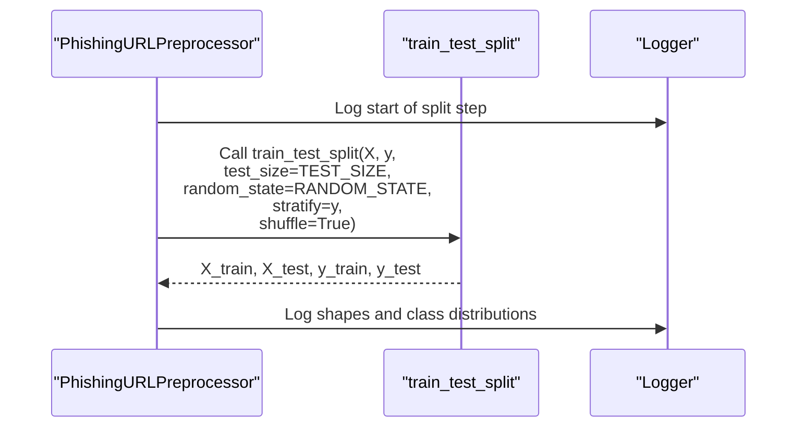
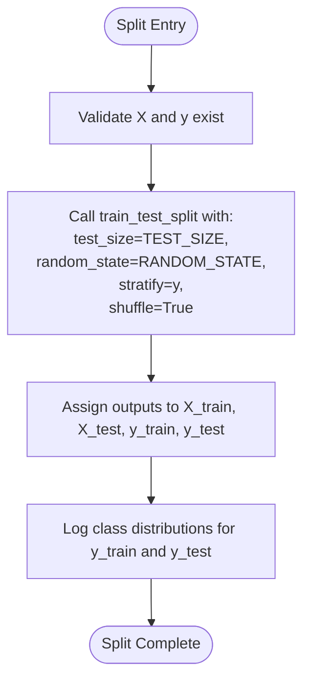
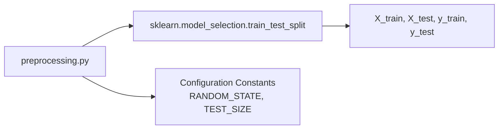

# Train-Test Split Strategy

<cite>
**Referenced Files in This Document**
- [preprocessing.py](file://preprocessing.py)
- [requirements.txt](file://requirements.txt)
</cite>

## Table of Contents
1. [Introduction](#introduction)
2. [Project Structure](#project-structure)
3. [Core Components](#core-components)
4. [Architecture Overview](#architecture-overview)
5. [Detailed Component Analysis](#detailed-component-analysis)
6. [Dependency Analysis](#dependency-analysis)
7. [Performance Considerations](#performance-considerations)
8. [Troubleshooting Guide](#troubleshooting-guide)
9. [Conclusion](#conclusion)

## Introduction
This document explains the stratified train-test split implementation used in the phishing URL detection pipeline. It focuses on how the approach preserves class balance between training and test sets, the fixed test size ratio, reproducible random state configuration, the shuffle process, and the impact on model evaluation. It also covers the rationale for stratification in imbalanced datasets, the choice of the random seed value, and best practices for maintaining consistent data splits across experiments.

## Project Structure
The project is organized around a single preprocessing module that implements a complete pipeline, including the stratified split. The relevant configuration constants and the split logic are defined within the preprocessing module.

**Diagram sources**
- [preprocessing.py:33-35](file://preprocessing.py#L33-L35)
- [preprocessing.py:425-445](file://preprocessing.py#L425-L445)

**Section sources**
- [preprocessing.py:112-134](file://preprocessing.py#L112-L134)
- [preprocessing.py:425-445](file://preprocessing.py#L425-L445)

## Core Components
- Configuration constants define the reproducibility and split ratio:
  - Random state for reproducibility
  - Fixed test size ratio for the split
- The split method performs stratification to preserve label distributions across training and test sets.

Key implementation references:
- Configuration constants: [preprocessing.py:33-35](file://preprocessing.py#L33-L35)
- Stratified split call: [preprocessing.py:431-438](file://preprocessing.py#L431-L438)
- Class distribution logs post-split: [preprocessing.py:442-443](file://preprocessing.py#L442-L443)

**Section sources**
- [preprocessing.py:33-35](file://preprocessing.py#L33-L35)
- [preprocessing.py:425-445](file://preprocessing.py#L425-L445)

## Architecture Overview
The stratified split is invoked during the preprocessing pipeline’s ninth step. It uses scikit-learn’s train_test_split with stratification enabled to ensure that both training and test sets reflect the original class proportions.

**Diagram sources**
- [preprocessing.py:425-445](file://preprocessing.py#L425-L445)

## Detailed Component Analysis

### Stratified Split Implementation
The split is performed inside the preprocessing pipeline’s dedicated method. It uses scikit-learn’s train_test_split with:
- Stratification on the target labels to preserve class balance
- A fixed test size ratio
- A reproducible random state
- Shuffling enabled

Implementation references:
- Split method definition: [preprocessing.py:425-445](file://preprocessing.py#L425-L445)
- Configuration constants: [preprocessing.py:33-35](file://preprocessing.py#L33-L35)
- Logging of distributions: [preprocessing.py:442-443](file://preprocessing.py#L442-L443)

**Diagram sources**
- [preprocessing.py:425-445](file://preprocessing.py#L425-L445)

**Section sources**
- [preprocessing.py:425-445](file://preprocessing.py#L425-L445)

### Configuration Constants
- Random state: Controls reproducibility across runs and experiments.
- Test size: Defines the proportion of samples allocated to the test set.

References:
- Random state constant: [preprocessing.py:33](file://preprocessing.py#L33)
- Test size constant: [preprocessing.py:34](file://preprocessing.py#L34)

**Section sources**
- [preprocessing.py:33-35](file://preprocessing.py#L33-L35)

### Impact on Model Evaluation
- Stratification ensures that both training and test sets maintain the original class proportions, preventing sampling bias.
- This improves the reliability of evaluation metrics and reduces variance in performance estimates.
- Consistent random state guarantees identical splits across experiments, enabling fair comparisons.

References:
- Stratified split call: [preprocessing.py:431-438](file://preprocessing.py#L431-L438)
- Post-split distribution logs: [preprocessing.py:442-443](file://preprocessing.py#L442-L443)

**Section sources**
- [preprocessing.py:431-438](file://preprocessing.py#L431-L438)
- [preprocessing.py:442-443](file://preprocessing.py#L442-L443)

### Rationale for Stratification in Imbalanced Phishing Detection
- Phishing URL datasets often exhibit class imbalance, where legitimate URLs outnumber malicious ones.
- Without stratification, random sampling could lead to underrepresentation of the minority class in either set, skewing evaluation.
- Stratification maintains representative samples of both classes, improving robustness of model assessment.

[No sources needed since this section provides general guidance]

### Random State Selection and Best Practices
- The chosen random seed ensures deterministic splits across runs and teams.
- Best practices:
  - Keep the random state constant for reproducibility within a project.
  - Avoid reusing the same seed across unrelated experiments to prevent accidental data leakage.
  - Document the seed value alongside the dataset and preprocessing steps.
  - Consider generating a new seed for each experiment when evaluating multiple variants.

References:
- Random state constant: [preprocessing.py:33](file://preprocessing.py#L33)
- Summary report includes random state: [preprocessing.py:610](file://preprocessing.py#L610)

**Section sources**
- [preprocessing.py:33](file://preprocessing.py#L33)
- [preprocessing.py:610](file://preprocessing.py#L610)

## Dependency Analysis
The split relies on scikit-learn’s train_test_split. The pipeline defines configuration constants locally and applies them consistently.

**Diagram sources**
- [preprocessing.py:26](file://preprocessing.py#L26)
- [preprocessing.py:33-35](file://preprocessing.py#L33-L35)
- [preprocessing.py:431-438](file://preprocessing.py#L431-L438)

**Section sources**
- [preprocessing.py:26](file://preprocessing.py#L26)
- [preprocessing.py:33-35](file://preprocessing.py#L33-L35)
- [preprocessing.py:431-438](file://preprocessing.py#L431-L438)

## Performance Considerations
- Stratification adds minimal overhead compared to the benefits of balanced class representation.
- Using a fixed random state avoids repeated shuffling variability, ensuring consistent timing across runs.
- For very large datasets, consider memory-efficient preprocessing prior to splitting to reduce overhead.

[No sources needed since this section provides general guidance]

## Troubleshooting Guide
Common issues and resolutions:
- Unexpected class imbalance in splits:
  - Verify that stratification is enabled and the target vector is passed correctly.
  - Confirm that the target variable contains only valid class labels.
- Reproducibility concerns:
  - Ensure the random state remains unchanged across runs.
  - Avoid inadvertently resetting the random state elsewhere in the pipeline.
- Logs verification:
  - Compare logged class distributions for training and test sets to confirm stratification effectiveness.

References:
- Stratified split call: [preprocessing.py:431-438](file://preprocessing.py#L431-L438)
- Post-split distribution logs: [preprocessing.py:442-443](file://preprocessing.py#L442-L443)

**Section sources**
- [preprocessing.py:431-438](file://preprocessing.py#L431-L438)
- [preprocessing.py:442-443](file://preprocessing.py#L442-L443)

## Conclusion
The stratified train-test split in this pipeline ensures that class distributions are preserved between training and test sets, using a fixed test size ratio and a reproducible random state. This approach enhances the reliability of model evaluation, especially in imbalanced phishing detection scenarios. Adhering to best practices for random state selection and consistent split reporting enables reproducible and comparable experiments across teams and iterations.