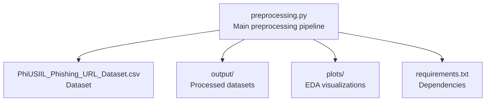
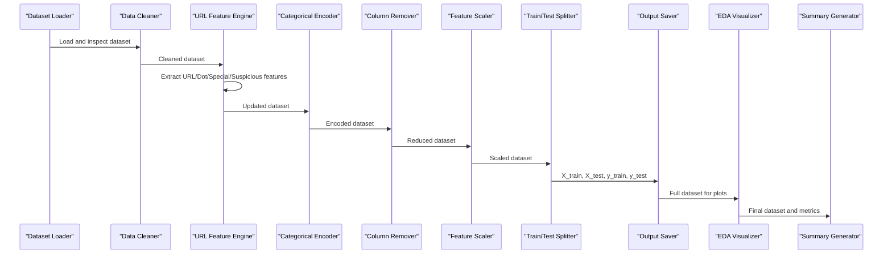
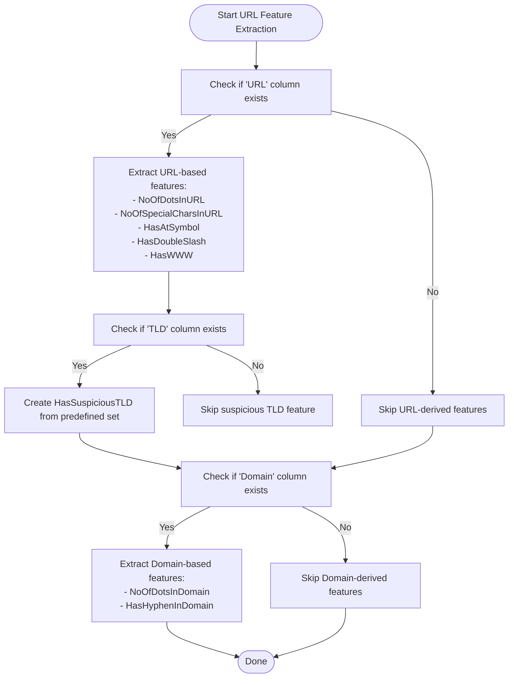
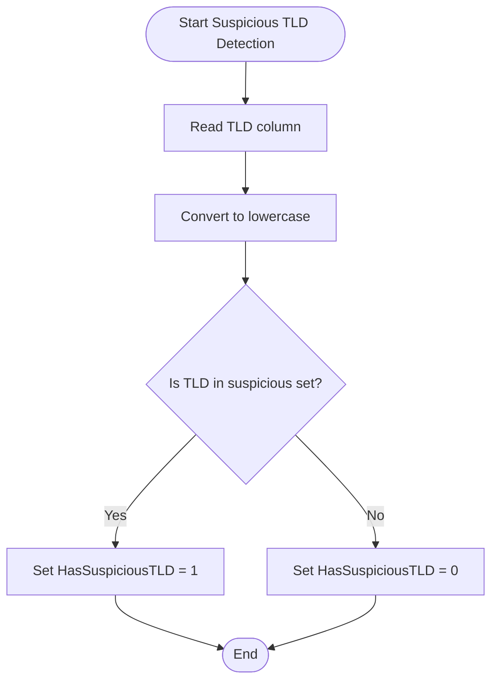
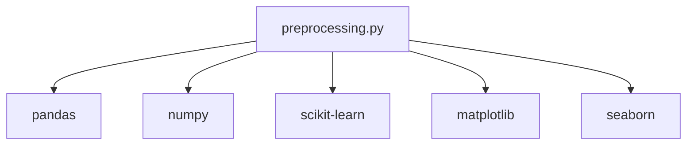

# URL Feature Engineering

<cite>
**Referenced Files in This Document**
- [preprocessing.py](file://preprocessing.py)
- [PhiUSIIL_Phishing_URL_Dataset.csv](file://PhiUSIIL_Phishing_URL_Dataset.csv)
- [requirements.txt](file://requirements.txt)
</cite>

## Table of Contents
1. [Introduction](#introduction)
2. [Project Structure](#project-structure)
3. [Core Components](#core-components)
4. [Architecture Overview](#architecture-overview)
5. [Detailed Component Analysis](#detailed-component-analysis)
6. [Dependency Analysis](#dependency-analysis)
7. [Performance Considerations](#performance-considerations)
8. [Troubleshooting Guide](#troubleshooting-guide)
9. [Conclusion](#conclusion)

## Introduction
This document explains the URL-specific feature engineering and extraction pipeline implemented in the preprocessing module. It focuses on automated feature generation from the URL and Domain columns, including dot counting, special character analysis, suspicious symbol detection, WWW prefix identification, and suspicious TLD detection. It also documents the regex patterns used, feature naming conventions, and the rationale behind each engineered feature for phishing URL detection.

## Project Structure
The project consists of a single preprocessing script that orchestrates loading, cleaning, feature engineering, encoding, scaling, splitting, saving outputs, and generating visualizations. The dataset is a CSV file containing URL-related attributes and labels.

**Diagram sources**
- [preprocessing.py:693-700](file://preprocessing.py#L693-L700)
- [PhiUSIIL_Phishing_URL_Dataset.csv:1-20](file://PhiUSIIL_Phishing_URL_Dataset.csv#L1-L20)

**Section sources**
- [preprocessing.py:112-134](file://preprocessing.py#L112-L134)
- [PhiUSIIL_Phishing_URL_Dataset.csv:1-20](file://PhiUSIIL_Phishing_URL_Dataset.csv#L1-L20)

## Core Components
This section documents the URL feature engineering steps performed by the preprocessing pipeline.

- Dot counting in the full URL
  - Feature: Number of dots in the full URL
  - Rationale: URLs with many dots often indicate obfuscation or subdomain abuse typical of phishing sites.
  - Implementation: Uses a regex to count occurrences of the dot character in the URL string.
  - Naming convention: NoOfDotsInURL

- Special character analysis in the full URL
  - Feature: Count of special characters in the URL
  - Rationale: Excessive special characters can signal attempts to confuse parsers or hide malicious intent.
  - Implementation: Counts characters that are not letters, digits, dots, forward slashes, or colons.
  - Naming convention: NoOfSpecialCharsInURL

- Suspicious symbol detection
  - Feature: Presence of @ symbol
  - Rationale: The @ symbol is rare in legitimate URLs and often indicates credential injection attempts.
  - Implementation: Boolean flag derived from regex match.
  - Naming convention: HasAtSymbol

  - Feature: Presence of double slash (//) in the URL
  - Rationale: Double slash can appear in legitimate contexts but is sometimes used to obscure path segments.
  - Implementation: Boolean flag derived from regex match.
  - Naming convention: HasDoubleSlash

- WWW prefix identification
  - Feature: Presence of www. prefix
  - Rationale: While not inherently malicious, the presence of www can be combined with other features to infer trust signals or anomalies.
  - Implementation: Boolean flag derived from regex match.
  - Naming convention: HasWWW

- Suspicious TLD detection
  - Feature: Presence of suspicious TLDs
  - Rationale: Certain top-level domains are frequently abused for phishing due to low registration requirements or lack of oversight.
  - Implementation: Compares the TLD column against a predefined set of suspicious TLDs and creates a boolean indicator.
  - Naming convention: HasSuspiciousTLD

- Domain-based feature extraction
  - Feature: Number of dots in the Domain
  - Rationale: Multiple dots in the domain name can indicate subdomain abuse or attempts to mimic trusted brands.
  - Implementation: Counts dots in the Domain string.
  - Naming convention: NoOfDotsInDomain

  - Feature: Hyphen presence in the Domain
  - Rationale: Hyphens can be used to create deceptive brand-like names; however, excessive use may be indicative of phishing.
  - Implementation: Boolean flag indicating presence of a hyphen in the Domain.
  - Naming convention: HasHyphenInDomain

These features are generated during the URL feature preprocessing step and integrated into the cleaned dataset for downstream modeling.

**Section sources**
- [preprocessing.py:262-316](file://preprocessing.py#L262-L316)
- [preprocessing.py:300-304](file://preprocessing.py#L300-L304)

## Architecture Overview
The URL feature engineering is part of a broader preprocessing pipeline that loads data, performs exploratory analysis, cleans the dataset, engineers features, encodes categoricals, removes unnecessary columns, scales numerical features, separates features and targets, splits into train/test sets, saves outputs, generates visualizations, and produces a summary report.

**Diagram sources**
- [preprocessing.py:138-166](file://preprocessing.py#L138-L166)
- [preprocessing.py:206-257](file://preprocessing.py#L206-L257)
- [preprocessing.py:262-316](file://preprocessing.py#L262-L316)
- [preprocessing.py:321-350](file://preprocessing.py#L321-L350)
- [preprocessing.py:355-371](file://preprocessing.py#L355-L371)
- [preprocessing.py:376-401](file://preprocessing.py#L376-L401)
- [preprocessing.py:406-445](file://preprocessing.py#L406-L445)
- [preprocessing.py:450-469](file://preprocessing.py#L450-L469)
- [preprocessing.py:474-586](file://preprocessing.py#L474-L586)
- [preprocessing.py:590-656](file://preprocessing.py#L590-L656)

## Detailed Component Analysis

### URL Feature Extraction Module
This module extracts and transforms URL and Domain features. It conditionally applies transformations depending on whether the raw URL and/or Domain columns are present.

Key operations:
- Dot counting in URL: Counts occurrences of the dot character in the URL string.
- Special character counting: Counts characters outside the safe set of letters, digits, dots, forward slashes, and colons.
- Suspicious symbol detection: Flags presence of @ and // in the URL.
- WWW prefix detection: Flags presence of www.
- Suspicious TLD detection: Flags TLDs against a curated set of commonly abused domains.
- Domain-based features: Counts dots in the Domain and checks for hyphen presence.

**Diagram sources**
- [preprocessing.py:279-316](file://preprocessing.py#L279-L316)
- [preprocessing.py:300-304](file://preprocessing.py#L300-L304)

**Section sources**
- [preprocessing.py:262-316](file://preprocessing.py#L262-L316)

### Suspicious TLD Detection Mechanism
The suspicious TLD detection compares the TLD column against a predefined set of commonly abused domains. The resulting boolean feature indicates whether the URL’s TLD belongs to the suspicious set.

- Predefined suspicious TLDs: tk, ml, ga, cf, top, xyz, bid, work, date, party, link, download
- Implementation: Converts TLD to lowercase and checks membership in the set; creates a binary indicator.

**Diagram sources**
- [preprocessing.py:300-304](file://preprocessing.py#L300-L304)

**Section sources**
- [preprocessing.py:300-304](file://preprocessing.py#L300-L304)

### Regex Patterns Used
- Dot counting in URL: r"\."
- Special character counting in URL: r"[^a-zA-Z0-9\.\/:]"
- Suspicious symbol detection:
  - At symbol: r"@"
  - Double slash: r"//"
- WWW prefix detection: r"www\."

These patterns are applied using vectorized string operations on the URL column.

**Section sources**
- [preprocessing.py:283-298](file://preprocessing.py#L283-L298)

### Feature Naming Conventions
- URL-based features:
  - NoOfDotsInURL
  - NoOfSpecialCharsInURL
  - HasAtSymbol
  - HasDoubleSlash
  - HasWWW
- Domain-based features:
  - NoOfDotsInDomain
  - HasHyphenInDomain
- Suspicious TLD feature:
  - HasSuspiciousTLD

Naming follows a consistent convention:
- Prefix indicates the source (NoOf for counts, Has for boolean flags)
- Suffix indicates the entity (URL, Domain, TLD)
- CamelCase improves readability

**Section sources**
- [preprocessing.py:283-316](file://preprocessing.py#L283-L316)

### Rationale Behind Each Engineered Feature
- NoOfDotsInURL
  - High dot counts often correlate with subdomain obfuscation and phishing attempts.
- NoOfSpecialCharsInURL
  - Excess special characters can indicate attempts to confuse parsers or inject payloads.
- HasAtSymbol
  - Rare in legitimate URLs; presence often signals credential theft attempts.
- HasDoubleSlash
  - Can be used to obscure path segments; warrants attention in anomaly detection.
- HasWWW
  - Neutral indicator; useful when combined with other features to infer trust signals.
- HasSuspiciousTLD
  - Low-cost heuristic leveraging known abusive TLDs to flag potentially malicious domains.
- NoOfDotsInDomain
  - Multiple dots in the domain can mimic trusted brands or indicate subdomain abuse.
- HasHyphenInDomain
  - Hyphens can be used to create deceptive brand-like names; combined with other signals for risk assessment.

**Section sources**
- [preprocessing.py:262-316](file://preprocessing.py#L262-L316)

## Dependency Analysis
The preprocessing pipeline depends on standard scientific Python libraries for data manipulation, visualization, and machine learning preprocessing.

**Diagram sources**
- [requirements.txt:1-6](file://requirements.txt#L1-L6)

**Section sources**
- [requirements.txt:1-6](file://requirements.txt#L1-L6)

## Performance Considerations
- Vectorized string operations: The feature extraction uses vectorized string methods to efficiently compute counts and boolean flags across large datasets.
- Memory usage: The pipeline logs memory usage during EDA to help monitor resource consumption.
- Scalability: The pipeline is designed to handle large datasets by operating on cleaned DataFrames and avoiding repeated transformations.

[No sources needed since this section provides general guidance]

## Troubleshooting Guide
Common issues and resolutions:
- Missing raw URL column
  - Symptom: Warning about skipping URL-derived feature engineering.
  - Resolution: Ensure the dataset contains a URL column or adjust the pipeline to rely on existing numeric features.

- Missing TLD or Domain columns
  - Symptom: Suspicious TLD or Domain-based features not created.
  - Resolution: Verify the dataset includes TLD and/or Domain columns; otherwise, skip those feature extractions.

- Unexpected NaN values
  - Symptom: Missing values after feature creation.
  - Resolution: Confirm that the dataset is cleaned of nulls prior to feature engineering.

- Incorrect TLD normalization
  - Symptom: Suspicious TLD flag not set despite known abusive TLDs.
  - Resolution: Ensure TLD values are normalized to lowercase before comparison.

**Section sources**
- [preprocessing.py:305-306](file://preprocessing.py#L305-L306)
- [preprocessing.py:300-304](file://preprocessing.py#L300-L304)

## Conclusion
The URL feature engineering pipeline systematically derives robust, interpretable features from URL and Domain columns to support phishing detection. By combining dot counting, special character analysis, suspicious symbol detection, WWW prefix identification, suspicious TLD detection, and domain-based features, the pipeline provides strong signals for machine learning models while maintaining transparency and explainability.