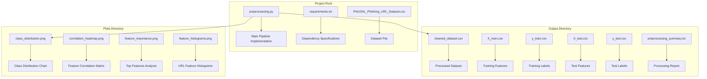
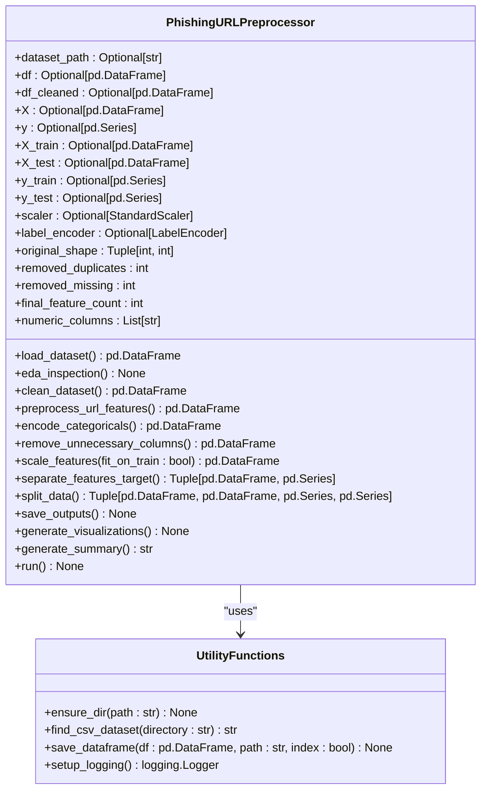
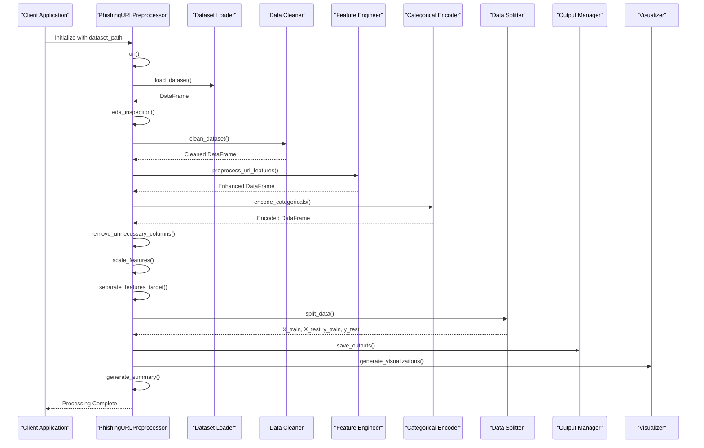
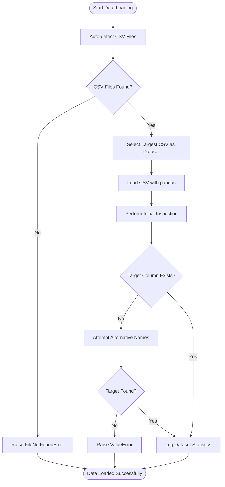
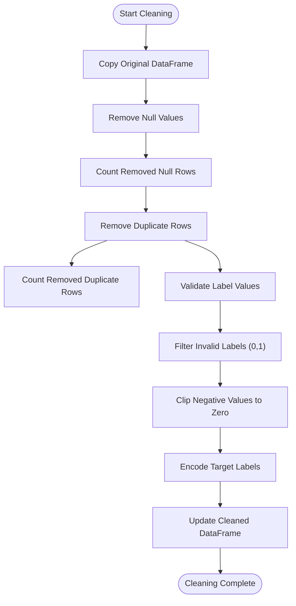
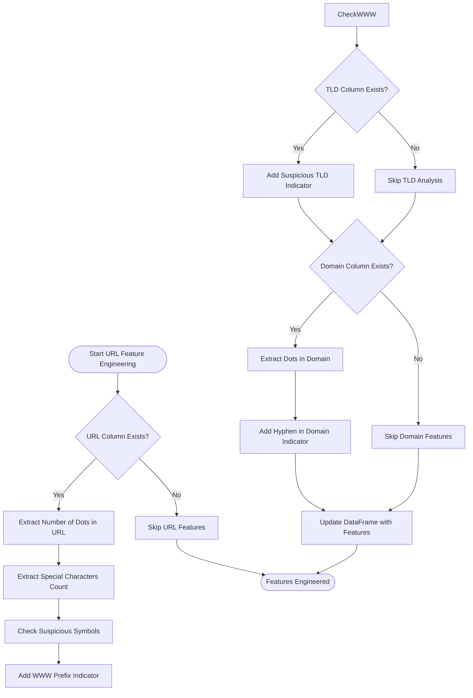

# Development Guide

<cite>
**Referenced Files in This Document**
- [preprocessing.py](file://preprocessing.py)
- [requirements.txt](file://requirements.txt)
- [PhiUSIIL_Phishing_URL_Dataset.csv](file://PhiUSIIL_Phishing_URL_Dataset.csv)
</cite>

## Table of Contents
1. [Introduction](#introduction)
2. [Project Structure](#project-structure)
3. [Core Components](#core-components)
4. [Architecture Overview](#architecture-overview)
5. [Detailed Component Analysis](#detailed-component-analysis)
6. [Extension Guidelines](#extension-guidelines)
7. [Customization Options](#customization-options)
8. [Testing Approach](#testing-approach)
9. [Debugging Techniques](#debugging-techniques)
10. [Logging Configuration](#logging-configuration)
11. [Dependency Management](#dependency-management)
12. [Development Environment Setup](#development-environment-setup)
13. [Validation Procedures](#validation-procedures)
14. [Integration Guidelines](#integration-guidelines)
15. [Best Practices](#best-practices)
16. [Troubleshooting Guide](#troubleshooting-guide)
17. [Conclusion](#conclusion)

## Introduction

The URL_Spam preprocessing pipeline is a production-ready, modular system designed for the PhiUSIIL Phishing URL Dataset. This comprehensive development guide provides detailed instructions for extending and modifying the preprocessing pipeline, adding new URL analysis features, customizing visualization generation, and extending the preprocessing pipeline with additional data cleaning steps.

The pipeline follows a structured approach with 12 sequential processing stages, from data loading and inspection through final visualization generation. It incorporates modern machine learning preprocessing techniques including feature engineering, categorical encoding, and statistical analysis.

## Project Structure

The project maintains a clean, minimal structure optimized for the preprocessing pipeline:



**Diagram sources**
- [preprocessing.py:693-700](file://preprocessing.py#L693-L700)
- [preprocessing.py:450-470](file://preprocessing.py#L450-L470)
- [preprocessing.py:474-586](file://preprocessing.py#L474-L586)

**Section sources**
- [preprocessing.py:11-70](file://preprocessing.py#L11-L70)
- [requirements.txt:1-6](file://requirements.txt#L1-L6)

## Core Components

The preprocessing pipeline centers around the `PhishingURLPreprocessor` class, which orchestrates the entire data processing workflow:

### Main Pipeline Class Structure



**Diagram sources**
- [preprocessing.py:112-134](file://preprocessing.py#L112-L134)
- [preprocessing.py:76-107](file://preprocessing.py#L76-L107)

### Processing Pipeline Stages

The pipeline executes through 12 distinct stages, each with specific responsibilities:

1. **Dataset Loading**: Reads CSV files and performs initial inspection
2. **Exploratory Data Analysis**: Logs comprehensive statistics
3. **Data Cleaning**: Handles missing values, duplicates, and invalid labels
4. **URL Feature Engineering**: Extracts URL-specific characteristics
5. **Categorical Encoding**: Processes text features appropriately
6. **Column Removal**: Eliminates non-ML features
7. **Feature Scaling**: Normalizes numerical attributes
8. **Feature-Target Separation**: Prepares data for modeling
9. **Train-Test Split**: Creates stratified datasets
10. **Output Persistence**: Saves processed datasets
11. **Visualization Generation**: Creates EDA charts
12. **Summary Reporting**: Documents processing results

**Section sources**
- [preprocessing.py:138-688](file://preprocessing.py#L138-L688)

## Architecture Overview

The preprocessing architecture follows a modular, stage-based design pattern that ensures maintainability and extensibility:



**Diagram sources**
- [preprocessing.py:661-688](file://preprocessing.py#L661-L688)
- [preprocessing.py:138-445](file://preprocessing.py#L138-L445)

## Detailed Component Analysis

### Data Loading and Inspection Module

The data loading module handles automatic CSV detection and initial dataset inspection:



**Diagram sources**
- [preprocessing.py:82-166](file://preprocessing.py#L82-L166)

### Data Cleaning and Validation

The cleaning module implements robust validation and preprocessing:



**Diagram sources**
- [preprocessing.py:206-257](file://preprocessing.py#L206-L257)

### URL Feature Engineering

The URL feature engineering module extracts sophisticated URL characteristics:



**Diagram sources**
- [preprocessing.py:262-316](file://preprocessing.py#L262-L316)

**Section sources**
- [preprocessing.py:138-688](file://preprocessing.py#L138-L688)

## Extension Guidelines

### Adding New URL Analysis Features

To extend the URL analysis capabilities, modify the `preprocess_url_features` method:

1. **Feature Extraction**: Add new URL parsing logic using regex patterns
2. **Feature Engineering**: Create meaningful derived features from URL components
3. **Validation**: Ensure new features handle edge cases and missing data
4. **Documentation**: Update the summary report to reflect new features

Example extension points:
- URL entropy calculation for obfuscation detection
- Subdomain depth analysis
- Path complexity metrics
- Query parameter analysis
- TLD reputation scoring

### Customizing Visualization Generation

The visualization system provides multiple customization options:

1. **Chart Types**: Modify the `generate_visualizations` method to add new plot types
2. **Styling**: Adjust matplotlib/seaborn parameters for different visual themes
3. **Feature Selection**: Customize which features are plotted based on dataset characteristics
4. **Export Settings**: Configure resolution, file formats, and storage locations

### Extending Data Cleaning Steps

Enhance the cleaning pipeline by adding new validation rules:

1. **Custom Validation**: Implement domain-specific validation logic
2. **Outlier Detection**: Add statistical outlier filtering
3. **Data Transformation**: Include normalization or transformation steps
4. **Quality Metrics**: Track additional cleaning statistics

**Section sources**
- [preprocessing.py:262-316](file://preprocessing.py#L262-L316)
- [preprocessing.py:474-586](file://preprocessing.py#L474-L586)

## Customization Options

### Configuration Parameters

The pipeline uses several configurable constants:

| Parameter | Default Value | Description |
|-----------|---------------|-------------|
| RANDOM_STATE | 42 | Random seed for reproducible results |
| TEST_SIZE | 0.2 | Proportion of data for testing |
| OUTPUT_DIR | "output" | Directory for processed outputs |
| PLOTS_DIR | "plots" | Directory for generated plots |
| DROP_COLUMNS | ["FILENAME","URL","Domain","Title"] | Columns to remove during preprocessing |

### Feature Engineering Customization

The URL feature engineering system supports:

- **Dynamic Feature Addition**: New features can be added without modifying core logic
- **Conditional Processing**: Features are only computed when source columns exist
- **Extensible Architecture**: Easy addition of new URL analysis techniques

### Visualization Customization

The visualization system offers:

- **Modular Plot Generation**: Each chart type is independently configurable
- **Statistical Analysis**: Built-in correlation and importance calculations
- **Export Flexibility**: Configurable file formats and quality settings

**Section sources**
- [preprocessing.py:34-46](file://preprocessing.py#L34-L46)
- [preprocessing.py:474-586](file://preprocessing.py#L474-L586)

## Testing Approach

### Unit Testing Strategy

The modular design facilitates comprehensive testing:

1. **Individual Method Testing**: Test each preprocessing stage independently
2. **Integration Testing**: Verify end-to-end pipeline functionality
3. **Edge Case Testing**: Validate behavior with malformed or incomplete data
4. **Performance Testing**: Measure processing time and memory usage

### Test Data Preparation

Recommended testing datasets:
- Small subset of the original dataset for quick validation
- Malformed data with missing values and outliers
- Edge cases with unusual URL formats
- Balanced and imbalanced label distributions

### Validation Metrics

Key metrics to track during testing:
- Data integrity preservation
- Feature engineering accuracy
- Memory usage efficiency
- Processing time performance
- Output file correctness

## Debugging Techniques

### Logging Configuration

The pipeline implements comprehensive logging:

```python
# Example logging configuration
logger = logging.getLogger("PhishingPreprocessing")
logger.setLevel(logging.INFO)

formatter = logging.Formatter(
    "%(asctime)s | %(levelname)-8s | %(message)s",
    datefmt="%Y-%m-%d %H:%M:%S"
)
```

### Debug Strategies

1. **Step-by-Step Execution**: Run individual pipeline stages to isolate issues
2. **Data Inspection**: Use pandas profiling to understand data transformations
3. **Memory Monitoring**: Track memory usage during large dataset processing
4. **Error Handling**: Implement try-catch blocks around critical operations

### Common Issues and Solutions

- **File Not Found Errors**: Verify CSV auto-detection logic
- **Memory Issues**: Optimize data types and chunk processing
- **Feature Engineering Failures**: Validate regex patterns and data types
- **Visualization Errors**: Check matplotlib backend configuration

**Section sources**
- [preprocessing.py:53-70](file://preprocessing.py#L53-L70)

## Logging Configuration

### Logger Setup

The pipeline uses a dedicated logger with timestamp formatting:

```python
logger = logging.getLogger("PhishingPreprocessing")
logger.setLevel(logging.INFO)
```

### Log Levels and Messages

- **INFO**: Major pipeline stages and processing progress
- **WARNING**: Non-fatal issues and edge cases
- **ERROR**: Critical failures and exceptions
- **DEBUG**: Detailed internal processing information (optional)

### Log Formatting

Standardized log format includes:
- Timestamp with date and time
- Severity level indicator
- Processing stage identification
- Action-specific messages

## Dependency Management

### Required Dependencies

The project requires the following minimum versions:

| Package | Minimum Version | Purpose |
|---------|----------------|---------|
| pandas | >=2.0.0 | Data manipulation and analysis |
| numpy | >=1.24.0 | Numerical computing and array operations |
| scikit-learn | >=1.3.0 | Machine learning preprocessing and modeling |
| matplotlib | >=3.7.0 | Data visualization and plotting |
| seaborn | >=0.12.0 | Statistical data visualization |

### Installation Requirements

```bash
pip install -r requirements.txt
```

### Version Compatibility

The pipeline is designed for:
- **Python 3.8+**: Recommended for latest feature support
- **Modern pandas**: Leverages recent DataFrame enhancements
- **Latest scikit-learn**: Utilizes newest preprocessing capabilities
- **Compatible visualization libraries**: Ensures cross-platform plotting

**Section sources**
- [requirements.txt:1-6](file://requirements.txt#L1-L6)

## Development Environment Setup

### Prerequisites

1. **Python Environment**: Install Python 3.8 or higher
2. **Virtual Environment**: Create isolated development environment
3. **Git**: Version control for source code management

### Installation Steps

1. Clone the repository
2. Create virtual environment: `python -m venv url_spam_env`
3. Activate environment: `source url_spam_env/bin/activate`
4. Install dependencies: `pip install -r requirements.txt`
5. Verify installation: `python -c "import pandas, numpy, sklearn"`

### Development Tools

Recommended IDE extensions:
- Python language server for intelligent code completion
- Git integration for version control
- Markdown preview for documentation editing
- Jupyter notebook support for interactive development

### Project Initialization

```python
# Example initialization
preprocessor = PhishingURLPreprocessor()
preprocessor.run()
```

## Validation Procedures

### Data Quality Validation

1. **Schema Validation**: Verify required columns exist
2. **Range Validation**: Check feature values fall within expected ranges
3. **Consistency Validation**: Ensure data relationships remain intact
4. **Completeness Validation**: Confirm no unexpected data loss

### Output Verification

1. **File Existence**: Verify all expected output files are created
2. **Content Validation**: Check output files contain expected data
3. **Format Validation**: Ensure files are properly formatted
4. **Size Validation**: Confirm output files have reasonable sizes

### Performance Validation

1. **Execution Time**: Monitor processing duration
2. **Memory Usage**: Track resource consumption
3. **Scalability Testing**: Test with larger datasets
4. **Resource Limits**: Verify operation within system constraints

## Integration Guidelines

### Dataset Integration

The pipeline supports various phishing detection datasets:

1. **Schema Adaptation**: Modify column mappings for different datasets
2. **Feature Alignment**: Ensure compatible feature sets
3. **Label Normalization**: Handle different label encodings
4. **Quality Standards**: Maintain consistent data quality thresholds

### External System Integration

Integration points for external systems:

1. **Model Training Pipelines**: Seamless integration with ML workflows
2. **Monitoring Systems**: Logging and alerting integration
3. **Data Warehouse Integration**: Batch processing capabilities
4. **API Services**: Web service deployment options

### Third-Party Tool Integration

Potential integrations:
- **Feature Store Integration**: Centralized feature management
- **ML Model Registry**: Model versioning and deployment
- **Data Catalog Services**: Metadata management
- **Monitoring Platforms**: Performance and health monitoring

## Best Practices

### Code Quality Standards

1. **Modular Design**: Maintain separation of concerns
2. **Error Handling**: Implement comprehensive exception handling
3. **Documentation**: Include inline documentation and docstrings
4. **Testing**: Write unit tests for all new functionality
5. **Performance**: Optimize for both speed and memory efficiency

### Python Best Practices

- **Type Hints**: Use explicit type annotations
- **PEP 8 Compliance**: Follow Python coding standards
- **Exception Safety**: Handle errors gracefully
- **Resource Management**: Properly manage file and memory resources
- **Logging**: Use structured logging consistently

### Backward Compatibility

- **API Stability**: Maintain consistent method signatures
- **Configuration Flexibility**: Allow parameter customization
- **Output Format Consistency**: Preserve expected output structures
- **Error Message Stability**: Keep error messages informative and consistent

## Troubleshooting Guide

### Common Issues and Solutions

**Issue**: FileNotFoundError when no CSV files found
- **Solution**: Ensure dataset files are in the working directory
- **Prevention**: Implement explicit dataset path specification

**Issue**: Memory errors with large datasets
- **Solution**: Process data in chunks or upgrade system resources
- **Prevention**: Monitor memory usage and implement pagination

**Issue**: Feature engineering failures
- **Solution**: Validate regex patterns and handle edge cases
- **Prevention**: Add comprehensive input validation

**Issue**: Visualization generation errors
- **Solution**: Check matplotlib backend configuration
- **Prevention**: Verify display environment setup

### Performance Optimization

1. **Memory Optimization**: Use appropriate data types and efficient algorithms
2. **Parallel Processing**: Leverage multiprocessing for CPU-intensive tasks
3. **I/O Optimization**: Minimize file operations and use efficient formats
4. **Caching**: Implement caching for expensive computations

### Debug Mode Features

Enable debug mode for detailed logging:
- Enhanced error messages
- Intermediate processing results
- Performance timing information
- Memory usage tracking

**Section sources**
- [preprocessing.py:693-700](file://preprocessing.py#L693-L700)

## Conclusion

The URL_Spam preprocessing pipeline provides a robust foundation for phishing URL detection system development. Its modular architecture, comprehensive logging, and extensible design enable developers to easily add new features while maintaining system reliability and performance.

Key strengths of the current implementation include:
- **Production-Ready Design**: Handles real-world data challenges
- **Comprehensive Logging**: Enables effective debugging and monitoring
- **Extensible Architecture**: Supports easy feature additions
- **Robust Error Handling**: Manages edge cases gracefully
- **Performance Focus**: Optimized for large-scale data processing

Future development should focus on expanding feature engineering capabilities, enhancing visualization options, and improving integration with broader ML ecosystems while maintaining the system's reliability and performance characteristics.