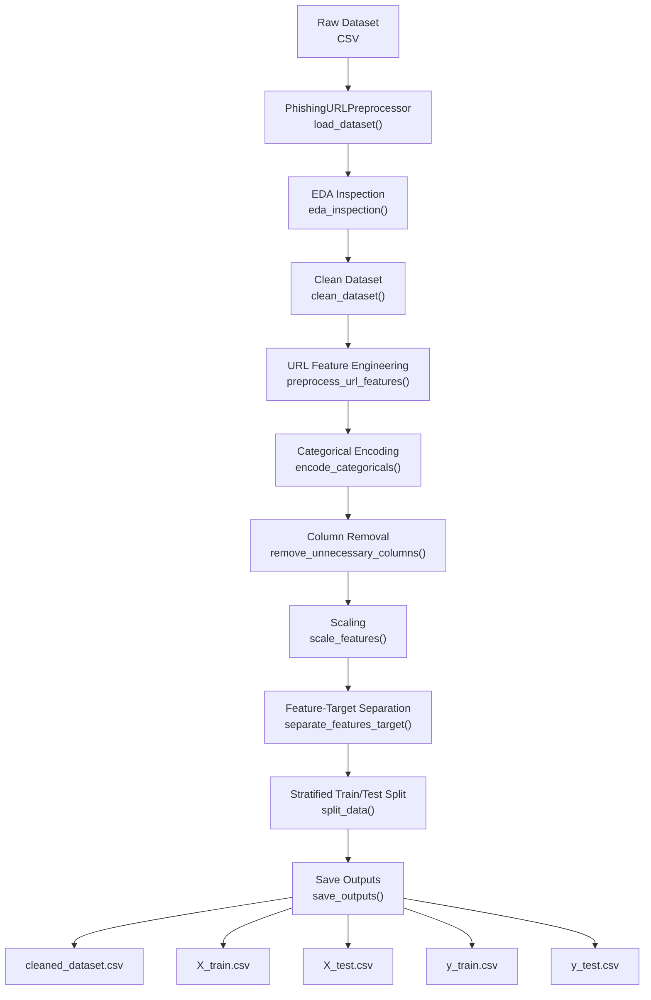
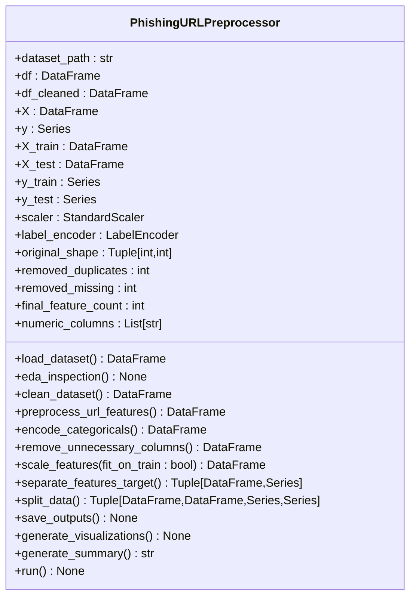
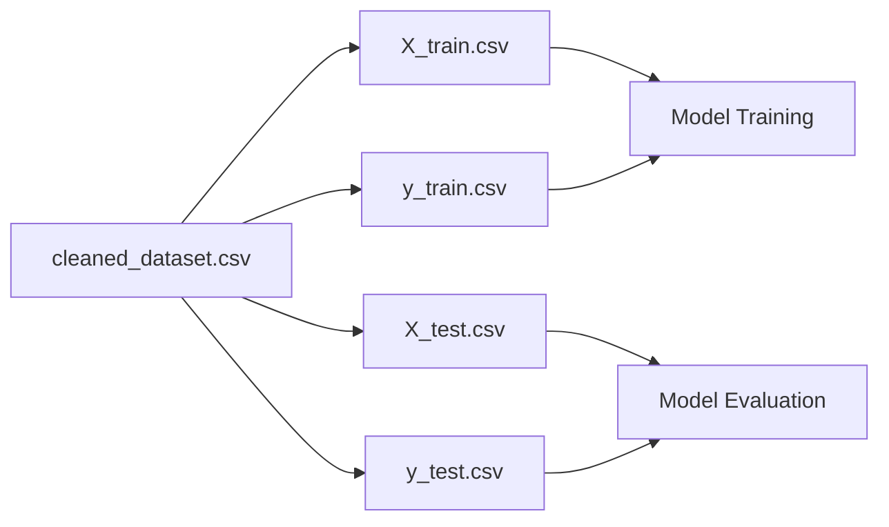
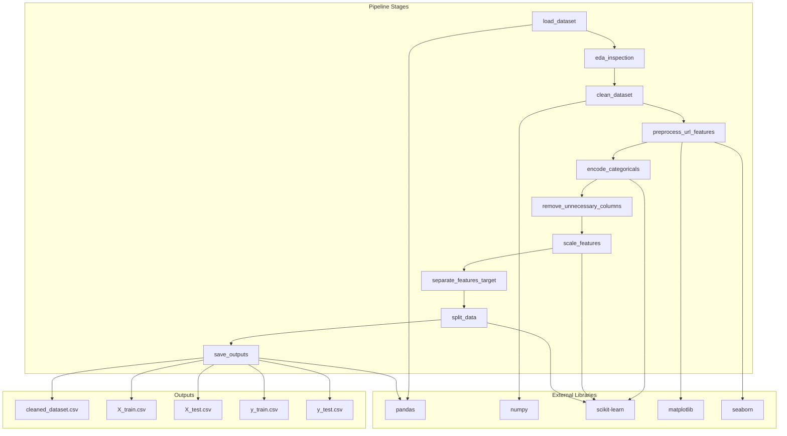

# Generated Datasets and Files

<cite>
**Referenced Files in This Document**
- [preprocessing.py](file://preprocessing.py)
- [output/cleaned_dataset.csv](file://output/cleaned_dataset.csv)
- [output/X_train.csv](file://output/X_train.csv)
- [output/X_test.csv](file://output/X_test.csv)
- [output/y_train.csv](file://output/y_train.csv)
- [output/y_test.csv](file://output/y_test.csv)
</cite>

## Table of Contents
1. [Introduction](#introduction)
2. [Project Structure](#project-structure)
3. [Core Components](#core-components)
4. [Architecture Overview](#architecture-overview)
5. [Detailed Component Analysis](#detailed-component-analysis)
6. [Dependency Analysis](#dependency-analysis)
7. [Performance Considerations](#performance-considerations)
8. [Troubleshooting Guide](#troubleshooting-guide)
9. [Conclusion](#conclusion)

## Introduction
This document provides comprehensive documentation for the generated datasets and output files produced by the phishing URL detection preprocessing pipeline. It explains the structure, content, and purpose of each output file, including the complete processed dataset and the train/test splits used for downstream machine learning workflows. The guide covers file format specifications, column definitions, data types, row counts, and the train/test split strategy, along with practical guidance for loading and using these datasets across common ML frameworks.

## Project Structure
The preprocessing pipeline generates five primary output files under the output directory:
- cleaned_dataset.csv: Complete processed dataset with all features and the target label
- X_train.csv: Training feature matrix
- X_test.csv: Testing feature matrix
- y_train.csv: Training target labels
- y_test.csv: Testing target labels

**Diagram sources**
- [preprocessing.py:450-470](file://preprocessing.py#L450-L470)

**Section sources**
- [preprocessing.py:450-470](file://preprocessing.py#L450-L470)

## Core Components
The preprocessing pipeline encapsulates a modular workflow that transforms raw CSV datasets into standardized training and testing assets for supervised learning. Key stages include:
- Dataset auto-detection and initial inspection
- Data cleaning (removing nulls, duplicates, invalid labels, clipping negative counts)
- Target encoding (binary classification)
- URL feature engineering (extracted from raw URL when available)
- Categorical encoding (one-hot vs frequency encoding)
- Column removal (non-ML identifiers)
- Feature scaling (standardization)
- Train/test split with stratification
- Output persistence

These steps collectively produce the five output files described below.

**Section sources**
- [preprocessing.py:138-166](file://preprocessing.py#L138-L166)
- [preprocessing.py:206-257](file://preprocessing.py#L206-L257)
- [preprocessing.py:262-316](file://preprocessing.py#L262-L316)
- [preprocessing.py:321-350](file://preprocessing.py#L321-L350)
- [preprocessing.py:355-371](file://preprocessing.py#L355-L371)
- [preprocessing.py:376-401](file://preprocessing.py#L376-L401)
- [preprocessing.py:406-420](file://preprocessing.py#L406-L420)
- [preprocessing.py:425-445](file://preprocessing.py#L425-L445)
- [preprocessing.py:450-469](file://preprocessing.py#L450-L469)

## Architecture Overview
The pipeline follows a production-ready, modular design with explicit separation of concerns:
- Configuration constants define random state, test size, and output directories
- A dedicated class manages the entire workflow
- Each stage is implemented as a method with logging and validation
- Outputs are persisted to CSV with error handling

**Diagram sources**
- [preprocessing.py:112-134](file://preprocessing.py#L112-L134)
- [preprocessing.py:661-687](file://preprocessing.py#L661-L687)

**Section sources**
- [preprocessing.py:34-42](file://preprocessing.py#L34-L42)
- [preprocessing.py:112-134](file://preprocessing.py#L112-L134)

## Detailed Component Analysis

### Output File: cleaned_dataset.csv
Purpose: Complete processed dataset containing all engineered features plus the target label.

Format and Specifications:
- File type: CSV
- Index: Not included
- Separator: Comma
- Encoding: UTF-8
- Header: Column names (features + label)

Structure:
- Rows: Total number of cleaned samples after removing duplicates, nulls, and invalid labels
- Columns: All numeric features (engineered and original) plus the encoded target label

Data Types:
- All feature columns: float64
- Target column: int64 (encoded labels)

Row Count:
- Determined by the final cleaned dataset shape after preprocessing

Usage Notes:
- Suitable for exploratory analysis, statistical summaries, and as a baseline dataset
- Can be used to re-run preprocessing steps independently

**Section sources**
- [preprocessing.py:458-461](file://preprocessing.py#L458-L461)
- [output/cleaned_dataset.csv:1-20](file://output/cleaned_dataset.csv#L1-L20)

### Output File: X_train.csv
Purpose: Training feature matrix for machine learning models.

Format and Specifications:
- File type: CSV
- Index: Not included
- Separator: Comma
- Encoding: UTF-8
- Header: Column names (all features)

Structure:
- Rows: Training samples (80% of total dataset)
- Columns: All feature columns (excluding the target)

Data Types:
- All columns: float64

Row Count:
- Approximately 80% of the cleaned dataset rows

Usage Notes:
- Use as X for training scikit-learn models
- Ensure consistent feature ordering with X_test

**Section sources**
- [preprocessing.py:464](file://preprocessing.py#L464)
- [output/X_train.csv:1-20](file://output/X_train.csv#L1-L20)

### Output File: X_test.csv
Purpose: Testing feature matrix for evaluating machine learning models.

Format and Specifications:
- File type: CSV
- Index: Not included
- Separator: Comma
- Encoding: UTF-8
- Header: Column names (all features)

Structure:
- Rows: Testing samples (20% of total dataset)
- Columns: All feature columns (excluding the target)

Data Types:
- All columns: float64

Row Count:
- Approximately 20% of the cleaned dataset rows

Usage Notes:
- Use as X for model evaluation and testing
- Maintain identical feature schema with X_train

**Section sources**
- [preprocessing.py:465](file://preprocessing.py#L465)
- [output/X_test.csv:1-20](file://output/X_test.csv#L1-L20)

### Output File: y_train.csv
Purpose: Training target labels aligned with X_train.

Format and Specifications:
- File type: CSV
- Index: Not included
- Separator: Comma
- Encoding: UTF-8
- Header: label (single column)

Structure:
- Rows: Training samples (80% of total dataset)
- Columns: Single column named label

Data Types:
- label: int64 (encoded 0/1)

Row Count:
- Same as X_train rows

Usage Notes:
- Use as y for training scikit-learn models
- Ensure alignment with X_train rows

**Section sources**
- [preprocessing.py:466](file://preprocessing.py#L466)
- [output/y_train.csv:1-20](file://output/y_train.csv#L1-L20)

### Output File: y_test.csv
Purpose: Testing target labels aligned with X_test.

Format and Specifications:
- File type: CSV
- Index: Not included
- Separator: Comma
- Encoding: UTF-8
- Header: label (single column)

Structure:
- Rows: Testing samples (20% of total dataset)
- Columns: Single column named label

Data Types:
- label: int64 (encoded 0/1)

Row Count:
- Same as X_test rows

Usage Notes:
- Use as y for model evaluation and testing
- Ensure alignment with X_test rows

**Section sources**
- [preprocessing.py:467](file://preprocessing.py#L467)
- [output/y_test.csv:1-20](file://output/y_test.csv#L1-L20)

### Train/Test Split Strategy and Stratification
The pipeline performs a stratified train/test split to preserve class balance:
- Test size: 20% (0.2)
- Random state: 42 (reproducible results)
- Stratification: Uses the target variable y to maintain class proportions in both sets

Implications:
- Both training and testing sets reflect the original class distribution
- Reduces risk of sampling bias in small classes
- Ensures reliable evaluation metrics

**Section sources**
- [preprocessing.py:35-36](file://preprocessing.py#L35-L36)
- [preprocessing.py:431-438](file://preprocessing.py#L431-L438)

### Relationship Between Output Files
The five output files form a cohesive dataset partitioning:
- cleaned_dataset.csv contains all rows and features plus the target
- X_train.csv and y_train.csv form the training pair
- X_test.csv and y_test.csv form the testing pair
- X_train and X_test share identical feature schemas
- y_train and y_test align with their respective X matrices

**Diagram sources**
- [preprocessing.py:458-467](file://preprocessing.py#L458-L467)

**Section sources**
- [preprocessing.py:458-467](file://preprocessing.py#L458-L467)

## Dependency Analysis
The preprocessing pipeline orchestrates multiple dependencies across data processing, feature engineering, and model preparation stages. The following diagram illustrates the primary dependencies among pipeline components and outputs.

**Diagram sources**
- [preprocessing.py:11-29](file://preprocessing.py#L11-L29)
- [preprocessing.py:138-166](file://preprocessing.py#L138-L166)
- [preprocessing.py:206-257](file://preprocessing.py#L206-L257)
- [preprocessing.py:262-316](file://preprocessing.py#L262-L316)
- [preprocessing.py:321-350](file://preprocessing.py#L321-L350)
- [preprocessing.py:355-371](file://preprocessing.py#L355-L371)
- [preprocessing.py:376-401](file://preprocessing.py#L376-L401)
- [preprocessing.py:406-420](file://preprocessing.py#L406-L420)
- [preprocessing.py:425-445](file://preprocessing.py#L425-L445)
- [preprocessing.py:450-469](file://preprocessing.py#L450-L469)

**Section sources**
- [preprocessing.py:11-29](file://preprocessing.py#L11-L29)

## Performance Considerations
- Memory usage: Large datasets may require sufficient RAM for in-memory operations; consider chunked processing for very large inputs
- Scaling overhead: StandardScaler is applied to all numeric features; ensure consistent scaling across training and testing sets
- Stratification cost: Stratified splitting adds minimal overhead while ensuring balanced class representation
- I/O efficiency: CSV persistence is straightforward; for large-scale workflows, consider parquet or feather formats for faster reads/writes

## Troubleshooting Guide
Common issues and resolutions:
- Missing target column: The pipeline attempts to auto-detect target columns with multiple naming variants; ensure the dataset contains a binary target column
- Empty outputs: Verify that the dataset contains sufficient rows after cleaning; duplicates and invalid labels are removed
- Column mismatch: Ensure that feature engineering and encoding steps are executed consistently across training and testing sets
- Scaling inconsistencies: The scaler is fitted on the full cleaned dataset; avoid refitting on test data in production workflows

**Section sources**
- [preprocessing.py:155-163](file://preprocessing.py#L155-L163)
- [preprocessing.py:458-469](file://preprocessing.py#L458-L469)

## Conclusion
The preprocessing pipeline produces a complete, reproducible dataset partitioning suitable for building and evaluating phishing URL detection models. The five output files provide a standardized foundation for training, validation, and testing, with careful attention to data quality, feature engineering, and stratified sampling. Researchers and data scientists can rely on these artifacts to accelerate model development and ensure consistent evaluation across experiments.