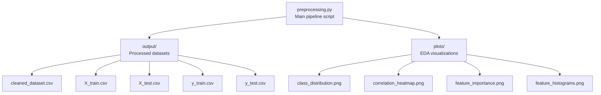
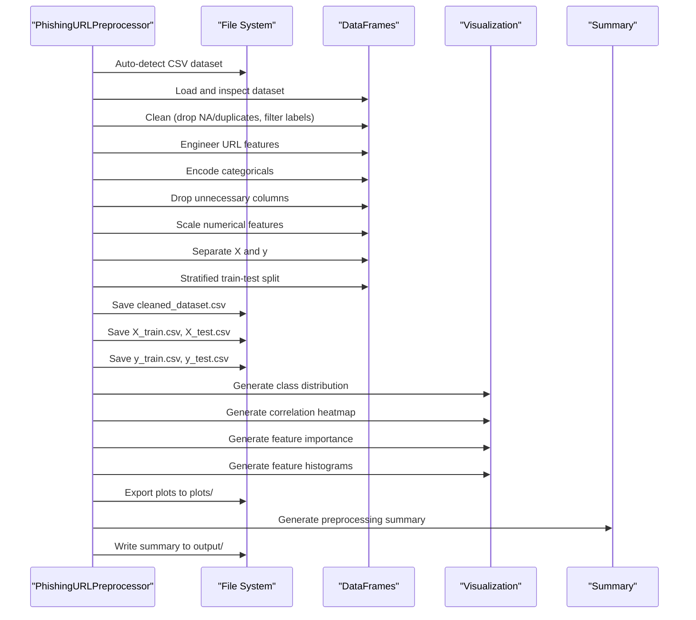
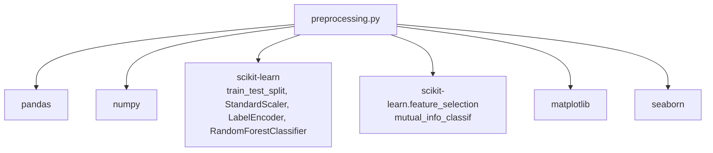

# Output and Visualization

<cite>
**Referenced Files in This Document**
- [preprocessing.py](file://preprocessing.py)
- [output/cleaned_dataset.csv](file://output/cleaned_dataset.csv)
- [output/X_train.csv](file://output/X_train.csv)
- [output/X_test.csv](file://output/X_test.csv)
- [output/y_train.csv](file://output/y_train.csv)
- [output/y_test.csv](file://output/y_test.csv)
- [plots/class_distribution.png](file://plots/class_distribution.png)
- [plots/correlation_heatmap.png](file://plots/correlation_heatmap.png)
- [plots/feature_importance.png](file://plots/feature_importance.png)
- [plots/feature_histograms.png](file://plots/feature_histograms.png)
- [requirements.txt](file://requirements.txt)
</cite>

## Table of Contents
1. [Introduction](#introduction)
2. [Project Structure](#project-structure)
3. [Core Components](#core-components)
4. [Architecture Overview](#architecture-overview)
5. [Detailed Component Analysis](#detailed-component-analysis)
6. [Dependency Analysis](#dependency-analysis)
7. [Performance Considerations](#performance-considerations)
8. [Troubleshooting Guide](#troubleshooting-guide)
9. [Conclusion](#conclusion)

## Introduction
This document explains the output generation and visualization components of the phishing URL detection preprocessing pipeline. It covers the five output artifacts produced by the pipeline and the four statistical visualizations used for exploratory data analysis. The guide describes the structure and content of each output file, their intended use in downstream machine learning workflows, and the file format specifications. It also details the visualization generation process, styling choices, export configurations, interpretation guidance, and the summary report format.

## Project Structure
The preprocessing pipeline organizes outputs into two primary directories:
- output/: Contains processed datasets for training and testing
- plots/: Contains statistical visualizations for EDA

**Diagram sources**
- [preprocessing.py:450-470](file://preprocessing.py#L450-L470)
- [preprocessing.py:474-586](file://preprocessing.py#L474-L586)

**Section sources**
- [preprocessing.py:36-38](file://preprocessing.py#L36-L38)
- [preprocessing.py:450-470](file://preprocessing.py#L450-L470)
- [preprocessing.py:474-586](file://preprocessing.py#L474-L586)

## Core Components
This section documents the five output files and their roles in the ML workflow.

- cleaned_dataset.csv
  - Purpose: Full cleaned dataset combining features (X) and target (y) after preprocessing
  - Structure: Header row lists feature names; subsequent rows contain numeric feature values and integer target labels
  - Typical use: Initial inspection, baseline modeling, or as a complete dataset snapshot
  - Format: Comma-separated values (CSV); no row indices; numeric features standardized; target encoded as integers

- X_train.csv
  - Purpose: Training feature matrix for supervised learning
  - Structure: Same feature header as cleaned_dataset.csv; rows represent training samples
  - Typical use: Model training with scikit-learn estimators
  - Format: CSV; numeric values; no index column

- X_test.csv
  - Purpose: Test feature matrix for evaluation
  - Structure: Identical feature header to training; rows represent held-out samples
  - Typical use: Model evaluation and performance measurement
  - Format: CSV; numeric values; no index column

- y_train.csv
  - Purpose: Training target labels aligned with X_train
  - Structure: Single column named label with integer class labels
  - Typical use: Supervised learning targets during training
  - Format: CSV; single column; no index

- y_test.csv
  - Purpose: Test target labels aligned with X_test
  - Structure: Single column named label with integer class labels
  - Typical use: Ground truth for evaluating predictions
  - Format: CSV; single column; no index

File format specifications:
- Delimiter: comma
- Encoding: UTF-8
- Index: Not included
- Missing values: Handled upstream by dropping NaN rows; no missing values in outputs
- Data types: Numeric features are float; target labels are integer

**Section sources**
- [preprocessing.py:458-467](file://preprocessing.py#L458-L467)
- [output/cleaned_dataset.csv:1-20](file://output/cleaned_dataset.csv#L1-L20)
- [output/X_train.csv:1-20](file://output/X_train.csv#L1-L20)
- [output/X_test.csv:1-20](file://output/X_test.csv#L1-L20)
- [output/y_train.csv:1-20](file://output/y_train.csv#L1-L20)
- [output/y_test.csv:1-20](file://output/y_test.csv#L1-L20)

## Architecture Overview
The pipeline orchestrates data loading, cleaning, feature engineering, encoding, scaling, splitting, saving outputs, generating visualizations, and writing a summary report.

**Diagram sources**
- [preprocessing.py:661-687](file://preprocessing.py#L661-L687)
- [preprocessing.py:450-470](file://preprocessing.py#L450-L470)
- [preprocessing.py:474-586](file://preprocessing.py#L474-L586)

## Detailed Component Analysis

### Output Files: Structure and Content
- Dataset composition
  - The pipeline constructs X (features) and y (target) from the cleaned dataset and persists them separately for training and testing.
  - The combined cleaned dataset merges X and y for convenience and completeness.

- Feature engineering and scaling
  - Engineered features include URL-derived metrics (e.g., dot counts, special character counts, suspicious symbol presence).
  - Numerical features are standardized using a scaler; categorical variables are encoded appropriately.

- Train/test split
  - Stratified sampling preserves class balance across splits; the split ratio is configurable.

- Persistence
  - Outputs are written to the output/ directory with explicit filenames and consistent headers.

**Section sources**
- [preprocessing.py:262-316](file://preprocessing.py#L262-L316)
- [preprocessing.py:376-401](file://preprocessing.py#L376-L401)
- [preprocessing.py:406-420](file://preprocessing.py#L406-L420)
- [preprocessing.py:425-445](file://preprocessing.py#L425-L445)
- [preprocessing.py:458-467](file://preprocessing.py#L458-L467)

### Statistical Visualizations: Generation and Interpretation

#### 1) Class Distribution Plot
- Generation process
  - Counts occurrences of each target class and renders a labeled bar chart.
  - Uses distinct colors for classes and displays counts as text annotations on bars.
- Styling and export
  - Figure size optimized for clarity; DPI set for high-quality export.
  - Labels and title indicate class semantics (legitimate vs phishing).
- Interpretation
  - Imbalance assessment: compare bar heights to gauge class balance.
  - Downstream implications: informs choice of evaluation metrics and potential resampling strategies.

**Section sources**
- [preprocessing.py:492-506](file://preprocessing.py#L492-L506)

#### 2) Correlation Heatmap
- Generation process
  - Computes correlations between numerical features and the target.
  - Selects top N features by absolute correlation for readability.
  - Renders a symmetric correlation matrix with annotated cell values.
- Styling and export
  - Colormap emphasizes positive/negative correlations; tight layout and DPI export.
- Interpretation
  - Identify multicollinear features (high absolute pairwise correlations).
  - Focus on features most predictive of the target (highest absolute correlation with y).

**Section sources**
- [preprocessing.py:511-525](file://preprocessing.py#L511-L525)

#### 3) Feature Importance Analysis (Random Forest)
- Generation process
  - Trains a Random Forest classifier on numeric features to estimate importances.
  - Displays top M features in descending order.
- Styling and export
  - Horizontal bar chart with consistent colors; inverted y-axis for descending order.
- Interpretation
  - Rank-order of feature relevance for classification tasks.
  - Useful for dimensionality reduction and feature selection.

**Section sources**
- [preprocessing.py:530-551](file://preprocessing.py#L530-L551)

#### 4) Histograms of Key URL Features
- Generation process
  - Selects predefined URL-related features present in the dataset.
  - Produces grouped histograms by class to compare distributions.
- Styling and export
  - Grid layout with multiple subplots; shared legends; DPI export.
- Interpretation
  - Compare distributions of selected features between legitimate and phishing URLs.
  - Detect separable patterns or overlapping distributions to inform model expectations.

**Section sources**
- [preprocessing.py:556-583](file://preprocessing.py#L556-L583)

### Summary Report
- Content
  - Includes dataset overview, preprocessing steps, train/test split details, feature engineering notes, scaling information, and file paths of generated outputs and plots.
- Format
  - Plain text with clear section headers and bullet lists.
  - Written to output/preprocessing_summary.txt.

**Section sources**
- [preprocessing.py:590-656](file://preprocessing.py#L590-L656)

## Dependency Analysis
The pipeline relies on standard scientific Python libraries for data manipulation, modeling, and visualization.

**Diagram sources**
- [requirements.txt:1-6](file://requirements.txt#L1-L6)
- [preprocessing.py:19-29](file://preprocessing.py#L19-L29)

**Section sources**
- [requirements.txt:1-6](file://requirements.txt#L1-L6)
- [preprocessing.py:19-29](file://preprocessing.py#L19-L29)

## Performance Considerations
- Headless rendering
  - Matplotlib backend configured for non-interactive environments to avoid GUI dependencies.
- Efficient computation
  - Random Forest importance computed on a subset of numerically relevant features for speed.
- Memory usage
  - Large datasets are handled via chunked operations and in-memory DataFrames; ensure sufficient RAM for correlation computations.

**Section sources**
- [preprocessing.py:21-24](file://preprocessing.py#L21-L24)
- [preprocessing.py:534-540](file://preprocessing.py#L534-L540)

## Troubleshooting Guide
- Missing target column
  - The pipeline attempts to auto-detect target column names; if none match expected labels, the process fails early. Verify the dataset contains a suitable target column.
- No CSV detected
  - Automatic CSV detection selects the largest CSV in the working directory; ensure a single primary dataset exists or adjust the working directory accordingly.
- Empty or unexpected outputs
  - Confirm that cleaning steps (dropping NA/duplicates) did not remove all rows; check logs for row counts and warnings.
- Visualization export failures
  - Ensure the plots/ directory is writable and that the chosen backend supports PNG export.

**Section sources**
- [preprocessing.py:82-96](file://preprocessing.py#L82-L96)
- [preprocessing.py:155-166](file://preprocessing.py#L155-L166)
- [preprocessing.py:486-487](file://preprocessing.py#L486-L487)

## Conclusion
The preprocessing pipeline systematically transforms raw phishing URL datasets into standardized training and testing sets, generates actionable visualizations, and produces a comprehensive summary report. The documented outputs and visualizations support downstream ML workflows, enabling model training, evaluation, and interpretability while facilitating debugging and validation of preprocessing decisions.