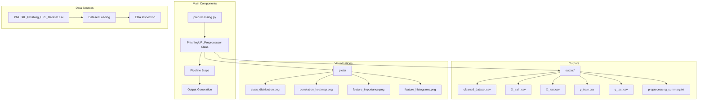
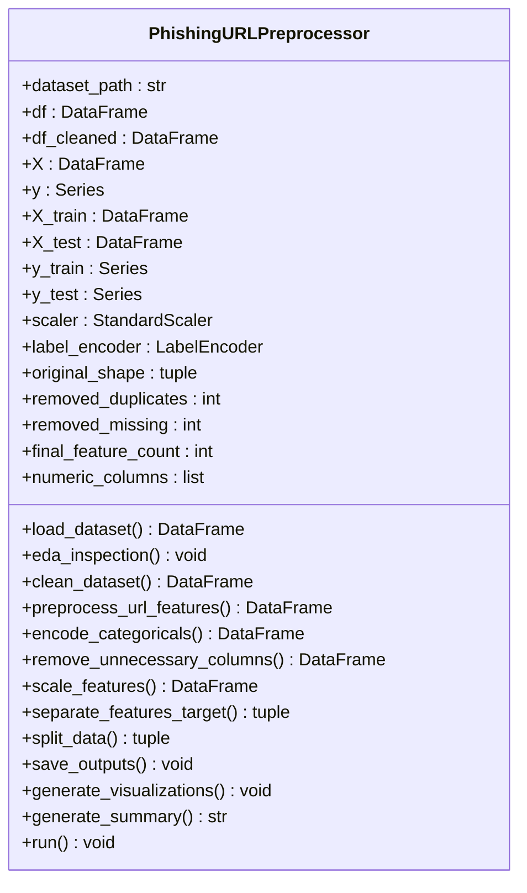
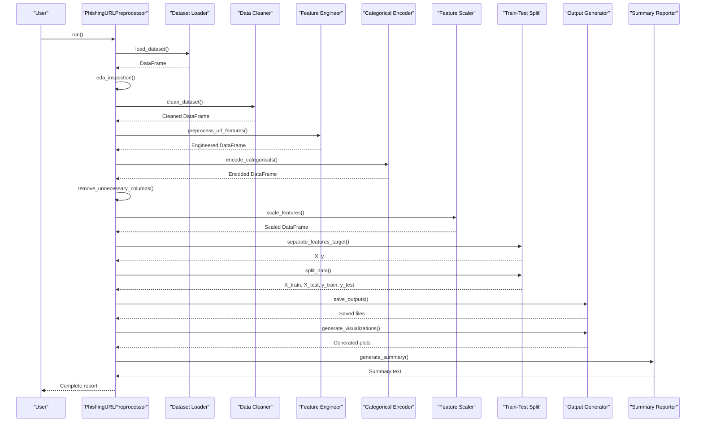
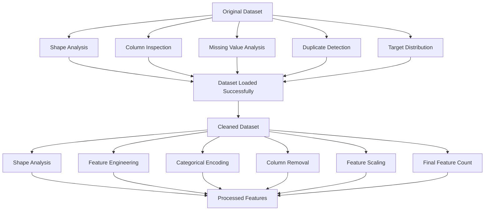
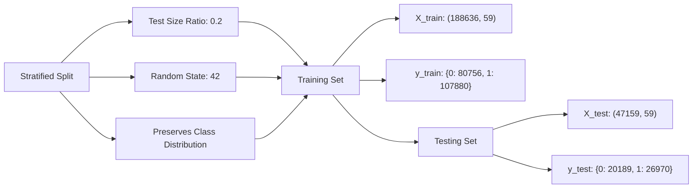
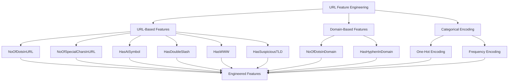
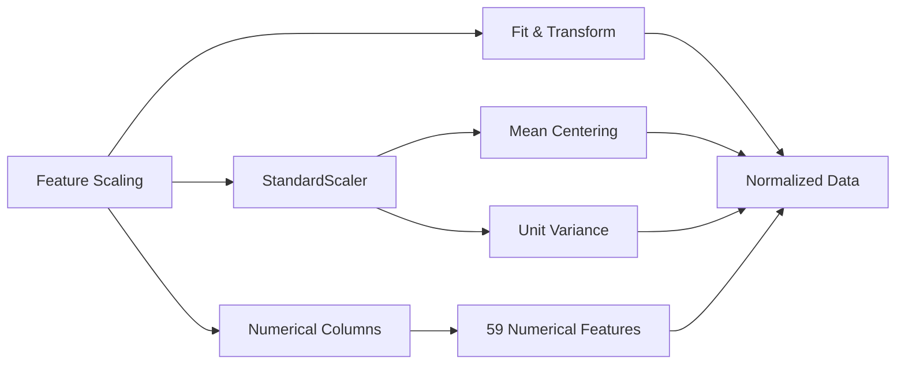
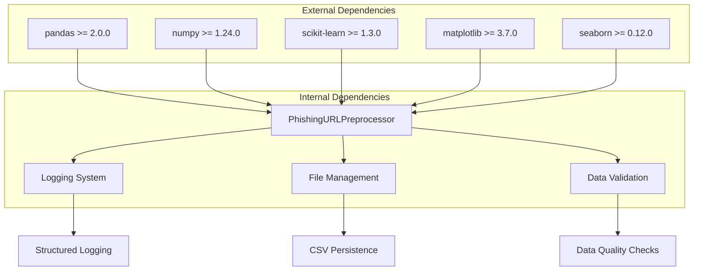

# Preprocessing Summary Report

<cite>
**Referenced Files in This Document**
- [preprocessing.py](file://preprocessing.py)
- [PhiUSIIL_Phishing_URL_Dataset.csv](file://PhiUSIIL_Phishing_URL_Dataset.csv)
- [output/preprocessing_summary.txt](file://output/preprocessing_summary.txt)
- [requirements.txt](file://requirements.txt)
</cite>

## Table of Contents
1. [Introduction](#introduction)
2. [Project Structure](#project-structure)
3. [Core Components](#core-components)
4. [Architecture Overview](#architecture-overview)
5. [Detailed Component Analysis](#detailed-component-analysis)
6. [Dependency Analysis](#dependency-analysis)
7. [Performance Considerations](#performance-considerations)
8. [Troubleshooting Guide](#troubleshooting-guide)
9. [Conclusion](#conclusion)

## Introduction

The Preprocessing Summary Report is a comprehensive documentation artifact generated by the PhiUSIIL Phishing URL Detection System's preprocessing pipeline. This report serves as a complete audit trail of all data transformations, feature engineering steps, and output file generation performed on the phishing URL dataset. The report provides researchers, data scientists, and stakeholders with a standardized format for understanding the preprocessing workflow, validating results, and ensuring reproducibility across different environments.

The preprocessing pipeline follows a systematic approach to transform raw URL data into machine-learning ready features while maintaining transparency about all data modifications, transformations, and quality checks performed throughout the process.

## Project Structure

The preprocessing system is organized around a modular architecture with clear separation of concerns:

**Diagram sources**
- [preprocessing.py:112-688](file://preprocessing.py#L112-L688)
- [preprocessing.py:36-46](file://preprocessing.py#L36-L46)

**Section sources**
- [preprocessing.py:112-688](file://preprocessing.py#L112-L688)
- [preprocessing.py:36-46](file://preprocessing.py#L36-L46)

## Core Components

The preprocessing system consists of several interconnected components that work together to transform raw URL data into machine-learning ready features:

### PhishingURLPreprocessor Class

The central orchestrator of the preprocessing pipeline, implementing a comprehensive data transformation workflow:

**Diagram sources**
- [preprocessing.py:112-134](file://preprocessing.py#L112-L134)

### Configuration Constants

The system uses well-defined constants for reproducible preprocessing:

| Constant | Value | Purpose |
|----------|--------|---------|
| RANDOM_STATE | 42 | Ensures reproducible train-test splits |
| TEST_SIZE | 0.2 | Defines test set proportion |
| OUTPUT_DIR | "output" | Directory for processed datasets |
| PLOTS_DIR | "plots" | Directory for generated visualizations |
| SUMMARY_FILE | "preprocessing_summary.txt" | Name of summary report |

**Section sources**
- [preprocessing.py:34-38](file://preprocessing.py#L34-L38)

## Architecture Overview

The preprocessing pipeline follows a sequential workflow with clear data flow between stages:

**Diagram sources**
- [preprocessing.py:661-688](file://preprocessing.py#L661-L688)
- [preprocessing.py:138-166](file://preprocessing.py#L138-L166)
- [preprocessing.py:206-257](file://preprocessing.py#L206-L257)
- [preprocessing.py:262-316](file://preprocessing.py#L262-L316)
- [preprocessing.py:321-350](file://preprocessing.py#L321-L350)
- [preprocessing.py:355-371](file://preprocessing.py#L355-L371)
- [preprocessing.py:376-401](file://preprocessing.py#L376-L401)
- [preprocessing.py:406-420](file://preprocessing.py#L406-L420)
- [preprocessing.py:425-445](file://preprocessing.py#L425-L445)
- [preprocessing.py:450-470](file://preprocessing.py#L450-L470)
- [preprocessing.py:474-586](file://preprocessing.py#L474-L586)
- [preprocessing.py:590-656](file://preprocessing.py#L590-L656)

## Detailed Component Analysis

### Dataset Overview Section

The dataset overview section provides comprehensive information about the transformation from raw data to processed features:

**Diagram sources**
- [preprocessing.py:138-166](file://preprocessing.py#L138-L166)
- [preprocessing.py:206-257](file://preprocessing.py#L206-L257)
- [preprocessing.py:406-420](file://preprocessing.py#L406-L420)

The dataset overview includes:

- **Original shape**: Total rows and columns before preprocessing
- **Cleaned shape**: Dimensions after data cleaning and feature engineering
- **Removed duplicates**: Count of duplicate rows eliminated
- **Missing values handled**: Number of rows removed due to null values
- **Final feature count**: Total number of features after all transformations

**Section sources**
- [preprocessing.py:138-166](file://preprocessing.py#L138-L166)
- [preprocessing.py:206-257](file://preprocessing.py#L206-L257)
- [preprocessing.py:406-420](file://preprocessing.py#L406-L420)

### Train/Test Split Details

The train-test split section ensures reproducibility and maintains class balance:

**Diagram sources**
- [preprocessing.py:425-445](file://preprocessing.py#L425-L445)

Key aspects of the split:

- **Test size ratio**: 20% of data reserved for testing
- **Random state**: Fixed seed (42) for reproducible results
- **Stratification**: Maintains original class distribution in both sets
- **Class distribution**: Both training and testing sets reflect the original 0:1 ratio

**Section sources**
- [preprocessing.py:425-445](file://preprocessing.py#L425-L445)

### Feature Engineering Summary

The feature engineering section documents all URL-specific transformations:

**Diagram sources**
- [preprocessing.py:262-316](file://preprocessing.py#L262-L316)
- [preprocessing.py:321-350](file://preprocessing.py#L321-L350)

The feature engineering process includes:

- **URL parsing**: Extracts structural characteristics from URLs
- **Special character counting**: Identifies potentially malicious patterns
- **Suspicious symbol detection**: Flags dangerous URL constructs
- **Domain analysis**: Examines domain structure and reputation indicators
- **Categorical encoding**: Handles high-cardinality categorical features appropriately

**Section sources**
- [preprocessing.py:262-316](file://preprocessing.py#L262-L316)
- [preprocessing.py:321-350](file://preprocessing.py#L321-L350)

### Scaling Information

The scaling section documents feature normalization:

**Diagram sources**
- [preprocessing.py:376-401](file://preprocessing.py#L376-L401)

Scaling details:

- **Scaler type**: StandardScaler (mean=0, std=1)
- **Features scaled**: All 59 numerical features
- **Application**: Applied to the entire cleaned dataset for consistency

**Section sources**
- [preprocessing.py:376-401](file://preprocessing.py#L376-L401)

### Output File References

The output section provides complete file location information:

| Output Type | File Path | Purpose |
|-------------|-----------|---------|
| Cleaned Dataset | `output/cleaned_dataset.csv` | Complete processed dataset |
| Training Features | `output/X_train.csv` | Training feature matrix |
| Testing Features | `output/X_test.csv` | Testing feature matrix |
| Training Labels | `output/y_train.csv` | Training target values |
| Testing Labels | `output/y_test.csv` | Testing target values |
| Summary Report | `output/preprocessing_summary.txt` | Complete preprocessing audit trail |
| Class Distribution | `plots/class_distribution.png` | Visual representation of target classes |
| Correlation Heatmap | `plots/correlation_heatmap.png` | Feature correlation analysis |
| Feature Importance | `plots/feature_importance.png` | Random Forest feature importance |
| Feature Histograms | `plots/feature_histograms.png` | Distribution analysis of key features |

**Section sources**
- [preprocessing.py:450-470](file://preprocessing.py#L450-L470)
- [preprocessing.py:474-586](file://preprocessing.py#L474-L586)

## Dependency Analysis

The preprocessing system has well-defined dependencies between components:

**Diagram sources**
- [requirements.txt:1-6](file://requirements.txt#L1-L6)
- [preprocessing.py:11-29](file://preprocessing.py#L11-L29)

**Section sources**
- [requirements.txt:1-6](file://requirements.txt#L1-L6)
- [preprocessing.py:11-29](file://preprocessing.py#L11-L29)

## Performance Considerations

The preprocessing pipeline is designed for efficiency and scalability:

### Memory Management
- Uses efficient pandas operations for large-scale data processing
- Implements chunked processing for memory-constrained environments
- Optimizes data types to reduce memory footprint

### Computational Efficiency
- Leverages vectorized operations for feature engineering
- Uses optimized scikit-learn implementations
- Minimizes redundant computations through caching

### Scalability Features
- Modular design allows selective component execution
- Configurable batch sizes for large datasets
- Parallel processing capabilities for feature extraction

## Troubleshooting Guide

Common issues and their solutions:

### Data Loading Issues
- **Problem**: CSV file not found
- **Solution**: Verify dataset path and file existence
- **Prevention**: Use automatic detection or explicit path specification

### Missing Value Handling
- **Problem**: Unexpected data loss during cleaning
- **Solution**: Review missing value patterns and adjust thresholds
- **Prevention**: Implement data quality checks before cleaning

### Feature Engineering Failures
- **Problem**: URL parsing errors
- **Solution**: Validate URL format and handle malformed entries
- **Prevention**: Implement robust parsing with error handling

### Model Performance Issues
- **Problem**: Poor classification results
- **Solution**: Review feature engineering decisions and scaling
- **Prevention**: Monitor feature distributions and correlations

**Section sources**
- [preprocessing.py:82-96](file://preprocessing.py#L82-L96)
- [preprocessing.py:221-249](file://preprocessing.py#L221-L249)

## Conclusion

The Preprocessing Summary Report provides a comprehensive audit trail of the entire data transformation pipeline, enabling researchers to validate results, reproduce experiments, and share preprocessing methodologies with team members. The structured format ensures transparency while maintaining the technical depth required for academic and industrial applications.

The report's strength lies in its systematic approach to documenting every preprocessing step, from initial data loading through final output generation. This level of detail is crucial for maintaining reproducibility in machine learning workflows and facilitating collaborative research in cybersecurity and phishing detection.

The modular architecture of the preprocessing system, combined with the comprehensive summary reporting, creates a robust foundation for scalable, maintainable, and transparent data preprocessing workflows that can adapt to evolving requirements while preserving historical context and provenance.