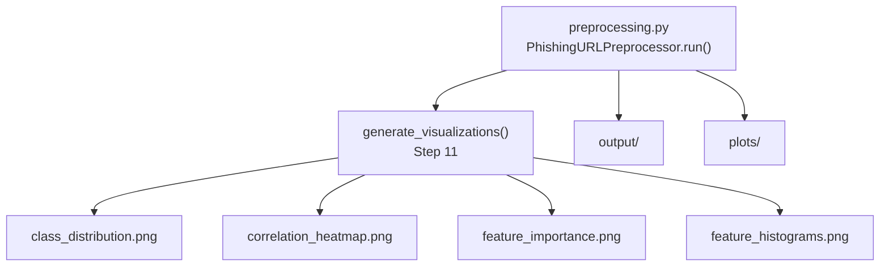
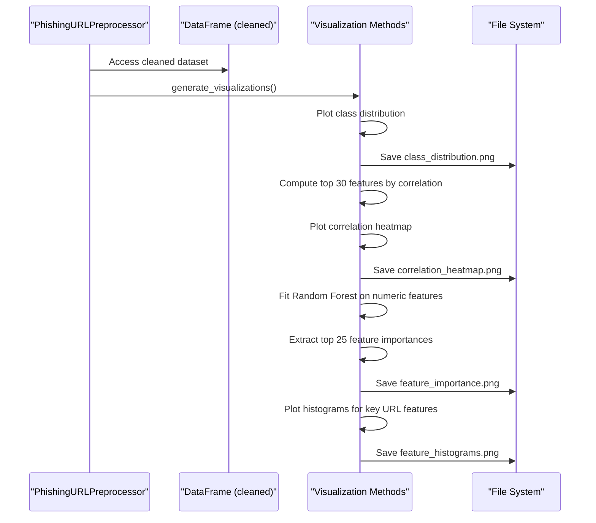
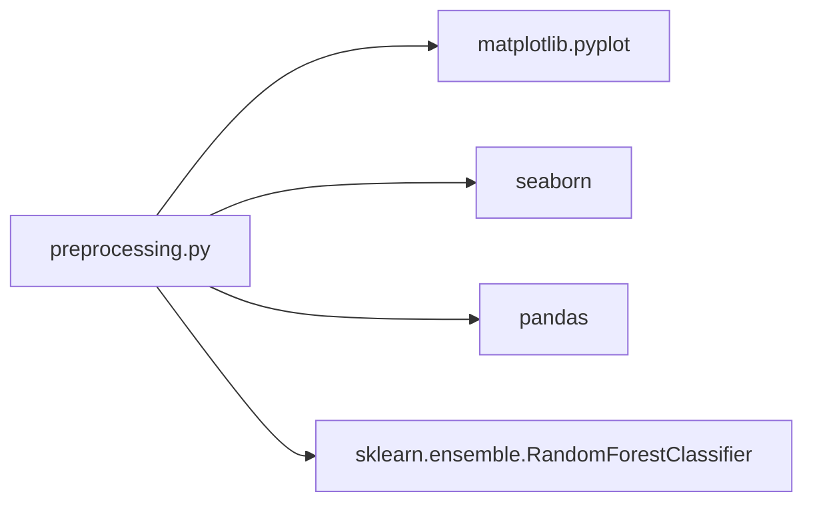

# Statistical Visualizations

<cite>
**Referenced Files in This Document**
- [preprocessing.py](file://preprocessing.py)
- [requirements.txt](file://requirements.txt)
</cite>

## Table of Contents
1. [Introduction](#introduction)
2. [Project Structure](#project-structure)
3. [Core Components](#core-components)
4. [Architecture Overview](#architecture-overview)
5. [Detailed Component Analysis](#detailed-component-analysis)
6. [Dependency Analysis](#dependency-analysis)
7. [Performance Considerations](#performance-considerations)
8. [Troubleshooting Guide](#troubleshooting-guide)
9. [Conclusion](#conclusion)

## Introduction
This document explains the four types of statistical visualizations produced by the preprocessing pipeline for phishing URL detection. It covers:
- Class distribution plot (legitimate vs phishing)
- Correlation heatmap of top 30 features
- Random Forest feature importance analysis
- Histograms of key URL features

It details the visualization generation process, styling choices, color schemes, export configurations, and interpretation guidelines for exploratory data analysis, model selection, and reporting.

## Project Structure
The preprocessing pipeline is implemented as a single module that orchestrates data loading, cleaning, feature engineering, scaling, train/test split, saving outputs, and generating EDA visualizations. The visualizations are saved under a dedicated plots directory with high-resolution PNG exports.

**Diagram sources**
- [preprocessing.py:661-688](file://preprocessing.py#L661-L688)
- [preprocessing.py:474-586](file://preprocessing.py#L474-L586)

**Section sources**
- [preprocessing.py:34-39](file://preprocessing.py#L34-L39)
- [preprocessing.py:450-470](file://preprocessing.py#L450-L470)

## Core Components
The visualization suite is generated within the generate_visualizations method of the PhishingURLPreprocessor class. It produces four distinct plots:
- Class distribution bar chart
- Top 30 feature correlation heatmap
- Top 25 feature importance bar chart (Random Forest)
- Grouped histograms for selected URL features

Each plot is configured with consistent styling, export DPI, and file naming conventions.

**Section sources**
- [preprocessing.py:474-586](file://preprocessing.py#L474-L586)

## Architecture Overview
The visualization generation follows a deterministic sequence within the pipeline. It relies on the cleaned dataset and numeric feature matrix to compute statistics and produce plots.

**Diagram sources**
- [preprocessing.py:474-586](file://preprocessing.py#L474-L586)

## Detailed Component Analysis

### Class Distribution Plot
Purpose:
- Show the count of legitimate (0) versus phishing (1) URLs to assess class balance.

Generation process:
- Counts occurrences of each class label and renders a grouped bar chart.
- Uses explicit colors for each class and adds value annotations on bars.
- Saves as a high-DPI PNG with a descriptive filename.

Styling and configuration:
- Figure size: 8 x 6 inches
- Bar colors: blue for legitimate, red for phishing
- Edge color: black for contrast
- Annotations: centered above each bar with thousands separators
- Export: 300 DPI PNG

Interpretation guide:
- Class balance: If counts are roughly equal, the dataset is balanced; significant skew suggests potential bias.
- Impact: Imbalanced classes may require resampling or class-weighted metrics during modeling.

Usage tips:
- Use for initial sanity checks and reporting baseline class distribution.
- Combine with stratified sampling to maintain balance in train/test splits.

Export details:
- Output path: plots/class_distribution.png

**Section sources**
- [preprocessing.py:492-506](file://preprocessing.py#L492-L506)

### Correlation Heatmap (Top 30 Features)
Purpose:
- Visualize pairwise linear relationships among the top 30 features correlated with the target label.

Generation process:
- Computes absolute correlation of numeric features with the target.
- Selects the top 30 features by descending absolute correlation.
- Builds a correlation matrix for these features and renders a heatmap.

Styling and configuration:
- Figure size: 18 x 14 inches
- Color scheme: coolwarm centered at zero
- Annotations: correlation coefficients formatted to two decimals
- Layout tightness: adjusted for readability
- Export: 300 DPI PNG

Interpretation guide:
- Positive correlation: as one feature increases, the target tends to increase.
- Negative correlation: as one feature increases, the target tends to decrease.
- Strong correlation: absolute value near 1; moderate correlation: around 0.5; weak correlation: below 0.3.
- Multicollinearity: high absolute correlations between features may indicate redundancy.

Usage tips:
- Identify redundant features to reduce dimensionality.
- Inform feature selection strategies and regularization choices.

Export details:
- Output path: plots/correlation_heatmap.png

**Section sources**
- [preprocessing.py:511-525](file://preprocessing.py#L511-L525)

### Feature Importance Analysis (Random Forest)
Purpose:
- Rank features by predictive strength using a Random Forest model on numeric features.

Generation process:
- Fits a Random Forest classifier on numeric features with a fixed number of estimators and random state.
- Extracts feature importances and selects the top 25.
- Renders a horizontal bar chart with inverted y-axis for descending order.

Styling and configuration:
- Figure size: 12 x 10 inches
- Bar color: teal
- Edge color: black
- Axis labels and title: bold fonts
- Export: 300 DPI PNG

Interpretation guide:
- Higher score indicates stronger predictive power for the target.
- Use to prioritize features for modeling and to prune less important ones.
- Consider domain knowledge to validate top-ranked features.

Usage tips:
- Combine with correlation insights to select complementary features.
- Monitor for overfitting by validating importance rankings on cross-validation folds.

Export details:
- Output path: plots/feature_importance.png

**Section sources**
- [preprocessing.py:527-551](file://preprocessing.py#L527-L551)

### Histograms of Key URL Features
Purpose:
- Compare distributions of selected URL-related features across classes (legitimate vs phishing).

Generation process:
- Identifies candidate features by name and filters those present in the dataset.
- Creates a grid of histograms with overlaid distributions for each class.
- Uses transparency to enable overlap visualization and legends for class identification.

Styling and configuration:
- Grid layout: up to 3 columns, computed rows to accommodate all features
- Figure size: width 15 inches; height scales with number of rows
- Colors: blue for legitimate, red for phishing
- Transparency: alpha blending for overlapping distributions
- Legend placement: inside subplots
- Export: 300 DPI PNG

Interpretation guide:
- Overlap: substantial overlap suggests difficulty distinguishing classes by this feature alone.
- Separation: minimal overlap indicates strong discriminative power.
- Outliers: extreme values may warrant transformation or outlier handling.

Usage tips:
- Focus on features with clear separation for supervised modeling.
- Combine with correlation and importance analyses for robust feature selection.

Export details:
- Output path: plots/feature_histograms.png

**Section sources**
- [preprocessing.py:553-586](file://preprocessing.py#L553-L586)

## Dependency Analysis
The visualization generation depends on:
- Matplotlib and Seaborn for rendering
- Pandas for data manipulation and filtering
- Scikit-learn Random Forest for feature importance computation

**Diagram sources**
- [preprocessing.py:19-30](file://preprocessing.py#L19-L30)

**Section sources**
- [requirements.txt:1-6](file://requirements.txt#L1-L6)

## Performance Considerations
- Random Forest runtime: The feature importance computation uses a fixed number of estimators and parallel jobs; adjust n_estimators for larger datasets.
- Heatmap readability: Limiting to top 30 features reduces computational cost and improves legibility.
- Figure sizing: Larger figures improve readability but increase export time and disk usage.
- DPI setting: 300 DPI ensures publication-quality images suitable for reports and presentations.

## Troubleshooting Guide
Common issues and resolutions:
- Missing target column: The pipeline expects a label column; if not found, it attempts common variants and raises an error if none match.
- No numeric features: If no numeric columns exist, correlation and Random Forest steps will log warnings; ensure feature engineering or scaling is performed.
- No suitable histogram columns: If none of the candidate features are present, a warning is logged; verify feature names in the dataset.
- Directory creation: The pipeline creates output and plots directories automatically; ensure write permissions.

Operational notes:
- Backend choice: The script sets a non-interactive matplotlib backend for headless environments.
- Logging: All visualization steps are logged with timestamps and informational messages.

**Section sources**
- [preprocessing.py:155-166](file://preprocessing.py#L155-L166)
- [preprocessing.py:511-516](file://preprocessing.py#L511-L516)
- [preprocessing.py:534-537](file://preprocessing.py#L534-L537)
- [preprocessing.py:557-558](file://preprocessing.py#L557-L558)
- [preprocessing.py:22-24](file://preprocessing.py#L22-L24)
- [preprocessing.py:50, 53, 54:50-56](file://preprocessing.py#L50-L56)

## Conclusion
The preprocessing pipeline systematically generates four complementary visualizations that support exploratory data analysis, model selection, and reporting:
- Class distribution confirms dataset balance and informs sampling strategies.
- Correlation heatmap reveals multivariate relationships and multicollinearity.
- Random Forest feature importance highlights predictive contributors.
- Feature histograms compare class-wise distributions for key URL characteristics.

These visualizations are exported at high resolution with consistent styling and saved under a dedicated plots directory for easy sharing and inclusion in reports.