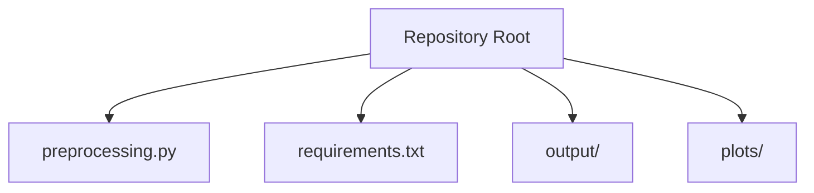
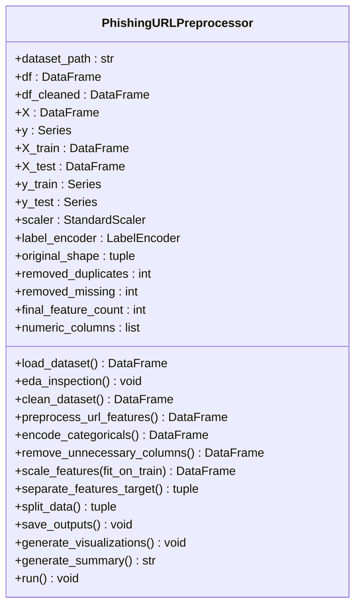
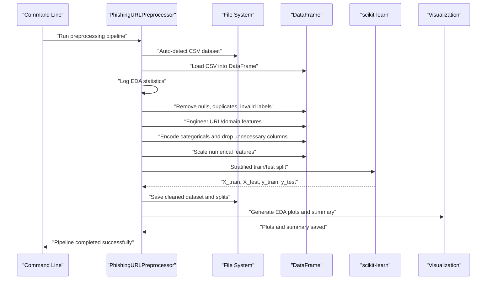
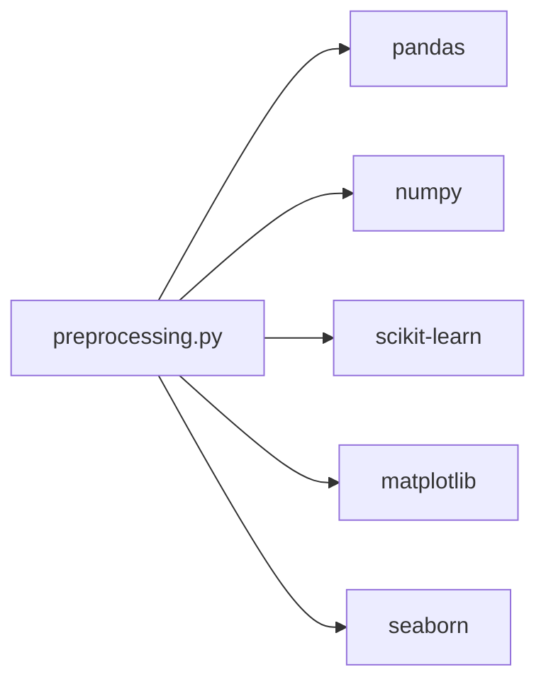

# Project Overview

<cite>
**Referenced Files in This Document**
- [preprocessing.py](file://preprocessing.py)
- [requirements.txt](file://requirements.txt)
</cite>

## Table of Contents
1. [Introduction](#introduction)
2. [Project Structure](#project-structure)
3. [Core Components](#core-components)
4. [Architecture Overview](#architecture-overview)
5. [Detailed Component Analysis](#detailed-component-analysis)
6. [Dependency Analysis](#dependency-analysis)
7. [Performance Considerations](#performance-considerations)
8. [Troubleshooting Guide](#troubleshooting-guide)
9. [Conclusion](#conclusion)

## Introduction
The URL_Spam project is an automated, production-ready preprocessing pipeline designed to transform the PhiUSIIL Phishing URL Dataset into a structured, ML-ready format for AI-powered cybersecurity applications. Its primary purpose is to streamline the ingestion, cleaning, feature engineering, and splitting of URL-related datasets so downstream machine learning models can be trained efficiently and consistently. The pipeline emphasizes reproducibility, logging, and visualization to support both cybersecurity practitioners new to machine learning and experienced developers building scalable ML workflows.

Key goals:
- Automate ingestion of CSV datasets with intelligent auto-detection of the main dataset file.
- Perform robust data cleaning and validation tailored to URL classification tasks.
- Engineer phishing-relevant features from raw URLs and domains.
- Encode categorical variables and scale numerical features for ML compatibility.
- Produce stratified train/test splits and persist artifacts for model training and evaluation.
- Generate diagnostic visualizations and a comprehensive preprocessing summary report.

This project is positioned as a foundational component in phishing URL detection systems, enabling seamless integration with scikit-learn-based models and broader ML ecosystems.

**Section sources**
- [preprocessing.py:1-9](file://preprocessing.py#L1-L9)
- [preprocessing.py:112-115](file://preprocessing.py#L112-L115)

## Project Structure
The repository follows a minimal, focused layout optimized for a single-purpose preprocessing pipeline:
- preprocessing.py: The core module implementing the end-to-end preprocessing pipeline, including dataset loading, cleaning, feature engineering, encoding, scaling, splitting, saving outputs, and visualization.
- requirements.txt: Declares the Python dependencies for pandas, numpy, scikit-learn, matplotlib, and seaborn.
- output/: Directory where processed datasets and summary reports are persisted after pipeline execution.
- plots/: Directory where exploratory data analysis visualizations are saved.

**Diagram sources**
- [preprocessing.py:112-115](file://preprocessing.py#L112-L115)
- [requirements.txt:1-6](file://requirements.txt#L1-L6)

**Section sources**
- [preprocessing.py:34-46](file://preprocessing.py#L34-L46)
- [preprocessing.py:450-470](file://preprocessing.py#L450-L470)
- [preprocessing.py:474-586](file://preprocessing.py#L474-L586)

## Core Components
The pipeline centers around a modular, stepwise process implemented in a single class with clearly defined responsibilities:

- Dataset discovery and loading: Auto-detects the largest CSV in the working directory and loads it into a DataFrame, logging metadata and basic statistics.
- Exploratory Data Analysis (EDA): Summarizes missing values, duplicates, target distribution, and numeric columns before cleaning.
- Data cleaning: Removes null rows, duplicate rows, invalid labels, and clips negative counts to non-negative values; encodes labels for binary classification.
- URL feature engineering: Extracts URL-derived features (e.g., dot counts, special character counts, suspicious symbol presence) and domain-based features when raw URL or domain columns are present.
- Categorical encoding: Applies one-hot encoding for low-cardinality categoricals and frequency encoding for high-cardinality ones.
- Column removal: Drops non-ML-friendly identifiers and text columns configured for removal.
- Feature scaling: Normalizes numerical features using StandardScaler.
- Feature-target separation and train-test split: Splits data into stratified train/test sets to preserve class balance.
- Artifact persistence: Saves cleaned datasets and train/test splits to the output directory.
- Visualization and reporting: Generates class distributions, correlation heatmaps, feature importance plots, and histograms; writes a detailed preprocessing summary.

These components collectively ensure that raw CSV data is transformed into a standardized, ready-to-use format for machine learning workflows.

**Section sources**
- [preprocessing.py:138-166](file://preprocessing.py#L138-L166)
- [preprocessing.py:171-202](file://preprocessing.py#L171-L202)
- [preprocessing.py:206-257](file://preprocessing.py#L206-L257)
- [preprocessing.py:262-316](file://preprocessing.py#L262-L316)
- [preprocessing.py:321-350](file://preprocessing.py#L321-L350)
- [preprocessing.py:355-371](file://preprocessing.py#L355-L371)
- [preprocessing.py:376-401](file://preprocessing.py#L376-L401)
- [preprocessing.py:406-420](file://preprocessing.py#L406-L420)
- [preprocessing.py:425-445](file://preprocessing.py#L425-L445)
- [preprocessing.py:450-469](file://preprocessing.py#L450-L469)
- [preprocessing.py:474-586](file://preprocessing.py#L474-L586)
- [preprocessing.py:590-656](file://preprocessing.py#L590-L656)

## Architecture Overview
The preprocessing pipeline is implemented as a single cohesive class with a master run method orchestrating the steps. It leverages pandas for data manipulation, scikit-learn for preprocessing and splitting, and matplotlib/seaborn for visualization. The pipeline is designed to be executed from the command line and logs progress and outcomes throughout.

**Diagram sources**
- [preprocessing.py:112-134](file://preprocessing.py#L112-L134)
- [preprocessing.py:661-687](file://preprocessing.py#L661-L687)

**Section sources**
- [preprocessing.py:112-134](file://preprocessing.py#L112-L134)
- [preprocessing.py:661-687](file://preprocessing.py#L661-L687)

## Detailed Component Analysis

### Purpose and Role in Cybersecurity and ML Workflows
- Purpose: The pipeline prepares the PhiUSIIL Phishing URL Dataset for supervised learning by converting raw CSV entries into a standardized tabular format with engineered features and balanced splits.
- Role in AI-powered cybersecurity: By automating cleaning, encoding, and splitting, it reduces human error and speeds up iteration cycles for phishing detection models.
- Relationship to ML workflows: Outputs include X_train, X_test, y_train, y_test, and a cleaned dataset, enabling immediate integration with scikit-learn classifiers and other ML frameworks.

**Section sources**
- [preprocessing.py:112-115](file://preprocessing.py#L112-L115)
- [preprocessing.py:450-469](file://preprocessing.py#L450-L469)

### Implementation Approach and Tools
- Python ecosystem: pandas for data structures and operations, scikit-learn for preprocessing and splitting, matplotlib/seaborn for visualization, numpy for numerical computations.
- Headless visualization: Uses a non-interactive matplotlib backend to support execution in server or CI environments.
- Logging: Structured logging with timestamps and levels for operational visibility.
- Configuration: Centralized constants for random state, test size, output directories, and columns to drop.

**Section sources**
- [preprocessing.py:11-29](file://preprocessing.py#L11-L29)
- [preprocessing.py:21-24](file://preprocessing.py#L21-L24)
- [preprocessing.py:53-70](file://preprocessing.py#L53-L70)
- [preprocessing.py:34-46](file://preprocessing.py#L34-L46)

### Practical Workflow Example
Below is a conceptual walkthrough of the pipeline’s end-to-end workflow from raw CSV to ready-to-use training datasets:

**Diagram sources**
- [preprocessing.py:661-687](file://preprocessing.py#L661-L687)
- [preprocessing.py:450-469](file://preprocessing.py#L450-L469)
- [preprocessing.py:474-586](file://preprocessing.py#L474-L586)
- [preprocessing.py:425-445](file://preprocessing.py#L425-L445)
- [preprocessing.py:376-401](file://preprocessing.py#L376-L401)
- [preprocessing.py:321-350](file://preprocessing.py#L321-L350)
- [preprocessing.py:262-316](file://preprocessing.py#L262-L316)
- [preprocessing.py:206-257](file://preprocessing.py#L206-L257)
- [preprocessing.py:138-166](file://preprocessing.py#L138-L166)

### Scope and Limitations
- Scope:
  - Supports binary classification with a label column (case-insensitive variants are accepted).
  - Handles URL and domain feature engineering when raw URL or domain columns are present.
  - Produces standardized train/test splits and visualizations for diagnostics.
- Known limitations:
  - Assumes a single main CSV dataset in the working directory; auto-detection prefers the largest file.
  - Target column naming is flexible but must resolve to a single “label” column after normalization.
  - Feature engineering relies on heuristics and assumes specific column prefixes (e.g., counts starting with “NoOf”, “Has”, “Is”).
  - Scaling applies to the entire dataset before splitting; in strict production, fitting scaler only on training data is recommended.

**Section sources**
- [preprocessing.py:82-96](file://preprocessing.py#L82-L96)
- [preprocessing.py:155-163](file://preprocessing.py#L155-L163)
- [preprocessing.py:242-249](file://preprocessing.py#L242-L249)
- [preprocessing.py:376-401](file://preprocessing.py#L376-L401)

### Integration Capabilities
- Downstream ML models: The pipeline outputs X_train, X_test, y_train, y_test, and a cleaned dataset, enabling direct integration with scikit-learn classifiers and other ML frameworks.
- Visualization and diagnostics: EDA plots and a summary report facilitate model selection and hyperparameter tuning decisions.
- Reproducibility: Centralized configuration and logging enable repeatable runs across environments.

**Section sources**
- [preprocessing.py:450-469](file://preprocessing.py#L450-L469)
- [preprocessing.py:474-586](file://preprocessing.py#L474-L586)
- [preprocessing.py:590-656](file://preprocessing.py#L590-L656)

## Dependency Analysis
The pipeline depends on a small set of core libraries, each serving a specific role in the preprocessing workflow.

**Diagram sources**
- [preprocessing.py:19-29](file://preprocessing.py#L19-L29)
- [requirements.txt:1-6](file://requirements.txt#L1-L6)

**Section sources**
- [requirements.txt:1-6](file://requirements.txt#L1-L6)
- [preprocessing.py:19-29](file://preprocessing.py#L19-L29)

## Performance Considerations
- Memory usage: The pipeline logs memory usage during EDA to help assess feasibility for large datasets.
- Numerical stability: StandardScaler ensures normalized features, which improves convergence for distance-based and gradient-based models.
- Visualization cost: Correlation heatmaps and feature importance plots use a subset of top features to balance interpretability and rendering performance.
- Execution time: The master run method measures total runtime, aiding profiling and optimization.

**Section sources**
- [preprocessing.py:178-180](file://preprocessing.py#L178-L180)
- [preprocessing.py:513-516](file://preprocessing.py#L513-L516)
- [preprocessing.py:536-540](file://preprocessing.py#L536-L540)
- [preprocessing.py:682-685](file://preprocessing.py#L682-L685)

## Troubleshooting Guide
Common issues and resolutions:
- No CSV detected: The pipeline raises an error if no CSV is found in the working directory. Ensure the dataset is placed in the root or adjust the working directory accordingly.
- Missing label column: The pipeline attempts to normalize common label column names; if none match, it raises an error. Rename the target column to a supported variant or ensure it exists.
- No numeric columns for scaling: If the dataset lacks numeric features, scaling is skipped with a warning. Add numeric features or adjust feature engineering.
- Visualization failures: The pipeline uses a non-interactive matplotlib backend to prevent GUI issues in headless environments.

Operational tips:
- Review the preprocessing summary report for dataset transformations and split distributions.
- Inspect generated plots under the plots directory for class balance and feature correlations.
- Verify saved outputs under the output directory for X_train, X_test, y_train, y_test, and the cleaned dataset.

**Section sources**
- [preprocessing.py:82-96](file://preprocessing.py#L82-L96)
- [preprocessing.py:155-163](file://preprocessing.py#L155-L163)
- [preprocessing.py:392-394](file://preprocessing.py#L392-L394)
- [preprocessing.py:21-24](file://preprocessing.py#L21-L24)
- [preprocessing.py:590-656](file://preprocessing.py#L590-L656)
- [preprocessing.py:474-586](file://preprocessing.py#L474-L586)
- [preprocessing.py:450-469](file://preprocessing.py#L450-L469)

## Conclusion
The URL_Spam preprocessing pipeline provides a robust, modular foundation for transforming the PhiUSIIL Phishing URL Dataset into a standardized, ML-ready format. By automating cleaning, feature engineering, encoding, scaling, and splitting, it accelerates the development of AI-powered phishing detection systems while maintaining transparency through logging, visualizations, and a comprehensive summary report. Its design supports both newcomers to machine learning and experienced practitioners, offering a clear path from raw CSV to production-grade training datasets.