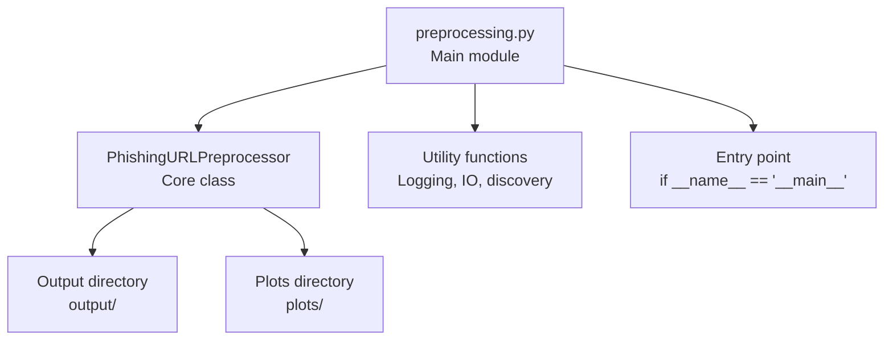
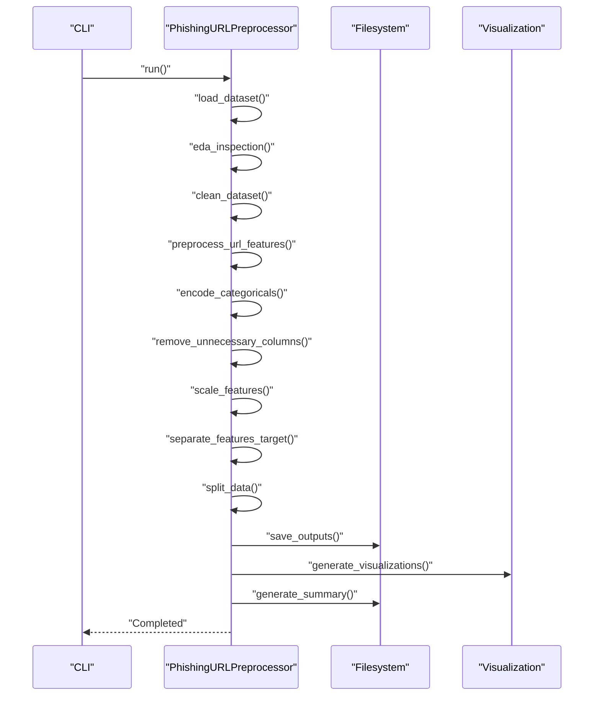
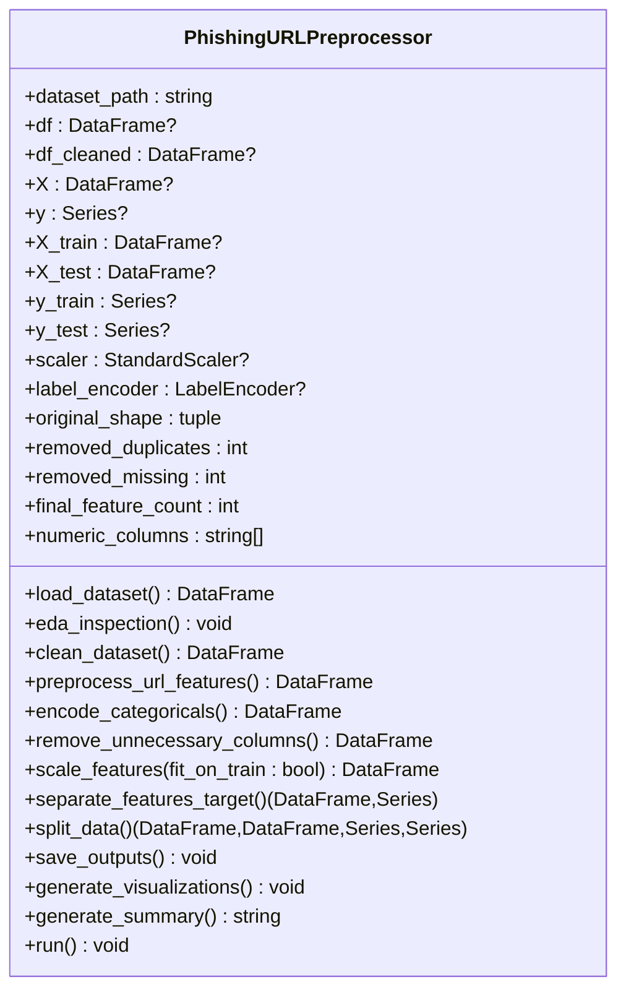
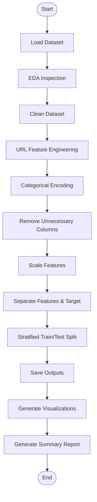
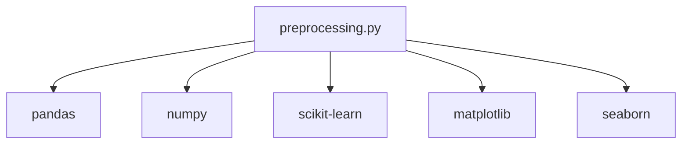

# Technical Architecture

<cite>
**Referenced Files in This Document**
- [preprocessing.py](file://preprocessing.py)
- [requirements.txt](file://requirements.txt)
</cite>

## Table of Contents
1. [Introduction](#introduction)
2. [Project Structure](#project-structure)
3. [Core Components](#core-components)
4. [Architecture Overview](#architecture-overview)
5. [Detailed Component Analysis](#detailed-component-analysis)
6. [Dependency Analysis](#dependency-analysis)
7. [Performance Considerations](#performance-considerations)
8. [Troubleshooting Guide](#troubleshooting-guide)
9. [Conclusion](#conclusion)
10. [Appendices](#appendices)

## Introduction
This document describes the technical architecture of the phishing URL preprocessing system centered around the PhishingURLPreprocessor class. It explains the high-level pipeline architecture using the pipeline pattern, component interactions across preprocessing stages, and the data flow from input CSV to processed datasets. It documents class design principles, module structure, and technical decisions such as StandardScaler for feature normalization, LabelEncoder for target encoding, and stratified sampling for train/test split. It also covers infrastructure requirements, memory considerations for large datasets, performance characteristics, integration with machine learning workflows, and cross-cutting concerns like logging, error handling, and output persistence. The technology stack includes pandas for data manipulation, scikit-learn for preprocessing, and matplotlib/seaborn for visualization.

## Project Structure
The project consists of a single Python module implementing the preprocessing pipeline and a requirements specification. Output artifacts are persisted to dedicated directories.

**Diagram sources**
- [preprocessing.py:112-699](file://preprocessing.py#L112-L699)

**Section sources**
- [preprocessing.py:112-134](file://preprocessing.py#L112-L134)
- [preprocessing.py:36-47](file://preprocessing.py#L36-L47)

## Core Components
- PhishingURLPreprocessor: The central orchestrator implementing the end-to-end preprocessing pipeline. It encapsulates state for the dataset, intermediate results, and preprocessing artifacts (scaler, encoder).
- Utility functions: Logging setup, directory creation, CSV auto-detection, and safe DataFrame persistence.
- Entry point: Instantiates the preprocessor and executes the pipeline.

Key responsibilities:
- Load and inspect dataset
- Exploratory data analysis (EDA)
- Data cleaning (missing/duplicate handling, label validation, clipping negatives)
- URL feature engineering
- Categorical encoding (one-hot vs frequency)
- Column removal
- Feature scaling
- Feature/target separation
- Stratified train/test split
- Output persistence and visualization
- Summary report generation

**Section sources**
- [preprocessing.py:112-134](file://preprocessing.py#L112-L134)
- [preprocessing.py:53-70](file://preprocessing.py#L53-L70)
- [preprocessing.py:76-107](file://preprocessing.py#L76-L107)
- [preprocessing.py:693-699](file://preprocessing.py#L693-L699)

## Architecture Overview
The system follows a staged pipeline pattern with explicit steps. Each stage transforms the dataset progressively, exposing intermediate results and persisting outputs. The pipeline is designed for modularity, reproducibility, and observability.

**Diagram sources**
- [preprocessing.py:661-687](file://preprocessing.py#L661-L687)
- [preprocessing.py:450-470](file://preprocessing.py#L450-L470)
- [preprocessing.py:474-586](file://preprocessing.py#L474-L586)
- [preprocessing.py:590-656](file://preprocessing.py#L590-L656)

## Detailed Component Analysis

### PhishingURLPreprocessor Class
The class encapsulates the entire preprocessing workflow as a sequence of methods, each corresponding to a pipeline stage. It maintains internal state for the dataset and preprocessing artifacts.

**Diagram sources**
- [preprocessing.py:112-134](file://preprocessing.py#L112-L134)
- [preprocessing.py:661-687](file://preprocessing.py#L661-L687)

Design principles:
- Single Responsibility Principle: Each method performs one stage of preprocessing.
- Encapsulation: Internal state tracks progress and artifacts.
- Observability: Extensive logging and summary reporting.
- Robustness: Safe IO, error handling, and defensive checks.

Inheritance pattern:
- No inheritance is used; the class is self-contained.

Modular structure:
- Stage-specific methods form a pipeline with clear boundaries.
- Utility functions support logging, IO, and dataset discovery.

**Section sources**
- [preprocessing.py:112-134](file://preprocessing.py#L112-L134)
- [preprocessing.py:138-166](file://preprocessing.py#L138-L166)
- [preprocessing.py:171-202](file://preprocessing.py#L171-L202)
- [preprocessing.py:206-257](file://preprocessing.py#L206-L257)
- [preprocessing.py:262-316](file://preprocessing.py#L262-L316)
- [preprocessing.py:321-350](file://preprocessing.py#L321-L350)
- [preprocessing.py:355-371](file://preprocessing.py#L355-L371)
- [preprocessing.py:376-401](file://preprocessing.py#L376-L401)
- [preprocessing.py:406-420](file://preprocessing.py#L406-L420)
- [preprocessing.py:425-445](file://preprocessing.py#L425-L445)
- [preprocessing.py:450-470](file://preprocessing.py#L450-L470)
- [preprocessing.py:474-586](file://preprocessing.py#L474-L586)
- [preprocessing.py:590-656](file://preprocessing.py#L590-L656)
- [preprocessing.py:661-687](file://preprocessing.py#L661-L687)

### Pipeline Stages and Data Flow
The pipeline transforms the dataset through a series of deterministic steps, producing cleaned data, train/test splits, visualizations, and a summary report.

**Diagram sources**
- [preprocessing.py:661-687](file://preprocessing.py#L661-L687)
- [preprocessing.py:138-166](file://preprocessing.py#L138-L166)
- [preprocessing.py:171-202](file://preprocessing.py#L171-L202)
- [preprocessing.py:206-257](file://preprocessing.py#L206-L257)
- [preprocessing.py:262-316](file://preprocessing.py#L262-L316)
- [preprocessing.py:321-350](file://preprocessing.py#L321-L350)
- [preprocessing.py:355-371](file://preprocessing.py#L355-L371)
- [preprocessing.py:376-401](file://preprocessing.py#L376-L401)
- [preprocessing.py:406-420](file://preprocessing.py#L406-L420)
- [preprocessing.py:425-445](file://preprocessing.py#L425-L445)
- [preprocessing.py:450-470](file://preprocessing.py#L450-L470)
- [preprocessing.py:474-586](file://preprocessing.py#L474-L586)
- [preprocessing.py:590-656](file://preprocessing.py#L590-L656)

### Technical Decisions and Rationale
- StandardScaler for feature normalization:
  - Choice: Applies mean-centering and unit variance scaling to numerical features.
  - Rationale: Improves convergence and stability for distance-based and gradient-based learners; ensures comparable scales across features.
  - Implementation: Fit on the full cleaned dataset prior to splitting for simplicity; note that in production, fitting only on training data is recommended to avoid leakage.

- LabelEncoder for target encoding:
  - Choice: Encodes string labels to integers for downstream compatibility.
  - Rationale: Suitable for binary classification; preserves order and enables downstream algorithms expecting integer targets.
  - Implementation: Applied to the label column after validation.

- Stratified sampling for train/test split:
  - Choice: Ensures balanced class distribution in both sets.
  - Rationale: Prevents class imbalance issues during model training and evaluation.
  - Implementation: Uses stratify on the target variable.

- Categorical encoding strategy:
  - Low cardinality (<10): One-hot encoding to avoid ordinal assumptions.
  - High cardinality: Frequency encoding to reduce dimensionality while preserving signal.

- URL feature engineering:
  - Adds derived features from the URL and Domain columns when present, including counts and presence indicators of suspicious patterns.

- Visualization and reporting:
  - Generates class distribution, correlation heatmap, feature importance, and histograms.
  - Produces a structured summary report with dataset overview, split details, and generated artifacts.

**Section sources**
- [preprocessing.py:250-253](file://preprocessing.py#L250-L253)
- [preprocessing.py:376-401](file://preprocessing.py#L376-L401)
- [preprocessing.py:425-445](file://preprocessing.py#L425-L445)
- [preprocessing.py:321-350](file://preprocessing.py#L321-L350)
- [preprocessing.py:262-316](file://preprocessing.py#L262-L316)
- [preprocessing.py:474-586](file://preprocessing.py#L474-L586)
- [preprocessing.py:590-656](file://preprocessing.py#L590-L656)

### Cross-Cutting Concerns
- Logging:
  - Centralized logger with timestamped messages and INFO level.
  - Handlers configured for stdout; consistent formatting across stages.

- Error handling:
  - Safe DataFrame saving with exception propagation.
  - CSV auto-detection raises explicit errors when no dataset is found.
  - Entry point catches exceptions and exits with failure status.

- Output persistence:
  - Saved datasets: cleaned full dataset, X_train, X_test, y_train, y_test.
  - Saved plots: class distribution, correlation heatmap, feature importance, histograms.
  - Summary report written to output directory.

- Memory considerations:
  - EDA logs memory usage for awareness.
  - One-hot encoding increases dimensionality; frequency encoding mitigates blow-up for high-cardinality categoricals.
  - For very large datasets, consider chunking or incremental processing and monitor memory usage.

**Section sources**
- [preprocessing.py:53-70](file://preprocessing.py#L53-L70)
- [preprocessing.py:99-106](file://preprocessing.py#L99-L106)
- [preprocessing.py:82-96](file://preprocessing.py#L82-L96)
- [preprocessing.py:693-699](file://preprocessing.py#L693-L699)
- [preprocessing.py:177-202](file://preprocessing.py#L177-L202)
- [preprocessing.py:335-347](file://preprocessing.py#L335-L347)

## Dependency Analysis
External libraries and their roles:
- pandas: Data loading, transformations, EDA, and serialization.
- numpy: Numerical operations and type handling.
- scikit-learn: Preprocessing (StandardScaler, LabelEncoder), train/test split, and feature selection.
- matplotlib/seaborn: Visualization of distributions, correlations, and feature importance.

**Diagram sources**
- [preprocessing.py:19-30](file://preprocessing.py#L19-L30)
- [requirements.txt:1-6](file://requirements.txt#L1-L6)

**Section sources**
- [preprocessing.py:19-30](file://preprocessing.py#L19-L30)
- [requirements.txt:1-6](file://requirements.txt#L1-L6)

## Performance Considerations
- Computational complexity:
  - String operations for URL feature engineering are linear in the number of rows and character counts.
  - One-hot encoding cost scales with the number of categories; frequency encoding reduces dimensionality for high-cardinality features.
  - Correlation and feature importance computations depend on the number of numerical features.

- Memory footprint:
  - EDA reports memory usage; monitor for large datasets.
  - One-hot encoding can increase memory usage significantly; consider sparse matrices or incremental approaches if needed.

- Scalability:
  - For very large datasets, consider:
    - Chunked processing for EDA and transformations.
    - Incremental scaling (fit only on training data).
    - Using categorical dtype and category optimization in pandas.
    - Offloading heavy computations to distributed frameworks if applicable.

- I/O throughput:
  - Writing multiple CSV files and plots can be I/O bound; ensure adequate disk throughput and storage capacity.

[No sources needed since this section provides general guidance]

## Troubleshooting Guide
Common issues and resolutions:
- No CSV detected:
  - Ensure a CSV file exists in the working directory; the auto-detection prefers the largest CSV.
  - Verify permissions and path correctness.

- Missing target column:
  - The pipeline attempts common variations; if none match, rename the target column to label or adjust the dataset accordingly.

- Negative values in count-like features:
  - The pipeline clips negative counts to zero; review data quality and preprocessing logic.

- No numeric columns for scaling:
  - If all remaining features are categorical, scaling is skipped; confirm feature engineering and column removal steps.

- Visualization failures:
  - Ensure the plots directory is writable and sufficient disk space is available.

- Logging and outputs:
  - Confirm logger handlers are attached and output directories exist; the pipeline creates them automatically.

**Section sources**
- [preprocessing.py:82-96](file://preprocessing.py#L82-L96)
- [preprocessing.py:155-163](file://preprocessing.py#L155-L163)
- [preprocessing.py:241-248](file://preprocessing.py#L241-L248)
- [preprocessing.py:392-394](file://preprocessing.py#L392-L394)
- [preprocessing.py:474-586](file://preprocessing.py#L474-L586)

## Conclusion
The PhishingURLPreprocessor implements a robust, modular, and observable preprocessing pipeline tailored for phishing URL detection. Its staged design, clear data flow, and comprehensive outputs enable seamless integration into machine learning workflows. The choices of StandardScaler, LabelEncoder, and stratified sampling align with best practices for tabular classification tasks. With careful attention to memory and I/O, the pipeline scales effectively for larger datasets.

[No sources needed since this section summarizes without analyzing specific files]

## Appendices

### Technology Stack
- pandas: Data loading, transformations, EDA, serialization
- numpy: Numerical operations
- scikit-learn: Preprocessing, train/test split, feature selection
- matplotlib/seaborn: Visualizations

**Section sources**
- [requirements.txt:1-6](file://requirements.txt#L1-L6)

### Output Artifacts
- Persisted datasets:
  - output/cleaned_dataset.csv
  - output/X_train.csv
  - output/X_test.csv
  - output/y_train.csv
  - output/y_test.csv
- Generated plots:
  - plots/class_distribution.png
  - plots/correlation_heatmap.png
  - plots/feature_importance.png
  - plots/feature_histograms.png
- Summary report:
  - output/preprocessing_summary.txt

**Section sources**
- [preprocessing.py:450-470](file://preprocessing.py#L450-L470)
- [preprocessing.py:474-586](file://preprocessing.py#L474-L586)
- [preprocessing.py:590-656](file://preprocessing.py#L590-L656)