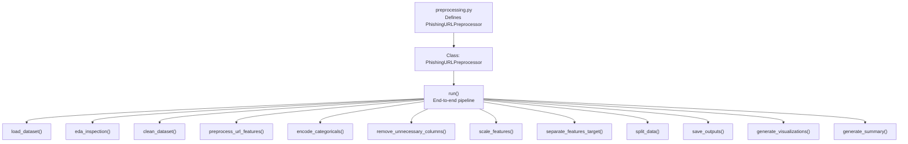
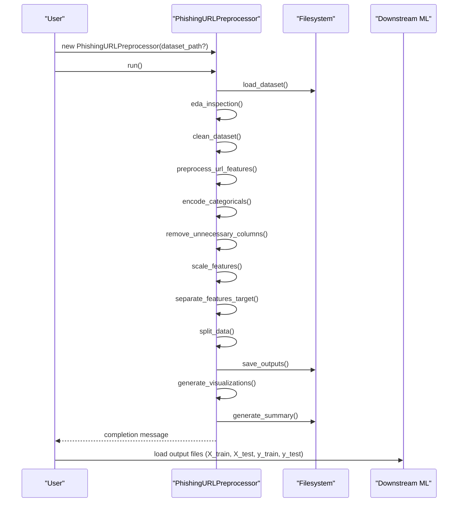

# Usage Examples

<cite>
**Referenced Files in This Document**
- [preprocessing.py](file://preprocessing.py)
- [requirements.txt](file://requirements.txt)
</cite>

## Table of Contents
1. [Introduction](#introduction)
2. [Project Structure](#project-structure)
3. [Core Components](#core-components)
4. [Architecture Overview](#architecture-overview)
5. [Detailed Component Analysis](#detailed-component-analysis)
6. [Dependency Analysis](#dependency-analysis)
7. [Performance Considerations](#performance-considerations)
8. [Troubleshooting Guide](#troubleshooting-guide)
9. [Conclusion](#conclusion)
10. [Appendices](#appendices)

## Introduction
This document provides practical usage examples for the URL_Spam preprocessing pipeline. It covers:
- Basic usage with the default PhiUSIIL dataset
- Custom dataset integration by replacing the default CSV
- Programmatic usage through direct class instantiation
- Advanced configuration examples for preprocessing parameters and feature engineering rules
- Batch processing and automation scenarios
- Troubleshooting common issues
- Integration examples for downstream machine learning workflows
- Performance optimization and memory management tips

## Project Structure
The repository contains a single preprocessing module and a requirements file. The preprocessing module defines a class-based pipeline that loads a dataset, performs cleaning and feature engineering, encodes categorical features, scales numerical features, splits the data, saves outputs, generates visualizations, and writes a summary report.

**Diagram sources**
- [preprocessing.py:112-688](file://preprocessing.py#L112-L688)

**Section sources**
- [preprocessing.py:112-688](file://preprocessing.py#L112-L688)

## Core Components
- PhishingURLPreprocessor: The main class orchestrating the end-to-end pipeline. It exposes methods for each stage and a master run method to execute the pipeline sequentially.
- Utility functions: Directory creation, CSV auto-detection, and safe saving of DataFrames.
- Configuration constants: Random state, test size, output directories, and columns to drop.

Key capabilities:
- Automatic CSV detection in the working directory
- Robust dataset loading with flexible target column naming
- Data cleaning (removal of nulls, duplicates, invalid labels, and negative counts)
- URL feature engineering (when raw URL or Domain columns are present)
- Categorical encoding (one-hot for low cardinality, frequency encoding for high cardinality)
- Numerical feature scaling
- Stratified train/test split
- Output persistence and EDA visualizations
- Summary report generation

**Section sources**
- [preprocessing.py:82-107](file://preprocessing.py#L82-L107)
- [preprocessing.py:112-688](file://preprocessing.py#L112-L688)

## Architecture Overview
The pipeline follows a stepwise, modular design. The master run method coordinates all steps, and each step is implemented as a dedicated method. Outputs are persisted to disk, and plots are generated for exploratory analysis.

**Diagram sources**
- [preprocessing.py:661-688](file://preprocessing.py#L661-L688)
- [preprocessing.py:450-470](file://preprocessing.py#L450-L470)
- [preprocessing.py:474-586](file://preprocessing.py#L474-L586)
- [preprocessing.py:590-656](file://preprocessing.py#L590-L656)

## Detailed Component Analysis

### Basic Usage with Default PhiUSIIL Dataset
Follow these steps to run the pipeline with the default dataset:
1. Place a CSV file in the working directory. The pipeline will auto-detect the largest CSV file.
2. Ensure the dataset contains a target column named “label” (case-insensitive variants are supported).
3. Install dependencies.
4. Execute the script.

Expected outputs:
- Persisted datasets under the output directory
- EDA plots under the plots directory
- A preprocessing summary report

Notes:
- The pipeline logs progress and errors during execution.
- If no CSV is found, the auto-detection raises an error.

**Section sources**
- [preprocessing.py:82-96](file://preprocessing.py#L82-L96)
- [preprocessing.py:138-166](file://preprocessing.py#L138-L166)
- [preprocessing.py:450-470](file://preprocessing.py#L450-L470)
- [preprocessing.py:474-586](file://preprocessing.py#L474-L586)
- [preprocessing.py:590-656](file://preprocessing.py#L590-L656)
- [preprocessing.py:693-700](file://preprocessing.py#L693-L700)

### Custom Dataset Integration
To integrate a custom dataset:
1. Replace the default CSV with your dataset in the working directory.
2. Ensure the dataset adheres to the expected schema:
   - A target column named “label” (or a supported variant)
   - Optional columns for URL feature engineering (e.g., URL, Domain, TLD)
3. Optionally adjust configuration constants if needed.

Behavior:
- The pipeline attempts to rename common target column variants to “label.”
- If “label” is not found, the pipeline raises an error.

**Section sources**
- [preprocessing.py:155-163](file://preprocessing.py#L155-L163)
- [preprocessing.py:82-96](file://preprocessing.py#L82-L96)

### Programmatic Usage Through Direct Class Instantiation
Instantiate the preprocessor and run individual steps or the full pipeline:
- Instantiate with dataset_path=None to auto-detect CSV
- Instantiate with dataset_path="/path/to/your/dataset.csv" to specify a path
- Call run() to execute the full pipeline
- Access intermediate results via attributes (e.g., X_train, X_test, y_train, y_test)

Example usage pattern:
- Initialize the preprocessor
- Optionally call specific steps (e.g., load_dataset, clean_dataset)
- Finalize with run() to persist outputs and generate plots

**Section sources**
- [preprocessing.py:117-134](file://preprocessing.py#L117-L134)
- [preprocessing.py:661-688](file://preprocessing.py#L661-L688)

### Advanced Configuration Examples
The pipeline exposes several configuration constants that influence behavior:
- RANDOM_STATE: Controls reproducibility of train/test split and modeling steps
- TEST_SIZE: Proportion of the dataset allocated to testing
- OUTPUT_DIR and PLOTS_DIR: Output locations for persisted datasets and plots
- DROP_COLUMNS: Columns removed prior to modeling (e.g., URL, Domain, Title)

Customization tips:
- Modify constants at the top of the file to change defaults globally
- For per-run customization, pass dataset_path to the constructor or override attributes after initialization
- Adjust DROP_COLUMNS to include/exclude features based on your dataset schema

**Section sources**
- [preprocessing.py:34-41](file://preprocessing.py#L34-L41)
- [preprocessing.py:117-134](file://preprocessing.py#L117-L134)

### Customizing Feature Engineering Rules
The pipeline can engineer additional URL-related features when raw URL or Domain columns are present:
- Additional features are conditionally added when the respective columns exist
- Domain-based features are engineered when a Domain column is present
- Suspicious TLD detection is performed when a TLD column is present

Adaptation ideas:
- Extend preprocess_url_features() to add new heuristics
- Modify suspicious TLD sets or thresholds
- Introduce new regex-based features for URLs or Domains

**Section sources**
- [preprocessing.py:262-316](file://preprocessing.py#L262-L316)

### Adapting the Pipeline for Different Phishing URL Datasets
The pipeline is designed to be dataset-agnostic:
- Target column normalization: Supports multiple naming conventions for the target column
- Optional feature engineering: URL and Domain columns are optional; the pipeline gracefully handles missing columns
- Flexible categorical encoding: Low-cardinality categoricals are one-hot encoded; high-cardinality ones are frequency-encoded

Adjustments:
- Ensure your dataset’s target column is named “label” or a supported variant
- Add or remove columns in DROP_COLUMNS to match your dataset schema
- Validate that categorical columns are present if you expect encoding

**Section sources**
- [preprocessing.py:155-163](file://preprocessing.py#L155-L163)
- [preprocessing.py:321-350](file://preprocessing.py#L321-L350)
- [preprocessing.py:406-420](file://preprocessing.py#L406-L420)

### Batch Processing Scenarios and Automation
Automation approaches:
- Script-driven runs: Invoke the script multiple times with different dataset paths
- Loop over directories: Iterate through folders containing CSV datasets and process each
- CI/CD integration: Schedule periodic runs to refresh processed datasets

Outputs:
- Persisted datasets under output/
- EDA plots under plots/
- Summary reports for auditability

**Section sources**
- [preprocessing.py:450-470](file://preprocessing.py#L450-L470)
- [preprocessing.py:474-586](file://preprocessing.py#L474-L586)
- [preprocessing.py:590-656](file://preprocessing.py#L590-L656)

### Integration Examples with Machine Learning Workflows
After preprocessing:
- Load X_train, X_test, y_train, y_test from the output directory
- Feed them into scikit-learn estimators or other ML frameworks
- Use the plots and summary for model selection and diagnostics

Typical integration steps:
- Load CSV files into DataFrames
- Fit a classifier (e.g., LogisticRegression, RandomForest)
- Evaluate metrics and iterate on preprocessing or modeling

**Section sources**
- [preprocessing.py:450-470](file://preprocessing.py#L450-L470)

## Dependency Analysis
External libraries and minimum versions:
- pandas>=2.0.0
- numpy>=1.24.0
- scikit-learn>=1.3.0
- matplotlib>=3.7.0
- seaborn>=0.12.0

These dependencies support:
- Data manipulation and preprocessing
- Model training and evaluation
- Visualization and reporting

**Section sources**
- [requirements.txt:1-6](file://requirements.txt#L1-L6)

## Performance Considerations
- Headless plotting: The pipeline sets a non-interactive Matplotlib backend to support headless environments.
- Memory usage logging: The pipeline logs memory usage during EDA inspection to help monitor resource consumption.
- Numerical scaling: StandardScaler is applied to all numeric columns; consider dimensionality reduction or feature selection for very large datasets.
- Parallelism: Some steps leverage scikit-learn’s n_jobs=-1 for parallel computation.

Recommendations:
- Monitor memory usage during EDA and feature engineering
- Reduce the number of plotted features if memory-constrained
- Consider chunked processing for extremely large datasets before applying the pipeline

**Section sources**
- [preprocessing.py:22](file://preprocessing.py#L22)
- [preprocessing.py:178-180](file://preprocessing.py#L178-L180)
- [preprocessing.py:536](file://preprocessing.py#L536)

## Troubleshooting Guide
Common issues and resolutions:
- Missing dependencies
  - Symptom: ImportError or ModuleNotFoundError
  - Resolution: Install required packages per requirements.txt
- No CSV detected
  - Symptom: FileNotFoundError indicating no CSV found
  - Resolution: Place a CSV file in the working directory; the pipeline prefers the largest CSV
- Target column not found
  - Symptom: ValueError stating target column “label” not found
  - Resolution: Ensure the dataset contains a target column named “label” or a supported variant; the pipeline attempts to normalize column names
- Dataset format problems
  - Symptom: Errors during loading or splitting
  - Resolution: Verify the CSV encoding and delimiter; ensure numeric columns are parseable and categorical columns are present as expected
- Processing errors
  - Symptom: Exceptions during pipeline execution
  - Resolution: Review the logged error messages; check that all required columns exist and data types are as expected

**Section sources**
- [requirements.txt:1-6](file://requirements.txt#L1-L6)
- [preprocessing.py:82-96](file://preprocessing.py#L82-L96)
- [preprocessing.py:155-163](file://preprocessing.py#L155-L163)
- [preprocessing.py:694-700](file://preprocessing.py#L694-L700)

## Conclusion
The URL_Spam preprocessing pipeline offers a robust, modular solution for preparing phishing URL datasets for machine learning. It supports default usage with minimal setup, easy customization for different datasets, and programmatic integration for automation and batch processing. By leveraging the provided outputs and visualizations, users can streamline downstream ML workflows while maintaining reproducibility and transparency.

## Appendices

### Appendix A: Step-by-Step Example Index
- Basic usage with default dataset
  - Place CSV in working directory
  - Install dependencies
  - Run the script
  - Review outputs and plots
- Custom dataset integration
  - Replace CSV with your dataset
  - Ensure target column naming
  - Re-run the pipeline
- Programmatic usage
  - Instantiate PhishingURLPreprocessor
  - Call run() or individual steps
  - Access X_train, X_test, y_train, y_test
- Advanced configuration
  - Modify RANDOM_STATE, TEST_SIZE, OUTPUT_DIR, PLOTS_DIR, DROP_COLUMNS
- Feature engineering customization
  - Extend preprocess_url_features()
- Batch processing
  - Loop over datasets or directories
- Troubleshooting
  - Missing dependencies, dataset format, processing errors

[No sources needed since this appendix summarizes previously analyzed sections]