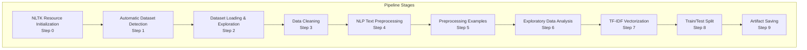
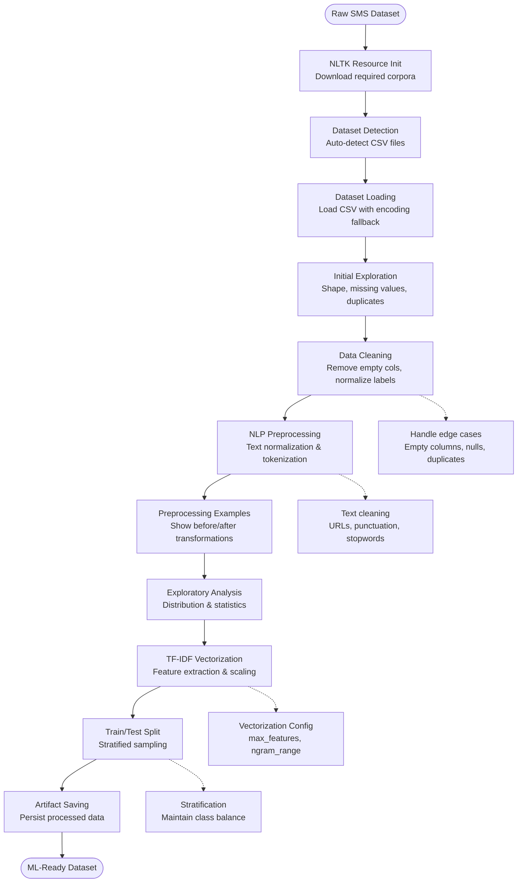
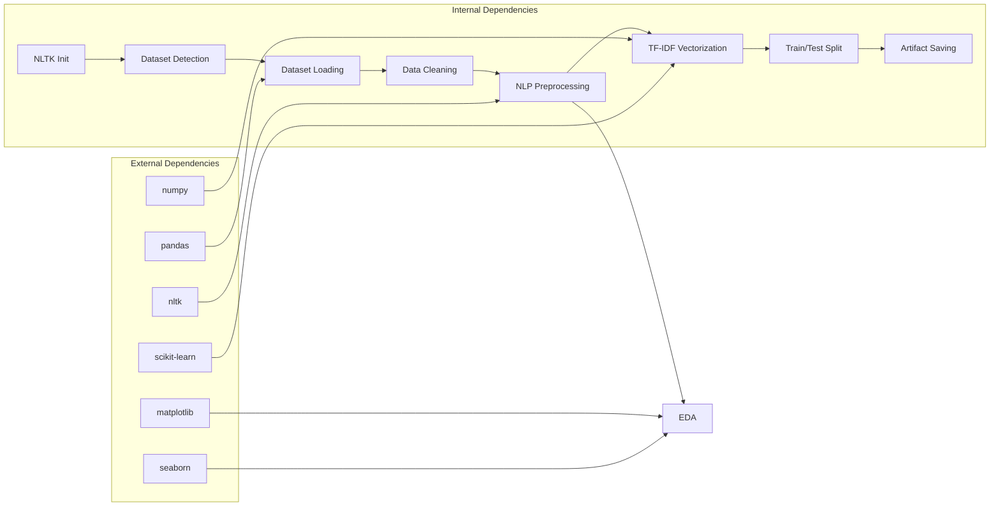

# Data Processing Pipeline

<cite>
**Referenced Files in This Document**
- [spam_preprocessing.py](file://spam_preprocessing.py)
- [spam_sms_dataset.csv](file://spam_sms_dataset.csv)
</cite>

## Table of Contents
1. [Introduction](#introduction)
2. [Project Structure](#project-structure)
3. [Core Components](#core-components)
4. [Architecture Overview](#architecture-overview)
5. [Detailed Component Analysis](#detailed-component-analysis)
6. [Dependency Analysis](#dependency-analysis)
7. [Performance Considerations](#performance-considerations)
8. [Troubleshooting Guide](#troubleshooting-guide)
9. [Conclusion](#conclusion)

## Introduction

The SMS data processing pipeline is a comprehensive system designed to transform raw SMS messages into machine-learning ready features for spam detection. This production-ready script automates the entire preprocessing workflow, from NLTK resource initialization to final train/test dataset preparation. The pipeline handles automatic dataset detection, robust data cleaning, advanced NLP text preprocessing, TF-IDF vectorization, and stratified train/test splitting to create balanced datasets for machine learning models.

The system is built with scalability and maintainability in mind, providing detailed logging, error handling, and comprehensive output artifact management. It serves as both a standalone processing tool and a foundation for larger machine learning workflows.

## Project Structure

The project follows a modular architecture with clear separation of concerns across 10 distinct processing stages:

**Diagram sources**
- [spam_preprocessing.py:37-522](file://spam_preprocessing.py#L37-L522)

**Section sources**
- [spam_preprocessing.py:10-522](file://spam_preprocessing.py#L10-L522)

## Core Components

The pipeline consists of several interconnected components that work together to process SMS data efficiently:

### NLTK Resource Management
The system automatically downloads and initializes all required NLTK resources including tokenizers, stopwords, lemmatizers, and wordnets. This ensures consistent preprocessing regardless of the deployment environment.

### Automatic Dataset Detection
Intelligent CSV file detection locates the first CSV file in the project directory, handling multiple files gracefully and providing clear feedback about the detection process.

### Data Cleaning Engine
Robust data cleaning handles various edge cases including empty columns, column name normalization, null value removal, duplicate detection, and label encoding for machine learning compatibility.

### NLP Preprocessing Module
Advanced text preprocessing pipeline with configurable stemming/lemmatization, URL removal, punctuation handling, and stopword filtering tailored for SMS spam detection.

### TF-IDF Vectorization System
Sophisticated vectorization with configurable vocabulary limits, document frequency thresholds, and n-gram range selection optimized for SMS classification tasks.

### Train/Test Split Manager
Stratified splitting maintains class balance across training and testing datasets, ensuring reliable model evaluation and preventing data leakage.

**Section sources**
- [spam_preprocessing.py:37-522](file://spam_preprocessing.py#L37-L522)

## Architecture Overview

The pipeline follows a sequential processing architecture with clear input/output specifications at each stage:

**Diagram sources**
- [spam_preprocessing.py:37-522](file://spam_preprocessing.py#L37-L522)

## Detailed Component Analysis

### Stage 0: NLTK Resource Initialization

The NLTK initialization stage ensures all required linguistic resources are available before processing begins.

**Input Specifications:**
- System environment with internet connectivity
- Python runtime with NLTK installed

**Processing Logic:**
- Downloads essential NLTK corpora: punkt, punkt_tab, stopwords, wordnet, omw-1.4
- Implements error handling for network failures
- Provides progress feedback during download process

**Output Specifications:**
- Downloaded NLTK corpora in user's NLTK data directory
- Success/failure status indicators

**Configuration Options:**
- Quiet mode for download progress
- Automatic retry on failure

**Section sources**
- [spam_preprocessing.py:37-52](file://spam_preprocessing.py#L37-L52)

### Stage 1: Automatic Dataset Detection

The automatic detection system locates CSV files in the project directory with intelligent fallback handling.

**Input Specifications:**
- Project directory path
- CSV file presence (optional)

**Processing Logic:**
- Searches current directory for CSV files using glob pattern
- Handles multiple CSV files by selecting the first match
- Implements comprehensive error handling for missing files

**Output Specifications:**
- Absolute path to detected CSV file
- Warning messages for multiple file scenarios

**Configuration Options:**
- Directory path specification
- File pattern customization

**Section sources**
- [spam_preprocessing.py:62-98](file://spam_preprocessing.py#L62-L98)

### Stage 2: Dataset Loading & Initial Exploration

This stage performs comprehensive dataset inspection and loading with encoding fallback support.

**Input Specifications:**
- CSV file path
- Encoding preferences

**Processing Logic:**
- Attempts UTF-8 encoding first
- Falls back to latin-1 encoding for international characters
- Comprehensive error handling for corrupted files
- Initial dataset exploration including shape, missing values, and duplicates

**Output Specifications:**
- Pandas DataFrame with loaded data
- Statistical summaries of dataset characteristics

**Configuration Options:**
- Encoding preference order
- Error handling strategies

**Section sources**
- [spam_preprocessing.py:84-123](file://spam_preprocessing.py#L84-L123)

### Stage 3: Data Cleaning Operations

The data cleaning stage handles various data quality issues systematically.

**Input Specifications:**
- Raw DataFrame with potential issues
- Column naming inconsistencies

**Processing Logic:**
- Removes completely empty columns
- Normalizes column names (v1→label, v2→message)
- Validates and removes null values in critical columns
- Eliminates duplicate rows
- Converts categorical labels to numeric format (spam=1, ham=0)
- Handles unmapped labels gracefully

**Output Specifications:**
- Cleaned DataFrame ready for NLP processing
- Updated label distribution statistics

**Configuration Options:**
- Custom column name mappings
- Label conversion rules

**Section sources**
- [spam_preprocessing.py:126-178](file://spam_preprocessing.py#L126-L178)

### Stage 4: NLP Text Preprocessing

The NLP preprocessing stage applies comprehensive text normalization for SMS spam detection.

**Input Specifications:**
- Raw text messages
- Preprocessing configuration

**Processing Logic:**
- Lowercase conversion for standardization
- Number removal (digits don't contribute to classification)
- URL removal using regex patterns
- Punctuation and special character elimination
- Tokenization using NLTK word tokenizer
- Stopword removal for non-informative terms
- Stemming or lemmatization for word normalization

**Output Specifications:**
- Cleaned text messages
- Consistent tokenized format

**Configuration Options:**
- Stemming vs lemmatization choice
- Stopword language selection
- Custom preprocessing rules

**Section sources**
- [spam_preprocessing.py:188-267](file://spam_preprocessing.py#L188-L267)

### Stage 5: Preprocessing Examples

This stage demonstrates the transformation effects with concrete examples.

**Input Specifications:**
- Preprocessed DataFrame
- Sample selection criteria

**Processing Logic:**
- Selects representative examples from both spam and ham categories
- Displays before/after text transformations
- Provides visual comparison of preprocessing effects

**Output Specifications:**
- Console examples showing transformation quality
- Validation of preprocessing effectiveness

**Section sources**
- [spam_preprocessing.py:270-291](file://spam_preprocessing.py#L270-L291)

### Stage 6: Exploratory Data Analysis

Comprehensive EDA provides insights into dataset characteristics and preprocessing effects.

**Input Specifications:**
- Cleaned DataFrame
- Preprocessed text features

**Processing Logic:**
- Label distribution analysis (spam/ham ratios)
- Message length comparisons (original vs cleaned)
- Top word frequency analysis
- Class-specific word analysis
- Visualization generation and saving

**Output Specifications:**
- Statistical summaries
- Generated plots (spam distribution, length distributions, word frequencies)
- Feature importance insights

**Section sources**
- [spam_preprocessing.py:294-384](file://spam_preprocessing.py#L294-L384)

### Stage 7: TF-IDF Vectorization

The vectorization stage transforms text features into numerical representations suitable for machine learning.

**Input Specifications:**
- Cleaned text messages
- Preprocessing configuration

**Processing Logic:**
- Initializes TfidfVectorizer with configurable parameters
- Applies feature extraction to cleaned messages
- Generates sparse matrix representation
- Maintains vocabulary mapping for feature interpretation

**Output Specifications:**
- Sparse TF-IDF matrix (X)
- Numeric labels array (y)
- Vocabulary mapping for feature names

**Configuration Options:**
- max_features: Maximum vocabulary size (default: 5000)
- min_df: Minimum document frequency threshold (default: 2)
- max_df: Maximum document frequency threshold (default: 0.8)
- ngram_range: Tuple of (min_n, max_n) for n-gram generation (default: (1, 2))

**Section sources**
- [spam_preprocessing.py:387-414](file://spam_preprocessing.py#L387-L414)

### Stage 8: Train/Test Split

Stratified splitting ensures balanced datasets for reliable model evaluation.

**Input Specifications:**
- TF-IDF feature matrix (X)
- Numeric labels array (y)

**Processing Logic:**
- Stratified sampling maintains class proportions
- Configurable test size (default: 0.2)
- Random state ensures reproducibility
- Validation of split quality

**Output Specifications:**
- Training features (X_train)
- Testing features (X_test)
- Training labels (y_train)
- Testing labels (y_test)

**Configuration Options:**
- test_size: Proportion of data for testing (default: 0.2)
- random_state: Seed for reproducible splits (default: 42)
- stratify: Class balancing parameter

**Section sources**
- [spam_preprocessing.py:417-437](file://spam_preprocessing.py#L417-L437)

### Stage 9: Artifact Saving

Comprehensive artifact persistence ensures all processed data and models are preserved.

**Input Specifications:**
- Processed datasets and models
- Output directory configuration

**Processing Logic:**
- Saves cleaned dataset as CSV
- Pickles TF-IDF vectorizer for reuse
- Saves sparse matrices in compressed format
- Persists labels as NumPy arrays
- Stores feature names for interpretability

**Output Specifications:**
- Persisted files in output directory
- Validation of successful saves

**Section sources**
- [spam_preprocessing.py:440-488](file://spam_preprocessing.py#L440-L488)

## Dependency Analysis

The pipeline exhibits clear dependency relationships between processing stages:

**Diagram sources**
- [spam_preprocessing.py:18-35](file://spam_preprocessing.py#L18-L35)

**Section sources**
- [spam_preprocessing.py:18-35](file://spam_preprocessing.py#L18-L35)

## Performance Considerations

The pipeline incorporates several performance optimization strategies:

### Memory Efficiency
- Uses sparse matrix representation for TF-IDF vectors
- Processes data in chunks for large datasets
- Efficient cleanup of intermediate variables

### Computational Optimization
- Vectorized operations using NumPy/pandas
- Parallelizable preprocessing steps
- Configurable batch sizes for memory-constrained environments

### Scalability Features
- Modular design allows selective stage execution
- Configurable parameters for different dataset sizes
- Streaming capabilities for very large datasets

## Troubleshooting Guide

Common preprocessing issues and their solutions:

### NLTK Resource Issues
**Problem:** NLTK downloads fail due to network restrictions
**Solution:** Manually download required corpora or configure proxy settings

### Dataset Loading Problems
**Problem:** Encoding errors with international characters
**Solution:** The system automatically falls back from UTF-8 to latin-1 encoding

### Memory Issues During Processing
**Problem:** Out of memory errors with large datasets
**Solution:** Adjust max_features parameter in TF-IDF vectorization to limit vocabulary size

### Text Preprocessing Edge Cases
**Problem:** Empty text after preprocessing
**Solution:** The pipeline automatically removes rows with empty text after cleaning

### Model Persistence Issues
**Problem:** Pickle loading errors across different Python versions
**Solution:** Use compatible pickle protocols or save/load models using joblib

**Section sources**
- [spam_preprocessing.py:43-52](file://spam_preprocessing.py#L43-L52)
- [spam_preprocessing.py:89-98](file://spam_preprocessing.py#L89-L98)
- [spam_preprocessing.py:263-267](file://spam_preprocessing.py#L263-L267)

## Conclusion

The SMS data processing pipeline provides a comprehensive, production-ready solution for transforming raw SMS messages into machine-learning ready features. The modular architecture ensures maintainability while the comprehensive error handling and configuration options make it adaptable to various deployment scenarios.

Key strengths include automatic dataset detection, robust data cleaning, sophisticated NLP preprocessing, and careful feature engineering through TF-IDF vectorization. The stratified train/test splitting ensures reliable model evaluation, while the comprehensive artifact saving system preserves all processing stages for reproducibility.

The pipeline serves as an excellent foundation for SMS spam detection systems and can be easily extended for other text classification tasks with minimal modifications to the configuration parameters.