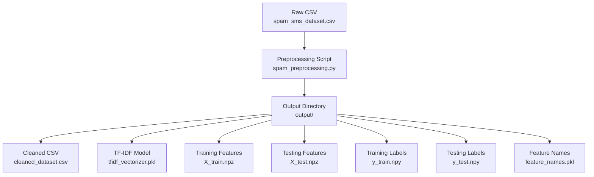
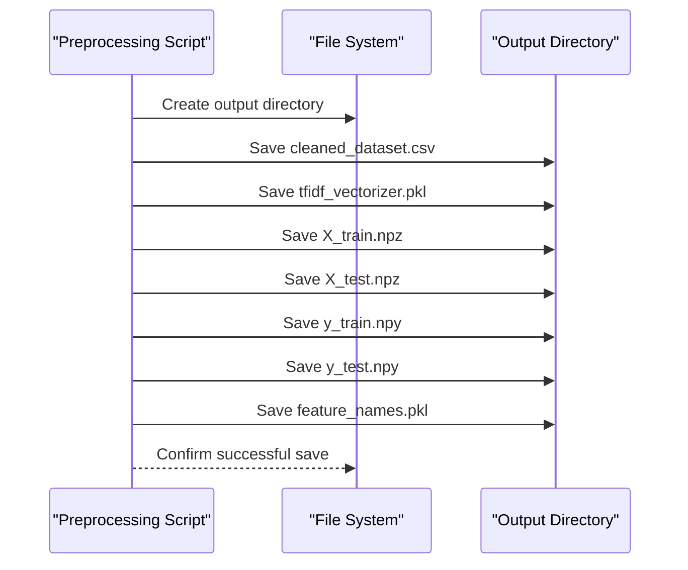
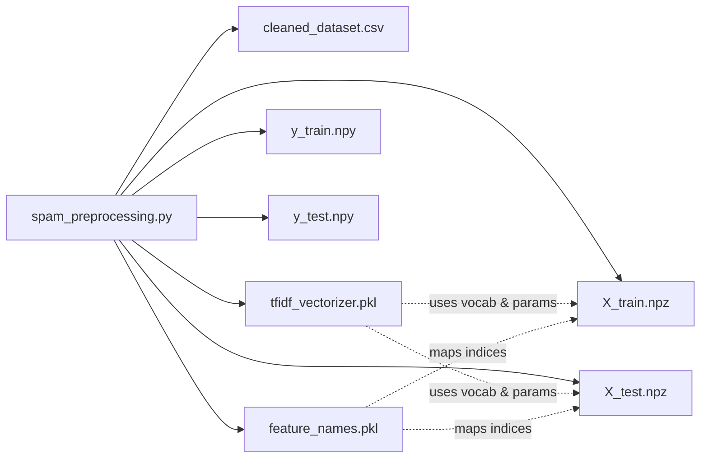

# Output Artifacts

<cite>
**Referenced Files in This Document**
- [spam_preprocessing.py](file://spam_preprocessing.py)
- [spam_sms_dataset.csv](file://spam_sms_dataset.csv)
- [cleaned_dataset.csv](file://output/cleaned_dataset.csv)
- [tfidf_vectorizer.pkl](file://output/tfidf_vectorizer.pkl)
- [X_train.npz](file://output/X_train.npz)
- [X_test.npz](file://output/X_test.npz)
- [y_train.npy](file://output/y_train.npy)
- [y_test.npy](file://output/y_test.npy)
- [feature_names.pkl](file://output/feature_names.pkl)
</cite>

## Table of Contents
1. [Introduction](#introduction)
2. [Project Structure](#project-structure)
3. [Core Components](#core-components)
4. [Architecture Overview](#architecture-overview)
5. [Detailed Component Analysis](#detailed-component-analysis)
6. [Dependency Analysis](#dependency-analysis)
7. [Performance Considerations](#performance-considerations)
8. [Troubleshooting Guide](#troubleshooting-guide)
9. [Conclusion](#conclusion)
10. [Appendices](#appendices)

## Introduction
This document explains all output artifacts produced by the preprocessing pipeline. It covers the cleaned dataset CSV, the fitted TF-IDF vectorizer, the training/testing sparse matrices, label arrays, and feature names file. It also provides practical guidance for loading, validating, and using these artifacts in downstream machine learning workflows, along with storage and performance considerations.

## Project Structure
The preprocessing pipeline reads a raw CSV dataset, performs cleaning and NLP preprocessing, fits a TF-IDF vectorizer, splits the data into train/test sets, and saves all artifacts to an output directory.

**Diagram sources**
- [spam_preprocessing.py:447-482](file://spam_preprocessing.py#L447-L482)
- [spam_sms_dataset.csv](file://spam_sms_dataset.csv)

**Section sources**
- [spam_preprocessing.py:447-482](file://spam_preprocessing.py#L447-L482)

## Core Components
Below are the artifacts and their roles in the ML workflow:

- Cleaned dataset CSV: Contains original and processed message columns, numeric labels, and derived lengths for EDA.
- TF-IDF vectorizer: Encodes text into a sparse matrix and stores vocabulary and transformation parameters.
- Training and testing sparse matrices: Efficiently stored TF-IDF feature matrices for training and evaluation.
- Label arrays: Numeric targets for training and testing sets.
- Feature names: Vocabulary mapping for interpretability.

**Section sources**
- [spam_preprocessing.py:451-482](file://spam_preprocessing.py#L451-L482)

## Architecture Overview
The pipeline’s saving stage writes artifacts to the output directory. The following sequence diagram maps the saving process to the actual code.

**Diagram sources**
- [spam_preprocessing.py:447-482](file://spam_preprocessing.py#L447-L482)

## Detailed Component Analysis

### Cleaned Dataset CSV (cleaned_dataset.csv)
- Purpose: Stores the cleaned dataset with both original and processed messages, numeric labels, and derived lengths for exploratory analysis.
- Columns:
  - label: Original categorical label (ham/spam).
  - message: Original raw message text.
  - label_num: Numeric encoding (ham=0, spam=1).
  - cleaned_message: NLP-preprocessed message text.
  - message_length: Character length of original message.
  - cleaned_length: Character length of cleaned message.
- Typical shape: Number of rows equals the number of cleaned samples; columns are as listed above.
- Notes: The dataset is saved without an index to minimize overhead.

Practical usage:
- Load with pandas for inspection, EDA, or to verify preprocessing.
- Use cleaned_message for vectorization; use label_num for training targets.

Validation tips:
- Verify presence of expected columns.
- Confirm numeric label distribution aligns with expectations.
- Ensure no empty cleaned_message rows remain.

**Section sources**
- [spam_preprocessing.py:452-454](file://spam_preprocessing.py#L452-L454)
- [spam_preprocessing.py:159-170](file://spam_preprocessing.py#L159-L170)
- [spam_preprocessing.py:324-350](file://spam_preprocessing.py#L324-L350)

### TF-IDF Vectorizer (tfidf_vectorizer.pkl)
- Purpose: Holds the fitted TfidfVectorizer with vocabulary, parameters, and transformation logic.
- Key attributes used by the pipeline:
  - vocabulary_: Size indicates the number of unique terms retained.
  - get_feature_names_out(): Provides feature names for interpretability.
  - Parameters configured: max_features=5000, min_df=2, max_df=0.8, ngram_range=(1, 2).
- Storage: Serialized with pickle for reuse in downstream training or inference.

Practical usage:
- Load the vectorizer and transform new messages to the same feature space.
- Retrieve feature names via get_feature_names_out() for model interpretation.

Validation tips:
- Confirm vocabulary size matches expectations.
- Ensure feature names align with the intended n-gram range.

**Section sources**
- [spam_preprocessing.py:394-414](file://spam_preprocessing.py#L394-L414)
- [spam_preprocessing.py:457-460](file://spam_preprocessing.py#L457-L460)
- [spam_preprocessing.py:478-482](file://spam_preprocessing.py#L478-L482)

### Training and Testing Sparse Matrices (X_train.npz, X_test.npz)
- Purpose: Store TF-IDF feature matrices for training and testing.
- Format: SciPy sparse .npz; internally compressed to reduce disk usage.
- Dimensions:
  - X_train: (n_train, n_features)
  - X_test: (n_test, n_features)
- Memory efficiency: Sparse matrices store mostly zeros compactly, reducing RAM/CPU usage during training.

Practical usage:
- Load with scipy.sparse.load_npz.
- Pass to scikit-learn estimators that support sparse matrices.

Validation tips:
- Verify shapes match expected sample counts and feature dimensionality.
- Confirm sparsity ratio is as expected for bag-of-words.

**Section sources**
- [spam_preprocessing.py:424-437](file://spam_preprocessing.py#L424-L437)
- [spam_preprocessing.py:465-470](file://spam_preprocessing.py#L465-L470)

### Label Arrays (y_train.npy, y_test.npy)
- Purpose: Store numeric labels for training and testing sets.
- Encoding: 0=ham, 1=spam.
- Storage: NumPy binary format (.npy) for fast I/O.
- Shapes:
  - y_train: (n_train,)
  - y_test: (n_test,)

Practical usage:
- Load with np.load.
- Use directly as targets for classifiers.

Validation tips:
- Confirm class balance is preserved across splits.
- Ensure dtype is integer suitable for classification tasks.

**Section sources**
- [spam_preprocessing.py:424-437](file://spam_preprocessing.py#L424-L437)
- [spam_preprocessing.py:472-476](file://spam_preprocessing.py#L472-L476)

### Feature Names (feature_names.pkl)
- Purpose: Persist the feature names (vocabulary) for interpretability and reproducibility.
- Content: Array of strings representing the TF-IDF feature names.
- Usage: Map coefficients or feature importances back to terms.

Practical usage:
- Load with pickle to retrieve feature names.
- Use alongside trained linear models or SHAP explanations.

Validation tips:
- Confirm length equals vocabulary size.
- Ensure ordering matches the vectorizer’s feature indices.

**Section sources**
- [spam_preprocessing.py:478-482](file://spam_preprocessing.py#L478-L482)

## Dependency Analysis
The artifacts are produced by a single script and are independent of each other. The vectorizer and feature names enable consistent transformation of new data. The sparse matrices and labels are coupled to the train/test split.

**Diagram sources**
- [spam_preprocessing.py:451-482](file://spam_preprocessing.py#L451-L482)

**Section sources**
- [spam_preprocessing.py:424-437](file://spam_preprocessing.py#L424-L437)
- [spam_preprocessing.py:451-482](file://spam_preprocessing.py#L451-L482)

## Performance Considerations
- Sparse matrices: Using scipy.sparse saves significant disk and memory compared to dense matrices.
- File formats:
  - .npz for sparse matrices: efficient compression and fast load/save.
  - .npy for dense arrays: minimal overhead for labels.
  - .pkl for vectorizer and feature names: preserves Python objects and enables reuse.
- Disk footprint: Prefer .npz/.npy over CSV for numerical artifacts to reduce I/O and parsing overhead.
- Memory usage: Load only necessary artifacts during training; stream or lazily load if datasets are large.

[No sources needed since this section provides general guidance]

## Troubleshooting Guide
Common issues and remedies:
- Missing artifacts:
  - Ensure the output directory exists and the script completed successfully.
  - Re-run the preprocessing script if artifacts are absent.
- Dimension mismatches:
  - Verify that X_train and X_test share the same number of features as the vectorizer’s vocabulary size.
  - Confirm y_train and y_test lengths match the corresponding sample counts.
- Loading errors:
  - Use scipy.sparse.load_npz for .npz files.
  - Use np.load for .npy files.
  - Use pickle.load for .pkl files.
- Integrity checks:
  - Compare vocabulary size from the vectorizer with feature_names length.
  - Validate label distributions in y_train and y_test against the original dataset.

**Section sources**
- [spam_preprocessing.py:465-482](file://spam_preprocessing.py#L465-L482)

## Conclusion
The preprocessing pipeline produces a cohesive set of artifacts optimized for downstream ML workflows. The cleaned dataset supports inspection and EDA; the vectorizer and feature names enable reproducible transformations and interpretability; and the sparse matrices plus labels provide efficient training and evaluation data. Following the guidance in this document ensures reliable loading, validation, and usage of these artifacts.

[No sources needed since this section summarizes without analyzing specific files]

## Appendices

### Practical Loading Examples (paths only)
- Load cleaned dataset:
  - [cleaned_dataset.csv](file://output/cleaned_dataset.csv)
- Load vectorizer and feature names:
  - [tfidf_vectorizer.pkl](file://output/tfidf_vectorizer.pkl)
  - [feature_names.pkl](file://output/feature_names.pkl)
- Load training and testing features:
  - [X_train.npz](file://output/X_train.npz)
  - [X_test.npz](file://output/X_test.npz)
- Load labels:
  - [y_train.npy](file://output/y_train.npy)
  - [y_test.npy](file://output/y_test.npy)

[No sources needed since this section lists file paths without code analysis]