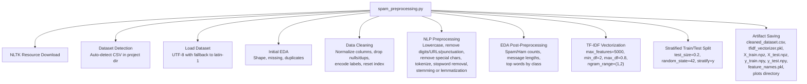
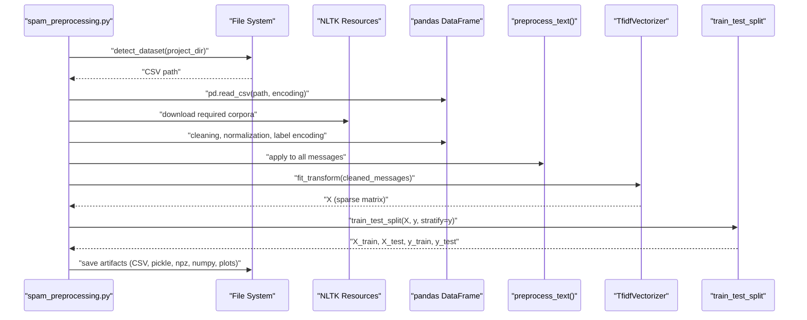
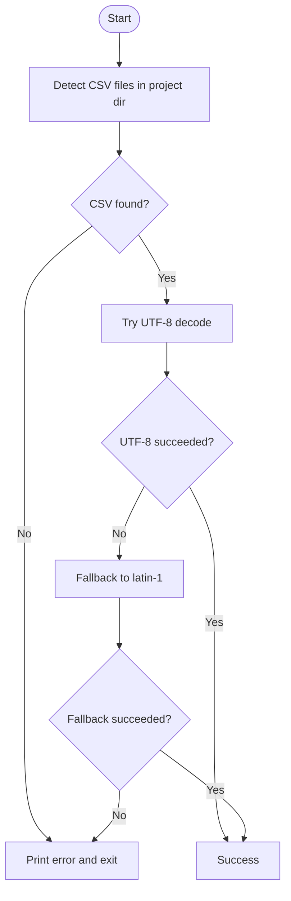
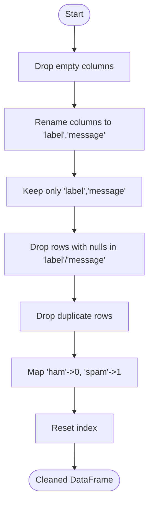
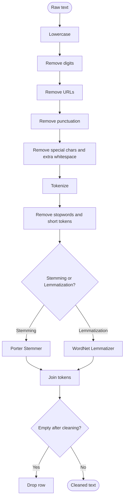
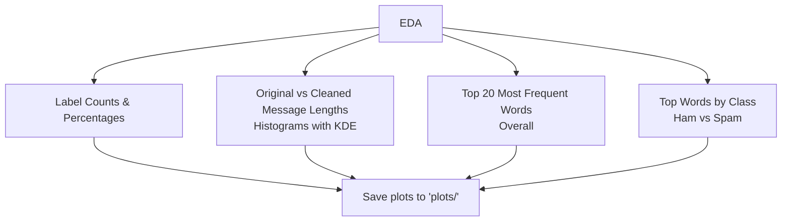
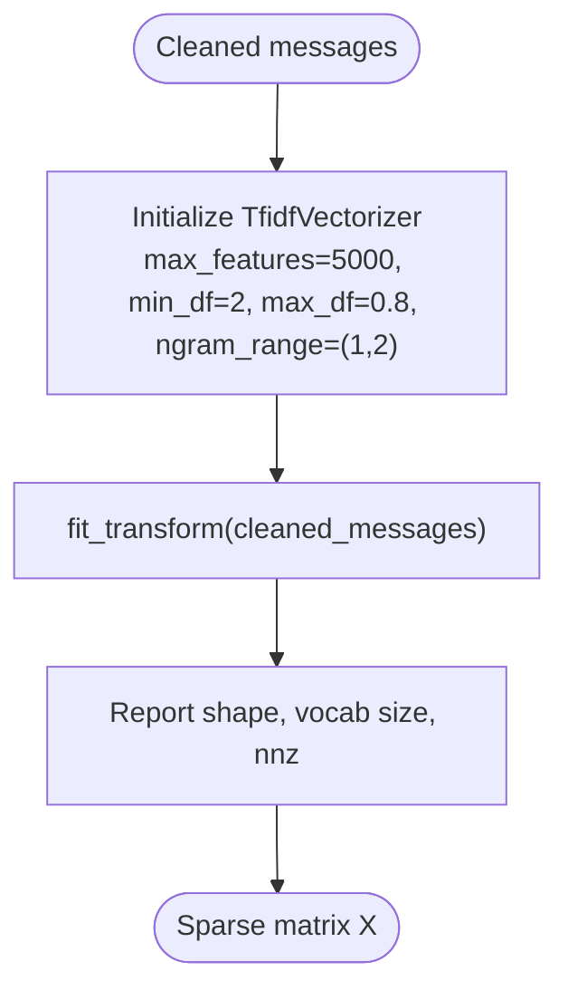
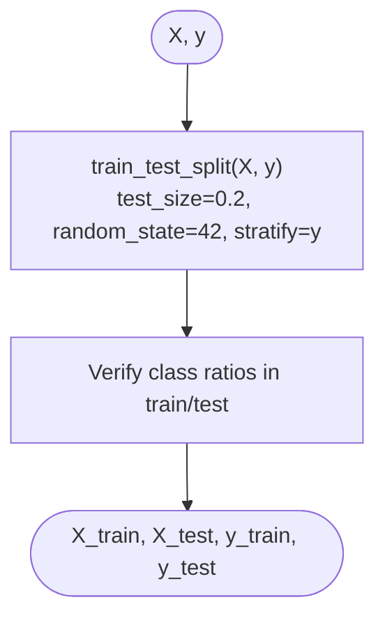
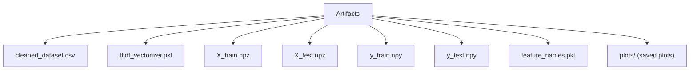
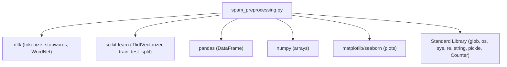

# Project Overview

<cite>
**Referenced Files in This Document**
- [spam_preprocessing.py](file://spam_preprocessing.py)
- [spam_sms_dataset.csv](file://spam_sms_dataset.csv)
</cite>

## Table of Contents
1. [Introduction](#introduction)
2. [Project Structure](#project-structure)
3. [Core Components](#core-components)
4. [Architecture Overview](#architecture-overview)
5. [Detailed Component Analysis](#detailed-component-analysis)
6. [Dependency Analysis](#dependency-analysis)
7. [Performance Considerations](#performance-considerations)
8. [Troubleshooting Guide](#troubleshooting-guide)
9. [Conclusion](#conclusion)

## Introduction
This project is a production-ready data cleaning and NLP preprocessing pipeline designed for SMS spam detection. It automatically detects and loads a dataset, performs robust data cleaning, applies a comprehensive NLP text preprocessing pipeline, transforms text into TF-IDF features, and splits the data into train/test sets using stratified sampling. The pipeline generates artifacts suitable for downstream machine learning workflows, including cleaned datasets, vectorizers, and serialized feature matrices.

The pipeline integrates NLTK for tokenization, stopword removal, stemming/lemmatization, and scikit-learn for TF-IDF vectorization and train/test splitting. It produces visualizations for exploratory data analysis and saves all outputs to a structured output directory for reproducible downstream model training.

## Project Structure
The project consists of a single preprocessing script and a CSV dataset:
- spam_preprocessing.py: Orchestrates the entire pipeline from dataset detection to artifact saving.
- spam_sms_dataset.csv: Contains labeled SMS messages with columns v1 (label) and v2 (message). The script normalizes column names and prepares the dataset for preprocessing.

**Diagram sources**
- [spam_preprocessing.py:37-522](file://spam_preprocessing.py#L37-L522)

**Section sources**
- [spam_preprocessing.py:37-101](file://spam_preprocessing.py#L37-L101)
- [spam_sms_dataset.csv:1-10](file://spam_sms_dataset.csv#L1-L10)

## Core Components
- Automatic dataset detection: Searches the project directory for CSV files and selects the first one found.
- Robust dataset loading: Attempts UTF-8 decoding with a fallback to latin-1.
- Initial dataset exploration: Prints shape, missing values, duplicates, and column names.
- Data cleaning: Normalizes column names, removes empty columns, drops nulls, removes duplicates, encodes labels to numeric (spam=1, ham=0), and resets the index.
- NLP preprocessing: Applies a comprehensive pipeline including lowercasing, removing digits and URLs, punctuation, special characters, tokenization, stopword removal, and optional stemming or lemmatization.
- Exploratory data analysis: Generates plots for label distribution, message length distributions, and top words (overall and by class).
- TF-IDF vectorization: Initializes a vectorizer with controlled vocabulary size and document frequency thresholds, then fits and transforms the cleaned messages.
- Stratified train/test split: Splits features and labels with stratification to preserve class ratios.
- Artifact saving: Saves cleaned data, vectorizer, sparse feature matrices, labels, feature names, and plots.

Key public interfaces and parameters:
- detect_dataset(project_dir): Detects CSV files in the project directory and returns the path to the first CSV.
- preprocess_text(text, use_stemming=True): Applies the NLP preprocessing pipeline to a single text and returns cleaned text.
- tfidf vectorizer parameters: max_features=5000, min_df=2, max_df=0.8, ngram_range=(1,2).
- train_test_split parameters: test_size=0.2, random_state=42, stratify=y.

Return values:
- detect_dataset returns a string path to the CSV file.
- preprocess_text returns a string (cleaned text).
- train_test_split returns four arrays: X_train, X_test, y_train, y_test.
- Vectorizer fit_transform returns a scipy.sparse matrix X.

**Section sources**
- [spam_preprocessing.py:62-101](file://spam_preprocessing.py#L62-L101)
- [spam_preprocessing.py:194-267](file://spam_preprocessing.py#L194-L267)
- [spam_preprocessing.py:394-414](file://spam_preprocessing.py#L394-L414)
- [spam_preprocessing.py:424-437](file://spam_preprocessing.py#L424-L437)

## Architecture Overview
The pipeline follows a modular, step-wise architecture:
- Step 0: NLTK resource download for tokenization, stopwords, WordNet, and multilingual data.
- Step 1: Dataset detection and loading with encoding fallback.
- Step 2: Initial dataset exploration.
- Step 3: Data cleaning and label encoding.
- Step 4: NLP preprocessing pipeline applied to all messages.
- Step 5: Before/after preprocessing examples.
- Step 6: EDA with plots and statistics.
- Step 7: TF-IDF vectorization.
- Step 8: Stratified train/test split.
- Step 9: Artifact saving to output directory.
- Step 10: Summary of results and saved artifacts.

**Diagram sources**
- [spam_preprocessing.py:37-522](file://spam_preprocessing.py#L37-L522)

## Detailed Component Analysis

### Dataset Detection and Loading
- Purpose: Automatically locate a CSV file in the project directory and load it with appropriate encoding.
- Implementation highlights:
  - Uses glob to find CSV files and selects the first match.
  - Attempts UTF-8 decoding; falls back to latin-1 if needed.
  - Provides informative logs and exits gracefully on failure.

**Diagram sources**
- [spam_preprocessing.py:62-101](file://spam_preprocessing.py#L62-L101)

**Section sources**
- [spam_preprocessing.py:62-101](file://spam_preprocessing.py#L62-L101)

### Data Cleaning and Label Encoding
- Purpose: Normalize dataset structure, remove noise, and prepare labels for modeling.
- Implementation highlights:
  - Drops completely empty columns.
  - Renames columns to standardized names if needed.
  - Keeps only label and message columns.
  - Drops rows with nulls in critical columns and removes duplicates.
  - Encodes labels to numeric (spam=1, ham=0) and resets index.

**Diagram sources**
- [spam_preprocessing.py:126-178](file://spam_preprocessing.py#L126-L178)

**Section sources**
- [spam_preprocessing.py:126-178](file://spam_preprocessing.py#L126-L178)

### NLP Preprocessing Pipeline
- Purpose: Transform raw SMS messages into normalized tokens suitable for TF-IDF vectorization.
- Implementation highlights:
  - Lowercases text.
  - Removes digits and URLs.
  - Strips punctuation and special characters.
  - Tokenizes using NLTK word tokenizer.
  - Filters stopwords and removes short tokens.
  - Applies stemming or lemmatization based on parameter.
  - Joins tokens back to a cleaned string and removes empty rows.

**Diagram sources**
- [spam_preprocessing.py:194-267](file://spam_preprocessing.py#L194-L267)

**Section sources**
- [spam_preprocessing.py:194-267](file://spam_preprocessing.py#L194-L267)

### Exploratory Data Analysis (EDA)
- Purpose: Provide insights into label distribution, message lengths, and vocabulary before and after preprocessing.
- Implementation highlights:
  - Label distribution counts and percentages.
  - Original and cleaned message length histograms with KDE.
  - Top 20 most frequent words overall and by class (ham/spam).
  - Saves plots to a dedicated directory.

**Diagram sources**
- [spam_preprocessing.py:294-384](file://spam_preprocessing.py#L294-L384)

**Section sources**
- [spam_preprocessing.py:294-384](file://spam_preprocessing.py#L294-L384)

### TF-IDF Vectorization
- Purpose: Convert cleaned messages into a sparse matrix representation suitable for machine learning.
- Implementation highlights:
  - Initializes TfidfVectorizer with controlled vocabulary size and document frequency thresholds.
  - Fits and transforms the cleaned messages.
  - Reports matrix shape, vocabulary size, and sparsity.

**Diagram sources**
- [spam_preprocessing.py:387-414](file://spam_preprocessing.py#L387-L414)

**Section sources**
- [spam_preprocessing.py:387-414](file://spam_preprocessing.py#L387-L414)

### Stratified Train/Test Split
- Purpose: Create balanced training and testing sets that reflect the original label distribution.
- Implementation highlights:
  - Splits features and labels with stratification.
  - Sets test size to 20% and random seed for reproducibility.
  - Verifies class ratios in both sets.

**Diagram sources**
- [spam_preprocessing.py:417-437](file://spam_preprocessing.py#L417-L437)

**Section sources**
- [spam_preprocessing.py:417-437](file://spam_preprocessing.py#L417-L437)

### Artifact Generation and Saving
- Purpose: Persist cleaned data, vectorizer, features, labels, feature names, and plots for downstream use.
- Implementation highlights:
  - Creates output directory if it does not exist.
  - Saves cleaned CSV, TF-IDF vectorizer, sparse feature matrices, labels, and feature names.
  - Saves EDA plots to a separate directory.

**Diagram sources**
- [spam_preprocessing.py:440-488](file://spam_preprocessing.py#L440-L488)

**Section sources**
- [spam_preprocessing.py:440-488](file://spam_preprocessing.py#L440-L488)

### Practical Example: Complete Workflow
- Load dataset from project directory.
- Explore initial structure and missing data.
- Clean data and encode labels.
- Apply NLP preprocessing to all messages.
- Generate EDA plots and statistics.
- Vectorize text with TF-IDF.
- Split data using stratified sampling.
- Save all artifacts for downstream ML training.

This workflow transforms raw SMS messages into ML-ready features while maintaining reproducibility and transparency through logging and artifact persistence.

**Section sources**
- [spam_preprocessing.py:37-522](file://spam_preprocessing.py#L37-L522)

## Dependency Analysis
The preprocessing script relies on the following libraries:
- NLTK: Tokenization, stopwords, WordNet lemmatization, and corpus downloads.
- scikit-learn: TfidfVectorizer and train_test_split.
- pandas/numpy: Data loading, cleaning, and numerical operations.
- matplotlib/seaborn: EDA visualizations.
- Standard library modules: glob, os, sys, re, string, pickle, and collections.Counter.

**Diagram sources**
- [spam_preprocessing.py:10-35](file://spam_preprocessing.py#L10-L35)

**Section sources**
- [spam_preprocessing.py:10-35](file://spam_preprocessing.py#L10-L35)

## Performance Considerations
- Vectorization parameters: max_features=5000, min_df=2, max_df=0.8, ngram_range=(1,2) balance model interpretability and performance.
- Sparse matrices: TF-IDF outputs are saved as sparse matrices to conserve memory.
- Logging and progress: Informative prints guide users through long-running steps like preprocessing and vectorization.
- Encoding fallback: Robust dataset loading prevents unnecessary retries and failures.

[No sources needed since this section provides general guidance]

## Troubleshooting Guide
Common issues and resolutions:
- NLTK resource download failures: Ensure network connectivity; the script attempts to download required corpora and exits on failure.
- Dataset detection errors: Confirm a CSV exists in the project directory; the script reports when none is found.
- Encoding issues: The loader tries UTF-8 first and falls back to latin-1; if both fail, the script exits with an error.
- Missing artifacts: Verify the output directory exists and the script has write permissions; artifacts include cleaned CSV, vectorizer, sparse matrices, labels, feature names, and plots.

**Section sources**
- [spam_preprocessing.py:37-52](file://spam_preprocessing.py#L37-L52)
- [spam_preprocessing.py:62-101](file://spam_preprocessing.py#L62-L101)
- [spam_preprocessing.py:440-488](file://spam_preprocessing.py#L440-L488)

## Conclusion
This SMS spam detection preprocessing pipeline provides a complete, automated workflow from raw CSV data to ML-ready features. It combines NLTK, scikit-learn, and pandas to deliver robust data cleaning, comprehensive NLP preprocessing, TF-IDF vectorization, and stratified sampling. The resulting artifacts enable seamless integration into downstream machine learning pipelines while preserving reproducibility and transparency through logging and visualization.