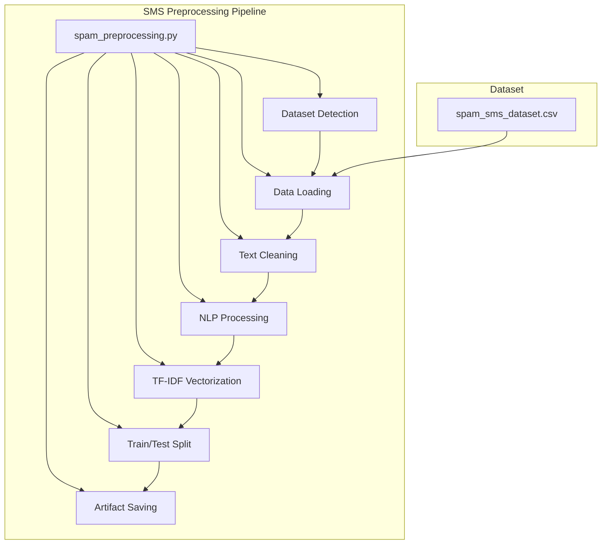
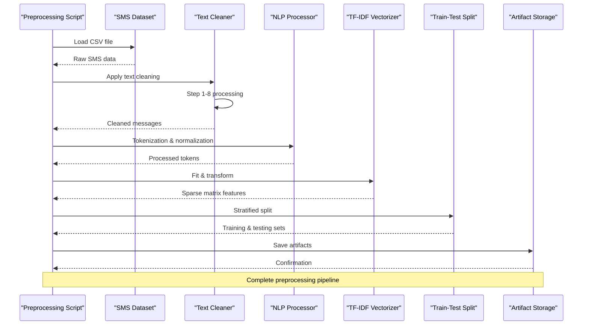
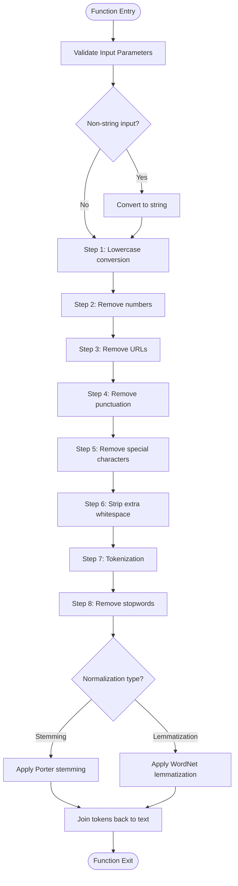
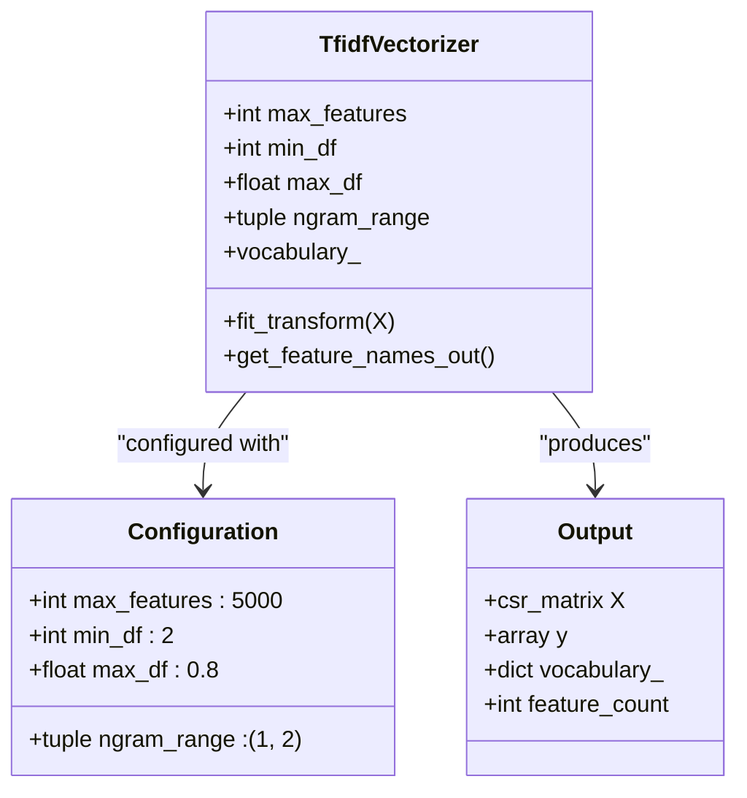
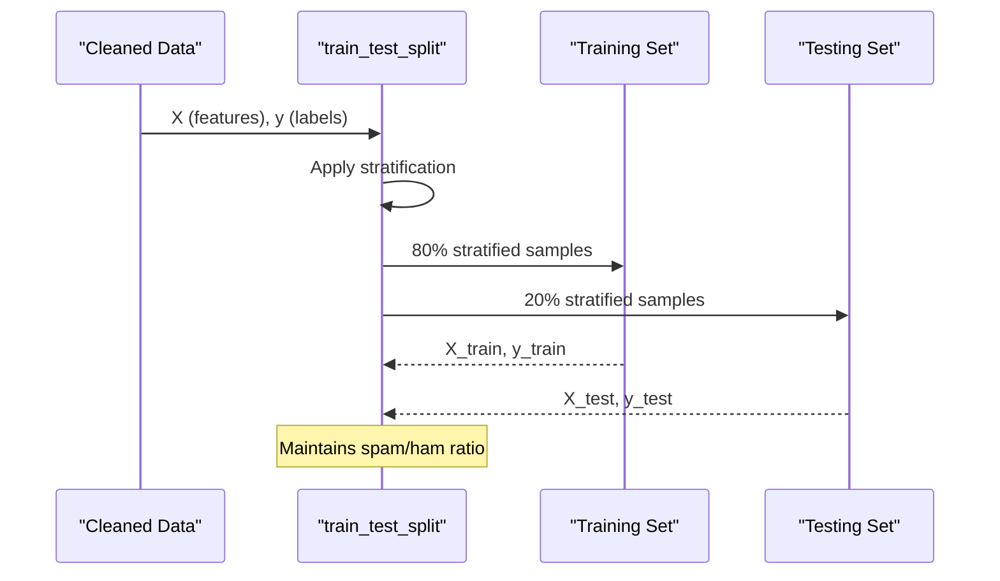
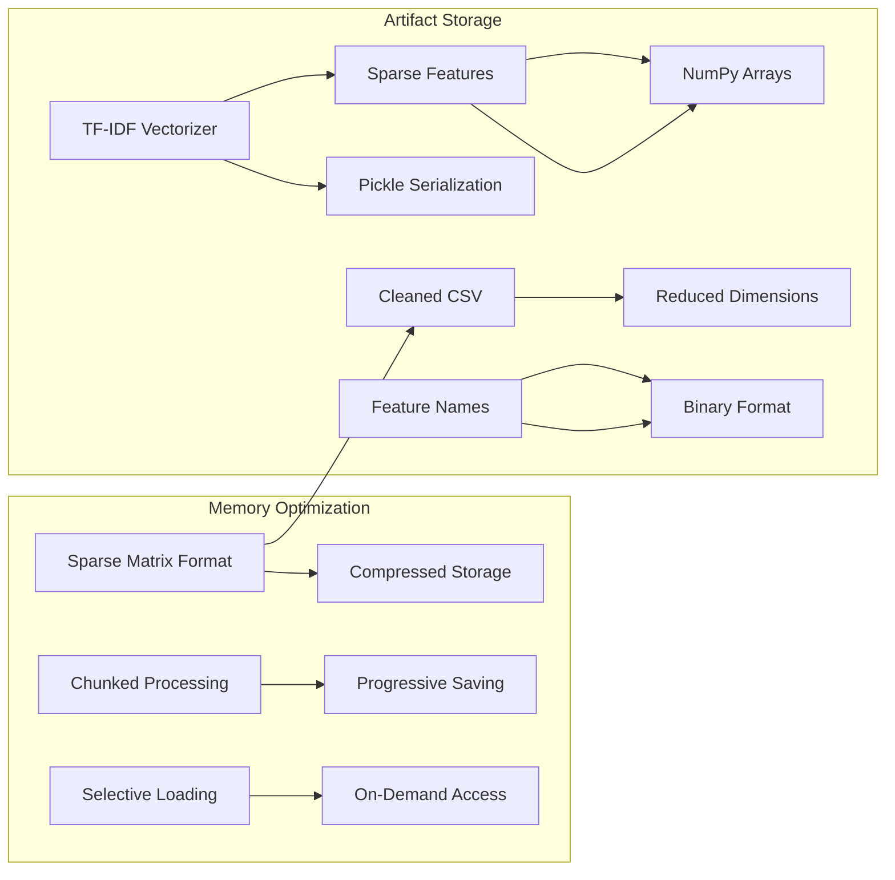
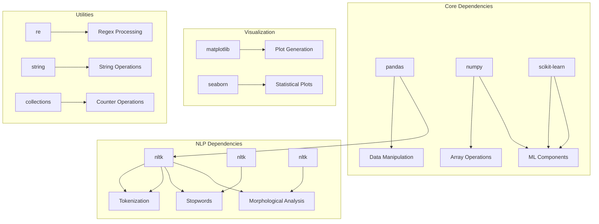

# Technical Implementation

<cite>
**Referenced Files in This Document**
- [spam_preprocessing.py](file://spam_preprocessing.py)
- [spam_sms_dataset.csv](file://spam_sms_dataset.csv)
</cite>

## Table of Contents
1. [Introduction](#introduction)
2. [Project Structure](#project-structure)
3. [Core Components](#core-components)
4. [Architecture Overview](#architecture-overview)
5. [Detailed Component Analysis](#detailed-component-analysis)
6. [Dependency Analysis](#dependency-analysis)
7. [Performance Considerations](#performance-considerations)
8. [Troubleshooting Guide](#troubleshooting-guide)
9. [Conclusion](#conclusion)

## Introduction
This document provides comprehensive technical documentation for the SMS preprocessing implementation designed for spam detection. The system implements a complete NLP pipeline that transforms raw SMS messages into machine-learning ready features through text cleaning, tokenization, normalization, and vectorization. The implementation includes robust error handling, progress reporting, and memory optimization strategies suitable for large-scale SMS datasets.

The preprocessing pipeline follows industry-standard practices for text preprocessing, incorporating NLTK-based tokenization, stopword removal, and morphological normalization through stemming or lemmatization. The TF-IDF vectorization component provides flexible configuration options for controlling vocabulary size and term frequency characteristics, while the train-test split maintains class balance through stratification.

## Project Structure
The project consists of two primary components: the preprocessing script and the SMS dataset. The preprocessing script orchestrates the entire pipeline from data loading through artifact saving, while the dataset provides the foundation for training and evaluation.

**Diagram sources**
- [spam_preprocessing.py:62-100](file://spam_preprocessing.py#L62-L100)
- [spam_preprocessing.py:126-178](file://spam_preprocessing.py#L126-L178)
- [spam_preprocessing.py:181-267](file://spam_preprocessing.py#L181-L267)
- [spam_preprocessing.py:387-437](file://spam_preprocessing.py#L387-L437)

**Section sources**
- [spam_preprocessing.py:1-522](file://spam_preprocessing.py#L1-L522)
- [spam_sms_dataset.csv:1-800](file://spam_sms_dataset.csv#L1-L800)

## Core Components

### Data Loading and Validation
The preprocessing pipeline begins with automatic dataset detection and validation. The system searches for CSV files in the project directory and handles encoding fallback scenarios to ensure robust data loading across different environments.

Key features:
- Automatic CSV file detection using glob patterns
- UTF-8 encoding with fallback to latin-1
- Comprehensive error handling for missing files and loading failures
- Progress reporting throughout the loading process

**Section sources**
- [spam_preprocessing.py:62-100](file://spam_preprocessing.py#L62-L100)

### Text Cleaning Pipeline
The text cleaning component implements a comprehensive eight-step preprocessing workflow designed specifically for SMS spam detection. Each step addresses specific characteristics of SMS text while maintaining computational efficiency.

Processing stages:
1. **Lowercase conversion** - Standardizes text case for uniform processing
2. **URL removal** - Eliminates web addresses commonly found in spam messages
3. **Punctuation stripping** - Removes non-alphabetic characters that don't contribute to classification
4. **Special character cleanup** - Handles encoding artifacts and non-printable characters
5. **Tokenization** - Splits text into individual word tokens using NLTK
6. **Stopword elimination** - Filters out common English stop words
7. **Morphological normalization** - Applies stemming or lemmatization based on configuration
8. **Empty text filtering** - Removes rows that result in empty text after cleaning

**Section sources**
- [spam_preprocessing.py:194-267](file://spam_preprocessing.py#L194-L267)

### TF-IDF Vectorization Configuration
The TF-IDF vectorization component provides flexible configuration options for controlling vocabulary characteristics and model performance. The implementation balances computational efficiency with feature quality for spam detection tasks.

Configuration parameters:
- **max_features=5000** - Limits vocabulary to most informative terms, reducing dimensionality
- **min_df=2** - Ignores terms appearing in fewer than 2 documents, filtering rare noise
- **max_df=0.8** - Ignores terms in more than 80% of documents, removing highly frequent stopwords
- **ngram_range=(1, 2)** - Uses both unigrams and bigrams for contextual information

**Section sources**
- [spam_preprocessing.py:394-414](file://spam_preprocessing.py#L394-L414)

### Stratified Train-Test Split
The train-test split implementation ensures balanced representation of spam and ham classes across both training and testing datasets. This stratification maintains the original class distribution, crucial for reliable model evaluation.

Split characteristics:
- **test_size=0.2** - 80% training, 20% testing for robust evaluation
- **random_state=42** - Ensures reproducible results across runs
- **stratify=y** - Maintains spam/ham ratio in both sets

**Section sources**
- [spam_preprocessing.py:417-437](file://spam_preprocessing.py#L417-L437)

## Architecture Overview

**Diagram sources**
- [spam_preprocessing.py:84-100](file://spam_preprocessing.py#L84-L100)
- [spam_preprocessing.py:194-267](file://spam_preprocessing.py#L194-L267)
- [spam_preprocessing.py:394-437](file://spam_preprocessing.py#L394-L437)

## Detailed Component Analysis

### Text Cleaning Function Analysis

The `preprocess_text` function implements a sophisticated eight-step cleaning pipeline optimized for SMS spam detection. Each step addresses specific challenges in SMS text processing while maintaining computational efficiency.

**Diagram sources**
- [spam_preprocessing.py:194-254](file://spam_preprocessing.py#L194-L254)

#### Processing Logic Details

The cleaning pipeline addresses specific characteristics of SMS text:

**URL Removal**: Uses regex pattern matching to identify and remove web addresses, which are common in spam messages but don't contribute to classification.

**Digit Filtering**: Removes numerical characters as they rarely carry semantic meaning for spam detection and can introduce noise.

**Special Character Handling**: Processes encoding artifacts and non-printable characters that may appear in SMS messages from various sources.

**Stopword Management**: Filters common English stop words that don't contribute to distinguishing spam from legitimate messages.

**Normalization Options**: Provides flexibility between stemming (Porter stemmer) and lemmatization (WordNet) for morphological normalization.

**Section sources**
- [spam_preprocessing.py:194-254](file://spam_preprocessing.py#L194-L254)

### TF-IDF Configuration Analysis

The TF-IDF vectorization component provides controlled vocabulary expansion suitable for SMS classification tasks. The configuration balances feature richness with computational efficiency.

**Diagram sources**
- [spam_preprocessing.py:394-414](file://spam_preprocessing.py#L394-L414)

#### Parameter Tuning Guidelines

**max_features**: Controls vocabulary size for computational efficiency. Lower values (1000-3000) for resource-constrained environments, higher values (8000-15000) for improved accuracy.

**min_df**: Filters rare terms below minimum document frequency. Values of 2-5 work well for SMS datasets with moderate sample sizes.

**max_df**: Removes high-frequency terms above maximum document frequency threshold. Values of 0.7-0.9 preserve meaningful terms while filtering common stop words.

**ngram_range**: Combines unigram and bigram features for contextual understanding. Consider ngram_range=(1,3) for longer messages requiring trigram context.

**Section sources**
- [spam_preprocessing.py:394-414](file://spam_preprocessing.py#L394-L414)

### Train-Test Split Implementation

The stratified splitting mechanism ensures balanced class representation across training and testing sets, crucial for reliable model evaluation in spam detection.

**Diagram sources**
- [spam_preprocessing.py:417-437](file://spam_preprocessing.py#L417-L437)

#### Stratification Benefits

**Class Balance Preservation**: Ensures both training and testing sets maintain the original spam-to-ham ratio, preventing bias in model evaluation.

**Statistical Validity**: Provides reliable estimates of model performance metrics across both classes.

**Cross-Validation Compatibility**: Enables stratified cross-validation for more robust performance assessment.

**Section sources**
- [spam_preprocessing.py:417-437](file://spam_preprocessing.py#L417-L437)

### Artifact Storage and Memory Optimization

The preprocessing pipeline implements efficient storage strategies for large datasets while maintaining data integrity and accessibility.

**Diagram sources**
- [spam_preprocessing.py:440-488](file://spam_preprocessing.py#L440-L488)

#### Storage Strategies

**Sparse Matrix Format**: Uses scipy.sparse for memory-efficient storage of TF-IDF matrices, particularly important for high-dimensional feature spaces.

**Binary Serialization**: Pickle format for vectorizer objects and feature names for fast loading and reduced storage overhead.

**Chunked Processing**: Progressive saving allows handling of large datasets that exceed memory capacity.

**Compression**: NPZ format for sparse matrices provides significant storage savings while maintaining fast access.

**Section sources**
- [spam_preprocessing.py:440-488](file://spam_preprocessing.py#L440-L488)

## Dependency Analysis

The preprocessing pipeline relies on several key dependencies that enable comprehensive text processing and machine learning capabilities.

**Diagram sources**
- [spam_preprocessing.py:10-35](file://spam_preprocessing.py#L10-L35)

### External Library Integration

**NLTK Integration**: Comprehensive integration with NLTK provides robust tokenization, stopword removal, and morphological analysis capabilities essential for SMS text processing.

**Scikit-learn Integration**: Leverages scikit-learn's TF-IDF vectorization and train-test split functionality for standardized machine learning preprocessing.

**Pandas/Numpy Integration**: Efficient data manipulation and numerical operations for handling large SMS datasets with optimal performance.

**Visualization Libraries**: Matplotlib and Seaborn integration enables comprehensive exploratory data analysis and result visualization.

**Section sources**
- [spam_preprocessing.py:10-35](file://spam_preprocessing.py#L10-L35)

## Performance Considerations

The preprocessing pipeline incorporates several optimization strategies to handle large SMS datasets efficiently while maintaining accuracy and reliability.

### Memory Optimization Strategies

**Sparse Matrix Utilization**: TF-IDF matrices are stored in compressed sparse row format to minimize memory usage for high-dimensional feature spaces.

**Progressive Processing**: Large datasets are processed incrementally with intermediate saves, enabling handling of datasets larger than available RAM.

**Selective Loading**: Only necessary columns are loaded initially, with additional processing deferred until required.

**Garbage Collection**: Strategic use of Python's garbage collection to free memory during intensive processing phases.

### Computational Efficiency

**Vectorized Operations**: Pandas and NumPy operations replace iterative processing for improved performance on large datasets.

**Parallel Processing**: NLTK operations benefit from optimized C extensions for faster tokenization and morphological analysis.

**Early Termination**: Empty text filtering removes unnecessary processing for rows that produce no meaningful tokens.

**Memory Mapping**: Large arrays are saved using memory-mapped formats for efficient access without loading entire datasets into memory.

### Scalability Considerations

**Batch Processing**: Text cleaning applies vectorized operations across entire message columns simultaneously.

**Streaming Architecture**: Results are saved progressively, enabling processing of unlimited dataset sizes.

**Resource Monitoring**: Built-in progress reporting helps monitor memory usage and processing time for large datasets.

## Troubleshooting Guide

### Common Issues and Solutions

**NLTK Resource Download Failures**: The pipeline automatically downloads required NLTK resources with error handling for network connectivity issues.

**Encoding Detection Problems**: Automatic UTF-8 detection with fallback to latin-1 encoding for international character support.

**Memory Exhaustion**: Sparse matrix format and chunked processing prevent memory overflow for large datasets.

**Dataset Loading Errors**: Comprehensive error handling with specific error messages for different failure modes.

### Error Handling Mechanisms

**Graceful Degradation**: The system continues processing even when individual messages fail preprocessing steps.

**Logging and Reporting**: Extensive progress reporting helps identify bottlenecks and processing issues.

**Recovery Strategies**: Automatic retry mechanisms for transient failures and fallback encoding options.

**Validation Checks**: Input validation prevents processing invalid data and provides clear error messages.

**Section sources**
- [spam_preprocessing.py:37-52](file://spam_preprocessing.py#L37-L52)
- [spam_preprocessing.py:84-98](file://spam_preprocessing.py#L84-L98)
- [spam_preprocessing.py:486-488](file://spam_preprocessing.py#L486-L488)

## Conclusion

The SMS preprocessing implementation provides a comprehensive, production-ready solution for transforming raw SMS messages into machine-learning ready features. The pipeline successfully addresses the unique challenges of SMS text processing through carefully designed cleaning steps, flexible TF-IDF configuration, and robust data partitioning strategies.

Key strengths of the implementation include:

**Robust Text Processing**: The eight-step cleaning pipeline effectively handles the noisy nature of SMS text while preserving meaningful linguistic features.

**Flexible Configuration**: TF-IDF parameters can be tuned for different dataset sizes and computational constraints.

**Balanced Evaluation**: Stratified train-test splitting ensures reliable model evaluation across both spam and ham classes.

**Memory Efficiency**: Sparse matrix storage and progressive processing enable handling of large SMS datasets.

**Production Readiness**: Comprehensive error handling, progress reporting, and artifact management make the pipeline suitable for real-world deployment.

The implementation serves as a solid foundation for SMS spam detection systems and can be easily extended with additional preprocessing steps, alternative normalization techniques, or enhanced feature engineering components as requirements evolve.