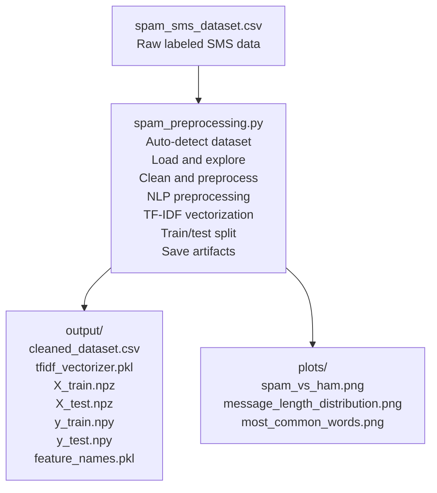
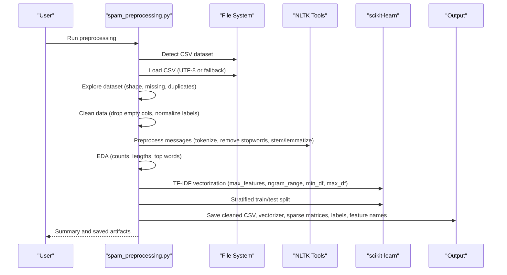
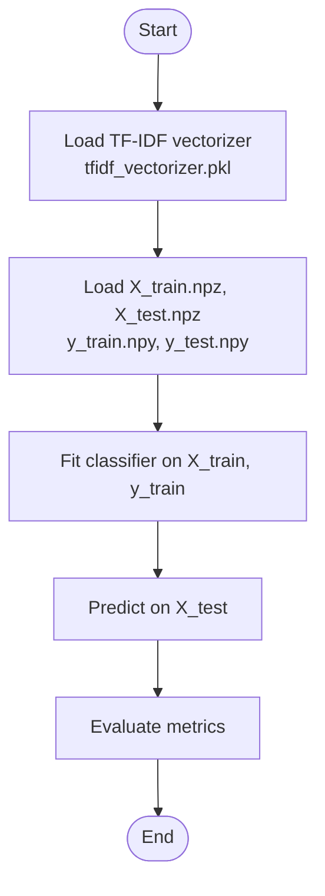
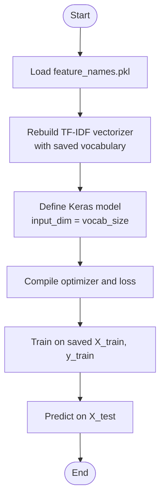
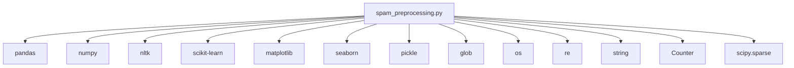

# Usage Examples

<cite>
**Referenced Files in This Document**
- [spam_preprocessing.py](file://spam_preprocessing.py)
- [spam_sms_dataset.csv](file://spam_sms_dataset.csv)
</cite>

## Table of Contents
1. [Introduction](#introduction)
2. [Project Structure](#project-structure)
3. [Core Components](#core-components)
4. [Architecture Overview](#architecture-overview)
5. [Detailed Component Analysis](#detailed-component-analysis)
6. [Dependency Analysis](#dependency-analysis)
7. [Performance Considerations](#performance-considerations)
8. [Troubleshooting Guide](#troubleshooting-guide)
9. [Conclusion](#conclusion)
10. [Appendices](#appendices)

## Introduction
This document provides practical usage examples for the SMS preprocessing pipeline designed for spam detection. It covers:
- End-to-end preprocessing from raw CSV to ML-ready features
- Custom configuration examples for TF-IDF and preprocessing options
- Integration examples with scikit-learn and TensorFlow/Keras
- Troubleshooting common issues
- Performance optimization tips for large datasets
- Production deployment and automation best practices

## Project Structure
The repository contains:
- A preprocessing script that auto-detects a CSV dataset, performs cleaning and NLP preprocessing, vectorizes messages with TF-IDF, splits into train/test sets, and saves artifacts for downstream ML training.
- A sample dataset file with labeled SMS messages.

**Diagram sources**
- [spam_preprocessing.py:62-100](file://spam_preprocessing.py#L62-L100)
- [spam_preprocessing.py:394-414](file://spam_preprocessing.py#L394-L414)
- [spam_preprocessing.py:447-488](file://spam_preprocessing.py#L447-L488)

**Section sources**
- [spam_preprocessing.py:62-100](file://spam_preprocessing.py#L62-L100)
- [spam_preprocessing.py:394-414](file://spam_preprocessing.py#L394-L414)
- [spam_preprocessing.py:447-488](file://spam_preprocessing.py#L447-L488)

## Core Components
- Dataset auto-detection and loading
- Initial exploration (shape, missing values, duplicates)
- Data cleaning (column normalization, null/duplicate removal, label conversion)
- NLP preprocessing (lowercasing, digit removal, URL removal, punctuation/special char removal, tokenization, stopword removal, stemming/lemmatization)
- EDA (counts, distributions, top words)
- TF-IDF vectorization with configurable parameters
- Stratified train/test split
- Artifact saving (cleaned CSV, vectorizer, sparse matrices, labels, feature names)
- Output and plots

Key implementation references:
- Dataset detection and loading: [spam_preprocessing.py:62-100](file://spam_preprocessing.py#L62-L100)
- Data cleaning: [spam_preprocessing.py:129-178](file://spam_preprocessing.py#L129-L178)
- NLP preprocessing function: [spam_preprocessing.py:194-254](file://spam_preprocessing.py#L194-L254)
- EDA and plots: [spam_preprocessing.py:297-384](file://spam_preprocessing.py#L297-L384)
- TF-IDF vectorization: [spam_preprocessing.py:394-414](file://spam_preprocessing.py#L394-L414)
- Train/test split: [spam_preprocessing.py:418-437](file://spam_preprocessing.py#L418-L437)
- Artifact saving: [spam_preprocessing.py:447-488](file://spam_preprocessing.py#L447-L488)

**Section sources**
- [spam_preprocessing.py:62-100](file://spam_preprocessing.py#L62-L100)
- [spam_preprocessing.py:129-178](file://spam_preprocessing.py#L129-L178)
- [spam_preprocessing.py:194-254](file://spam_preprocessing.py#L194-L254)
- [spam_preprocessing.py:297-384](file://spam_preprocessing.py#L297-L384)
- [spam_preprocessing.py:394-414](file://spam_preprocessing.py#L394-L414)
- [spam_preprocessing.py:418-437](file://spam_preprocessing.py#L418-L437)
- [spam_preprocessing.py:447-488](file://spam_preprocessing.py#L447-L488)

## Architecture Overview
End-to-end preprocessing pipeline flow:

**Diagram sources**
- [spam_preprocessing.py:62-100](file://spam_preprocessing.py#L62-L100)
- [spam_preprocessing.py:129-178](file://spam_preprocessing.py#L129-L178)
- [spam_preprocessing.py:194-254](file://spam_preprocessing.py#L194-L254)
- [spam_preprocessing.py:297-384](file://spam_preprocessing.py#L297-L384)
- [spam_preprocessing.py:394-414](file://spam_preprocessing.py#L394-L414)
- [spam_preprocessing.py:418-437](file://spam_preprocessing.py#L418-L437)
- [spam_preprocessing.py:447-488](file://spam_preprocessing.py#L447-L488)

## Detailed Component Analysis

### Basic Preprocessing Workflow Example
Complete end-to-end process from raw dataset to ML-ready features:
- Place your CSV dataset in the same directory as the script.
- Ensure the CSV has a label column and a message column (the script normalizes common column names).
- Run the preprocessing script. It will:
  - Auto-detect and load the dataset
  - Explore and clean the data
  - Apply NLP preprocessing to messages
  - Generate EDA plots
  - Vectorize with TF-IDF
  - Split into train/test sets
  - Save artifacts to the output directory

Expected outputs:
- Cleaned CSV with normalized columns and numeric labels
- TF-IDF vectorizer object
- Sparse matrices for training and testing features
- NumPy arrays for training and testing labels
- Feature names list
- EDA plots in the plots directory

References:
- Dataset detection and loading: [spam_preprocessing.py:62-100](file://spam_preprocessing.py#L62-L100)
- Data cleaning: [spam_preprocessing.py:129-178](file://spam_preprocessing.py#L129-L178)
- NLP preprocessing: [spam_preprocessing.py:194-254](file://spam_preprocessing.py#L194-L254)
- EDA: [spam_preprocessing.py:297-384](file://spam_preprocessing.py#L297-L384)
- TF-IDF vectorization: [spam_preprocessing.py:394-414](file://spam_preprocessing.py#L394-L414)
- Train/test split: [spam_preprocessing.py:418-437](file://spam_preprocessing.py#L418-L437)
- Artifact saving: [spam_preprocessing.py:447-488](file://spam_preprocessing.py#L447-L488)

**Section sources**
- [spam_preprocessing.py:62-100](file://spam_preprocessing.py#L62-L100)
- [spam_preprocessing.py:129-178](file://spam_preprocessing.py#L129-L178)
- [spam_preprocessing.py:194-254](file://spam_preprocessing.py#L194-L254)
- [spam_preprocessing.py:297-384](file://spam_preprocessing.py#L297-L384)
- [spam_preprocessing.py:394-414](file://spam_preprocessing.py#L394-L414)
- [spam_preprocessing.py:418-437](file://spam_preprocessing.py#L418-L437)
- [spam_preprocessing.py:447-488](file://spam_preprocessing.py#L447-L488)

### Custom Configuration Examples

#### Modify TF-IDF Parameters
Adjust vectorization settings to fit your dataset characteristics:
- max_features: limit vocabulary size
- ngram_range: use unigrams, bigrams, or higher-order n-grams
- min_df: ignore terms appearing in fewer than N documents
- max_df: ignore terms appearing in more than P percent of documents

References:
- TF-IDF initialization and fit: [spam_preprocessing.py:394-414](file://spam_preprocessing.py#L394-L414)

**Section sources**
- [spam_preprocessing.py:394-414](file://spam_preprocessing.py#L394-L414)

#### Adjust Preprocessing Options
Customize the NLP preprocessing pipeline:
- Toggle stemming vs lemmatization
- Modify stopword removal behavior
- Adjust tokenization and filtering rules

References:
- Preprocessing function: [spam_preprocessing.py:194-254](file://spam_preprocessing.py#L194-L254)

**Section sources**
- [spam_preprocessing.py:194-254](file://spam_preprocessing.py#L194-L254)

#### Customize Vectorization Settings
- Choose between stemming and lemmatization
- Control vocabulary size and sparsity
- Tune n-gram coverage

References:
- Vectorization and splitting: [spam_preprocessing.py:394-414](file://spam_preprocessing.py#L394-L414), [spam_preprocessing.py:418-437](file://spam_preprocessing.py#L418-L437)

**Section sources**
- [spam_preprocessing.py:394-414](file://spam_preprocessing.py#L394-L414)
- [spam_preprocessing.py:418-437](file://spam_preprocessing.py#L418-L437)

### Integration Examples with ML Frameworks

#### Scikit-learn Integration
Load saved artifacts and train a classifier:
- Load the TF-IDF vectorizer
- Load training and testing sparse matrices
- Load labels
- Train a classifier (e.g., LogisticRegression, RandomForestClassifier)

References:
- Vectorizer and matrices saving/loading: [spam_preprocessing.py:447-488](file://spam_preprocessing.py#L447-L488)

**Diagram sources**
- [spam_preprocessing.py:447-488](file://spam_preprocessing.py#L447-L488)

**Section sources**
- [spam_preprocessing.py:447-488](file://spam_preprocessing.py#L447-L488)

#### TensorFlow/Keras Integration
Load saved artifacts and build a neural network:
- Load feature names and vocabulary metadata
- Reconstruct TF-IDF vectorizer for inference
- Build a simple dense model for binary classification

References:
- Feature names saving/loading: [spam_preprocessing.py:478-482](file://spam_preprocessing.py#L478-L482)
- Vectorizer saving/loading: [spam_preprocessing.py:456-460](file://spam_preprocessing.py#L456-L460)

**Diagram sources**
- [spam_preprocessing.py:478-482](file://spam_preprocessing.py#L478-L482)
- [spam_preprocessing.py:456-460](file://spam_preprocessing.py#L456-L460)

**Section sources**
- [spam_preprocessing.py:478-482](file://spam_preprocessing.py#L478-L482)
- [spam_preprocessing.py:456-460](file://spam_preprocessing.py#L456-L460)

### Troubleshooting Examples

Common issues and resolutions:
- Memory constraints during preprocessing
  - Reduce max_features in TF-IDF
  - Use smaller ngram_range
  - Process in chunks if applicable
  - References: [spam_preprocessing.py:394-414](file://spam_preprocessing.py#L394-L414)
- Preprocessing errors
  - Ensure NLTK resources are downloaded
  - Validate dataset encoding and column names
  - References: [spam_preprocessing.py:39-52](file://spam_preprocessing.py#L39-L52), [spam_preprocessing.py:86-98](file://spam_preprocessing.py#L86-L98)
- Artifact loading problems
  - Confirm saved artifacts exist in output directory
  - Verify correct paths and file extensions
  - References: [spam_preprocessing.py:447-488](file://spam_preprocessing.py#L447-L488)

**Section sources**
- [spam_preprocessing.py:394-414](file://spam_preprocessing.py#L394-L414)
- [spam_preprocessing.py:39-52](file://spam_preprocessing.py#L39-L52)
- [spam_preprocessing.py:86-98](file://spam_preprocessing.py#L86-L98)
- [spam_preprocessing.py:447-488](file://spam_preprocessing.py#L447-L488)

### Performance Optimization Examples

Optimization strategies for large datasets and batch processing:
- Use sparse matrices for TF-IDF features
- Save and load sparse matrices efficiently
- Batch process messages when extending preprocessing
- Tune TF-IDF parameters for speed and memory
- References: [spam_preprocessing.py:463-469](file://spam_preprocessing.py#L463-L469), [spam_preprocessing.py:394-414](file://spam_preprocessing.py#L394-L414)

**Section sources**
- [spam_preprocessing.py:463-469](file://spam_preprocessing.py#L463-L469)
- [spam_preprocessing.py:394-414](file://spam_preprocessing.py#L394-L414)

### Best Practices for Production Deployment and Automation

Production readiness checklist:
- Version control and environment isolation
- Automated dataset validation and logging
- Robust artifact management and provenance
- CI/CD pipeline for preprocessing and model training
- Monitoring and alerting for preprocessing failures
- References: [spam_preprocessing.py:62-100](file://spam_preprocessing.py#L62-L100), [spam_preprocessing.py:447-488](file://spam_preprocessing.py#L447-L488)

**Section sources**
- [spam_preprocessing.py:62-100](file://spam_preprocessing.py#L62-L100)
- [spam_preprocessing.py:447-488](file://spam_preprocessing.py#L447-L488)

## Dependency Analysis
High-level dependencies in the preprocessing pipeline:

**Diagram sources**
- [spam_preprocessing.py:10-35](file://spam_preprocessing.py#L10-L35)

**Section sources**
- [spam_preprocessing.py:10-35](file://spam_preprocessing.py#L10-L35)

## Performance Considerations
- Prefer sparse matrices for TF-IDF features to reduce memory usage
- Limit vocabulary size and n-gram range for large corpora
- Use chunked processing for very large datasets
- Cache intermediate artifacts to avoid recomputation
- References: [spam_preprocessing.py:394-414](file://spam_preprocessing.py#L394-L414), [spam_preprocessing.py:463-469](file://spam_preprocessing.py#L463-L469)

**Section sources**
- [spam_preprocessing.py:394-414](file://spam_preprocessing.py#L394-L414)
- [spam_preprocessing.py:463-469](file://spam_preprocessing.py#L463-L469)

## Troubleshooting Guide
- NLTK resource download failures
  - Ensure network connectivity and retry downloads
  - References: [spam_preprocessing.py:39-52](file://spam_preprocessing.py#L39-L52)
- Dataset loading errors
  - Verify encoding (UTF-8 or fallback)
  - Check for unexpected columns and normalize names
  - References: [spam_preprocessing.py:86-98](file://spam_preprocessing.py#L86-L98), [spam_preprocessing.py:137-144](file://spam_preprocessing.py#L137-L144)
- Artifact saving/loading issues
  - Confirm output directory creation and permissions
  - Validate file paths and extensions
  - References: [spam_preprocessing.py:447-488](file://spam_preprocessing.py#L447-L488)

**Section sources**
- [spam_preprocessing.py:39-52](file://spam_preprocessing.py#L39-L52)
- [spam_preprocessing.py:86-98](file://spam_preprocessing.py#L86-L98)
- [spam_preprocessing.py:137-144](file://spam_preprocessing.py#L137-L144)
- [spam_preprocessing.py:447-488](file://spam_preprocessing.py#L447-L488)

## Conclusion
This usage guide demonstrates how to run the SMS preprocessing pipeline end-to-end, customize TF-IDF and preprocessing parameters, integrate with scikit-learn and TensorFlow/Keras, troubleshoot common issues, optimize performance, and operationalize the pipeline for production. The included references point directly to the relevant sections of the preprocessing script and dataset file for quick implementation.

## Appendices
- Sample dataset preview: [spam_sms_dataset.csv:1-20](file://spam_sms_dataset.csv#L1-L20)

**Section sources**
- [spam_sms_dataset.csv:1-20](file://spam_sms_dataset.csv#L1-L20)